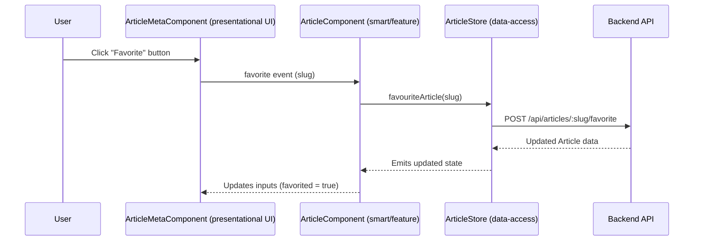

# Chapter 3: Standalone Smart and Presentational Components Pattern

[← Routing, Lazy Loading, and Resolver Abstractions](02_routing__lazy_loading__and_resolver_abstractions.md)

---

## Motivation: Tackling Complexity in Page Design

In the last chapter, we explored how lazy, modular routing connects large-scale apps into a cohesive experience.  
Now, let's zoom in: inside each routed page or feature, **how do you organize your Angular components to maximize reusability, testability, and clarity—without turning every component into a ball of mud?**

**A Central Use Case:**  
_*Imagine implementing the "Article Page" in the Conduit app.*_  

- The page loads and displays an article body, metadata, and comments.
- Authenticated users can favorite/unfavorite an article, follow/unfollow the author, add comments, or delete their comments/articles.
- Anonymous users can't do these actions, but they should still see the UI.
- The same _comment form_, _favorite button_, or _user meta_ widget could appear in many places: other pages, popups, lists, etc.

**Problem:**  
Features like Article Page quickly devolve into fat, hard-to-test, un-reusable components unless business logic and UI rendering are clearly separated.

---

## Solution: Smart and Presentational Components Pattern

> **Divide and conquer:**  
>
> - _Smart components_ (feature, orchestrator) manage state, side-effects, and business rules.  
> - _Presentational components_ display data, receive inputs, and emit events—no business knowledge, state, or API calls.

**In the Conduit architecture:**  

- Presentational components are easily reused across domains, apps, and contexts.
- Smart components wire up stores, services, and state to their presentational children.
- The pattern is enforced naturally in the Nx workspace layout:  
  - `feature-*` libraries house smart components.
  - `ui/components` and domain `ui` libraries host pure presentational components.

---

## Key Concepts

Let's break it down.

### 1. Presentational Components

**Role:**  

- Think of these as _stateless specialists_—the "UI surgeons":  
  - Receive all data via `@Input`/input signals.
  - Emit user actions/events via `@Output` or outputs.
  - No services injected, no API calls, no store access.
  - Fully controlled by their parent.

**Benefits:**  

- **Pure, testable,** and easy to reason about.
- **Reusable anywhere**, across features, even outside Angular apps (Storybook, microfrontends).
- Anyone can consume without fear of side-effects.

### 2. Smart Components

**Role:**  

- Act as the _managers_ or _orchestrators_:
  - Owns business logic, state subscriptions, and side-effects (API, store, router).
  - Coordinates data loading and actions.
  - Passes only what’s needed down as `@Input`s. Listens to child event outputs, and acts accordingly.

**Benefits:**  

- Encapsulates "the workflow of the page/feature".
- Keeps UI logic out of the mess of state/reducers/services.
- **Only smart components (never pure UI) know about the global store, API, router, etc.**

### 3. Why Standalone?

Angular now supports [Standalone Components](https://angular.io/guide/standalone-components), which don't need Angular modules.

- Each component declares `imports` as needed.
- Promotes "single file" clarity.
- Nx's per-lib structure means you can compose smart/presentational components flexibly.

---

## Applying the Pattern: Real World Example

Let's walk step-by-step through implementing the Article Page.

### Step 1: Smart Component – Feature Container

The top-level orchestrator for the page:

```typescript
// File: libs/articles/feature-article/src/article.component.ts

import { ChangeDetectionStrategy, Component, OnDestroy, OnInit, computed, inject, input } from '@angular/core';
import { ArticleMetaComponent } from './article-meta/article-meta.component';
import { ArticleCommentComponent } from './article-comment/article-comment.component';
import { AddCommentComponent } from './add-comment/add-comment.component';
// ...omitted non-critical imports...

@Component({
  selector: 'cdt-article',
  templateUrl: './article.component.html',
  // Imports smartly chosen for composition
  imports: [ArticleMetaComponent, ArticleCommentComponent, AddCommentComponent, /*...*/],
  changeDetection: ChangeDetectionStrategy.OnPush,
})
export class ArticleComponent implements OnInit, OnDestroy {
  slug = input<string>('');

  // Inject stores and domain APIs
  private readonly authStore = inject(AuthStore);
  private readonly articleStore = inject(ArticleStore);

  // Expose reactively selected state for children
  $article = this.articleStore.data;
  $comments = this.articleStore.comments;
  $authorUsername = this.articleStore.data.author.username;
  $isAuthenticated = this.authStore.loggedIn;
  $currentUser = this.authStore.user;
  $canModify = computed(() => this.authStore.user.username() === this.$authorUsername());

  ngOnInit() {
    this.articleStore.getArticle(this.slug());
    this.articleStore.getComments(this.slug());
  }

  follow(username: string) {
    this.articleStore.followUser(username);
  }
  unfollow(username: string) {
    this.articleStore.unfollowUser(username);
  }
  favorite(slug: string) {
    this.articleStore.favouriteArticle(slug);
  }
  unfavorite(slug: string) {
    this.articleStore.unFavouriteArticle(slug);
  }
  delete(slug: string) {
    this.articleStore.deleteArticle(slug);
  }
  deleteComment(data: { commentId: number; slug: string }) {
    this.articleStore.deleteComment(data);
  }
  submit(comment: string) {
    this.articleStore.addComment(comment);
  }

  ngOnDestroy() {
    this.articleStore.initializeArticle();
  }
}
```

**Explanation:**  
This component is the _workflow manager_:  

- Handles lifecycle hooks (load article/comments on init, clear on destroy).
- Connects to stores.
- Passes state/data to child presentational components via inputs.
- Reacts to child outputs (e.g., comment submitted, favorite toggled).

### Step 2: Presentational Child – Article Metadata

```typescript
// File: libs/articles/feature-article/src/article-meta/article-meta.component.ts

import { Component, input, output } from '@angular/core';
import { Article } from '@realworld/core/api-types';

@Component({
  selector: 'cdt-article-meta',
  templateUrl: './article-meta.component.html',
  // Only pure imports
})
export class ArticleMetaComponent {
  article = input.required<Article>();
  canModify = input.required<boolean>();

  follow = output<string>();
  unfollow = output<string>();
  unfavorite = output<string>();
  favorite = output<string>();
  delete = output<string>();

  toggleFavorite() {
    if (this.article().favorited) {
      this.unfavorite.emit(this.article().slug);
    } else {
      this.favorite.emit(this.article().slug);
    }
  }

  toggleFollow() {
    if (this.article().author.following) {
      this.unfollow.emit(this.article().author.username);
    } else {
      this.follow.emit(this.article().author.username);
    }
  }

  deleteArticle() {
    this.delete.emit(this.article().slug);
  }
}
```

**Explanation:**  

- This is a _pure UI_ component.
- Accepts all required data (`@Input`, input signals).
- Emits user action events upwards (`@Output`/outputs).
- _No injected services,_ no API calls, no store or router logic.
- Can be reused in any "meta" context across the product.

### Step 3: Presentational Child – Add Comment Form

```typescript
// File: libs/articles/feature-article/src/add-comment/add-comment.component.ts

import { Component, input, output, inject } from '@angular/core';
import { FormBuilder, ReactiveFormsModule } from '@angular/forms';

@Component({
  selector: 'cdt-add-comment',
  templateUrl: './add-comment.component.html',
  imports: [ReactiveFormsModule],
})
export class AddCommentComponent {
  private readonly fb = inject(FormBuilder);

  article = input.required<Article>();
  currentUser = input.required<User>();
  submitComment = output<string>();

  form = this.fb.nonNullable.group({
    comment: [''],
  });

  // On submit, emit the comment text upstream
  onSubmit() {
    if (this.form.valid) {
      this.submitComment.emit(this.form.value.comment);
      this.form.reset();
    }
  }
}
```

**Explanation:**  

- Receives all data from parent.
- Emits only the "what happened" event (not what to do).
- Doesn't depend on how/where comments are submitted—parent decides.

### Step 4: Wiring It Together

```html
<!-- File: libs/articles/feature-article/src/article.component.html -->

<!-- All presentational children get their data as inputs and emit outputs -->
<cdt-article-meta
  [article]="$article()"
  [canModify]="$canModify()"
  (follow)="follow($event)"
  (unfollow)="unfollow($event)"
  (favorite)="favorite($event)"
  (unfavorite)="unfavorite($event)"
  (delete)="delete($event)">
</cdt-article-meta>

<main>
  <div [innerHTML]="$article().body"></div>
</main>

<section>
  <cdt-add-comment
    [article]="$article()"
    [currentUser]="$currentUser()"
    (submitComment)="submit($event)">
  </cdt-add-comment>

  <ng-container *ngFor="let comment of $comments()">
    <cdt-article-comment
      [comment]="comment"
      [canModify]="$canModify()"
      (deleteComment)="deleteComment($event)">
    </cdt-article-comment>
  </ng-container>
</section>
```

**Explanation:**  

- The smart component owns all wiring.
- Presentational components are _dumb_: they simply display, they signal user actions, they never orchestrate.

---

## Flow in Practice: Event Propagation

Let's see the flow when a user clicks "Favorite" on the article.



- **Event flows up:** from pure UI child to smart parent.
- **Action/side-effect happens in smart parent / store, not in the UI child.**
- **Updated data flows down:** smart parent passes changed state into UI children.

---

## Internal Implementation: Under the Hood

### Directory Layout Enforces the Pattern

- _Presentational:_  
  `libs/ui/components/*` or `libs/<domain>/ui/*`  
  - e.g. `libs/ui/components/src/article-list-item/article-list-item.component.ts`  
- _Smart/Feature:_  
  `libs/<domain>/feature-*/`  
  - e.g. `libs/articles/feature-article/article.component.ts`, `libs/auth/feature-auth/login.component.ts`

### _Nx module boundaries ensure:*_

- Presentational UI components depend only on inputs/outputs.
- Only feature (smart/orchestrator) components import state/services.

### Example: Article List Item

```typescript
// File: libs/articles/feature-articles-list/src/article-list-item/article-list-item.component.ts

import { Component, input, output } from '@angular/core';
import { Article } from '@realworld/core/api-types';

@Component({
  selector: 'cdt-article-list-item',
  templateUrl: './article-list-item.component.html',
})
export class ArticleListItemComponent {
  article = input.required<Article>();
  favorite = output<string>();
  unFavorite = output<string>();
  navigateToArticle = output<string>();

  toggleFavorite(article: Article) {
    if (article.favorited) {
      this.unFavorite.emit(article.slug);
    } else {
      this.favorite.emit(article.slug);
    }
  }
}
```

- **Inputs:** Only receives `Article` to display.
- **Outputs:** Emits events upward, no internal state.

### Example: Smart List Container

```typescript
// File: libs/articles/feature-articles-list/src/article-list.component.ts

import { Component, inject } from '@angular/core';
import { ArticleStore } from '@realworld/articles/data-access';
import { ArticleListItemComponent } from './article-list-item/article-list-item.component';

@Component({
  selector: 'cdt-article-list',
  template: `
    <cdt-article-list-item
      *ngFor="let article of $articles()"
      [article]="article"
      (favorite)="onFavorite($event)"
      (unFavorite)="onUnFavorite($event)"
      (navigateToArticle)="goToArticle($event)">
    </cdt-article-list-item>
  `,
  imports: [ArticleListItemComponent],
})
export class ArticleListComponent {
  private readonly articleStore = inject(ArticleStore);
  $articles = this.articleStore.articles;

  onFavorite(slug: string) {
    this.articleStore.favouriteArticle(slug);
  }
  onUnFavorite(slug: string) {
    this.articleStore.unFavouriteArticle(slug);
  }
  goToArticle(slug: string) {
    // handle navigation, if needed
  }
}
```

- Orchestrates list, handles business actions, passes only necessary data down.

---

## Analogy: Orchestra Conductor vs. Musicians

- **Smart component** = Conductor:  
  - Knows the score, decides when who should play, signals everyone.
- **Presentational component** = Musician:  
  - Knows how to play their instrument, but doesn't know about the other instruments or the overall performance; plays when conductor signals.

---

## Benefits Recap

- **Testability:**  
  Presentational components can be tested in total isolation. Smart components can be tested by mocking UI children.
- **Reusability:**  
  Presentational components ("cards," "pagers," "meta," "comment forms," etc.) reused across apps/domains.
- **Maintainability:**  
  Business logic, state, and API calls live only in a few orchestrator components.

---

## Advanced: Boundary Enforcement & Nx

Nx and directory conventions combine to _force_ this separation:

- **Presentational** components are published from clearly marked `ui/components` libraries.
- **Feature/Smart** components live in `feature-` libraries and import presentational UIs as needed, but never the other way around.
- **Types/Contracts** live in shared `core/api-types` ([see: API Types (Domain Model Contracts)](09_api_types__domain_model_contracts_.md)), so there's no business logic leak in UI.

---

## Summary and What's Next

**In this chapter, you learned:**

- **Why** splitting smart (feature) from presentational (UI) components tames view complexity.
- **How** presentational components are pure, stateless, and event-driven.
- **How** feature (smart) components orchestrate state, stores, and compose UI.
- **How** Nx enforces—and the codebase scales elegantly as a result.

**Next:**  
Pages and features need real business state, orchestrated and shared across the app—often with NgRx or Signals.  
In [Signal Store Pattern (NgRx Signal Store)](04_signal_store_pattern__ngrx_signal_store_.md), we'll see how state management seamlessly fits into the smart/presentational split, pairing the best of reactive programming with this component architecture.

[→ Signal Store Pattern (NgRx Signal Store)](04_signal_store_pattern__ngrx_signal_store_.md)

---

Generated by [AI Codebase Knowledge Generator](https://github.com/vegeta03/codebase-knowledge-generator)
