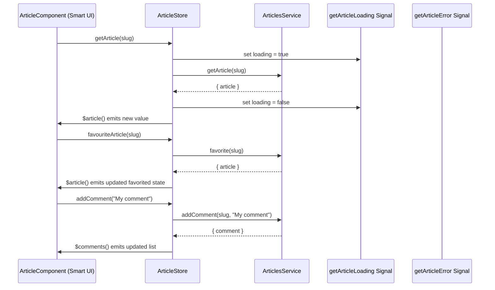

# Chapter 4: Signal Store Pattern (NgRx Signal Store)

[← Standalone Smart and Presentational Components Pattern](03_standalone_smart_and_presentational_components_pattern.md)

---

## Motivation: What Problem Does the Signal Store Pattern Solve?

> _Modern Angular needs state management that's both reactive and scalable, yet concise and ergonomic. How do we move beyond "boilerplate fatigue," gain strong typing and fine-grained reactivity, and avoid the pitfalls of rigid, class-heavy stores?_

_Consider this RealWorld example:_

- On an article page, the UI needs to render:
  - The current article (author, body, tags, comments, etc)
  - Loading states (fetching article, posting comments)
  - Error states (form errors, network errors)
  - All while enabling instant updates when users favorite, follow, comment, or edit
- Other UIs—Article List, Profile, Home-tags—have their own slices and "state hubs"
- All updates should be instant, consistent, and only propagate where needed—no global bottlenecks!

**Traditional solutions (like old-school NgRx or services-with-Subjects) are either too verbose or not type-safe enough. The Signal Store Pattern, powered by `@ngrx/signals`, brings a new level of composability, performance, and developer clarity.**

---

## What is the Signal Store Pattern?

Think of it as your smart home hub:  

- All state lives in one central (per-domain) place.
- Anyone (UI, service, resolver) can **react** to changes instantly (via Signals!).
- Methods on the hub are used for ALL reads/updates (like pressing a button or starting an automation).
- The hub keeps history, prevents direct "tampering," and only exposes safe, fine-tuned controls.

Or, more concretely:  
A **Signal Store** is a strongly-typed, reactive state container built around Angular's Signals and enriched by NgRx's `@ngrx/signals` utilities.  
It:

- **Encapsulates domain state** (auth, article, profile, etc)
- Exposes **Signals** as the canonical API for querying and subscribing to state
- Provides **methods** (including "rxMethods" for async jobs) to update state in immutable, functional, and pure ways
- Manages call states (loading, loaded, error) for any side-effectful operation

---

## Key Concepts (Broken Down)

Let's demystify the anatomy of a Signal Store:

1. **State & Signal Encapsulation**
    - All state is stored _privately_.
    - **Read** state through exported Signals: e.g., `.article()`, `.comments()`, `.loading()`.
2. **Methods are the Only Way In (Mutability Gateway)**
    - Synchronous methods: instant updates, pure patching.
    - Asynchronous methods: using RxJS pipelines (`rxMethod`) for HTTP, I/O, timers, etc.
3. **Fine-Grained Reactivity by Design**
    - Components wire up only to the Signals they need. No over-listening.
    - You never "select" more than you asked for—write efficient, fast, small UI.
4. **Call-State Management Is Built-In**
    - For every async action: get a `.loading()`, `.loaded()`, `.error()` signal—no hand-rolled "isLoading" flags!
5. **Domain Boundaries (Per-Store)**
    - Each domain (auth, articles, etc.) owns its store—no leaky abstractions.
    - Stores are injectable singletons; never constructed manually, always provided in root/domain.

---

## Core Use Case: Managing Article Page State the Reactive Way

Let's ground this in a scenario:

> **When a user navigates to an Article Page**,  
>
> - We want the UI to “instantly react” when:
>   - The article is loaded from API
>   - The user favorites/unfavorites the article
>   - Comments are loaded, added, or deleted
>   - Loading/errors happen on any operation
>
> **We expect:**
>
> - Smart components to wire to these signals and orchestrate actions cleanly
> - Presentational components to “just reflect” the needed state, _no side-effects_
> - All updates and reads to be instant, strongly-typed, and efficient  
> - Minimal 'store boilerplate'

Let's see this pattern in action!

---

## Anatomy of a Signal Store (With Example)

We'll implement a Signal Store for articles:  

- Exposes signals for `data`, `comments` (for reading)
- Provides rxMethods for actions: `getArticle`, `favorite`, `addComment`, etc
- Handles call state (loading, error) natively

### Step 1: Define State Shape and Initial State

```typescript
// File: libs/articles/data-access/src/models/article.model.ts

import { Article, Comment } from '@realworld/core/api-types';

export interface ArticleState {
  data: Article;          // The current article entity (or initial stub)
  comments: Comment[];    // Loaded comments
  // Optionally more fields: selectedComment, pendingEdits, etc
}

// Provide a safe initial state (defaults, empty data)
export const articleInitialState: ArticleState = {
  data: { /* ...default Article fields... */ },
  comments: [],
};
```

**Explanation:**  

- Clearly specify all data you intend to manage in this store.
- Strong typing helps prevent accidental/incorrect updates.

---

### Step 2: Create the Article Signal Store

We use `signalStore(...)`, passing in:

1. **withState**: Gives us type-safe, reactive backing state.
2. **withMethods**: Attach sync/async methods.
3. **withCallState** (optional): Add built-in loading/error signals for specific operations.

Let's look at a simplified version for managing articles:

```typescript
// File: libs/articles/data-access/src/article.store.ts

import { signalStore, withState, withMethods, patchState } from '@ngrx/signals';
import { inject } from '@angular/core';
import { ArticleState, articleInitialState } from './models/article.model';
import { ArticlesService } from './services/articles.service';
import { rxMethod } from '@ngrx/signals/rxjs-interop';
import { switchMap, pipe } from 'rxjs';
import { tapResponse } from '@ngrx/operators';

// 1. Define the signal store for the Articles domain
export const ArticleStore = signalStore(
  { providedIn: 'root' },
  withState<ArticleState>(articleInitialState),

  withMethods((store, articlesService = inject(ArticlesService)) => ({
    // --- Asynchronous load method using rxMethod pattern ---
    getArticle: rxMethod<string>(
      pipe(
        switchMap((slug) =>
          articlesService.getArticle(slug).pipe(
            tapResponse({
              next: ({ article }) => patchState(store, { data: article }),   // Safely patch into state
              error: () => patchState(store, { data: articleInitialState.data })
            })
          )
        )
      )
    ),

    // --- Synchronous state reset (for teardown or navigation away) ---
    initializeArticle: () => {
      patchState(store, articleInitialState);
    },

    // More methods: addComment, favorite, delete, etc.
  }))
);
```

**Explanation:**  

- `signalStore(...)` creates the reactive store, injectable as a singleton.
- The `withState()` plugin supplies fine-grained state with Signal-based reads: you can use `.data()`, `.comments()` (once you add comments in state).
- The `withMethods()` plugin exposes only defined mutation operations (method closure).
- The `rxMethod` helper cleanly integrates RxJS async flows in an ergonomic, composable way.

---

### Step 3: Accessing and Using the Store in Components

You do **not** read or mutate state via Subject, BehaviorSubject, or big select functions—**just Signals and methods!**

```typescript
// File: libs/articles/feature-article/src/article.component.ts

import { Component, inject, OnInit, OnDestroy } from '@angular/core';
import { ArticleStore } from '@realworld/articles/data-access';

@Component({
  selector: 'cdt-article',
  template: `
    <section *ngIf="$article(); else loading">
      <h1>{{ $article().title }}</h1>
      <p>{{ $article().body }}</p>
      <!-- More UI bound to signals -->
    </section>
    <ng-template #loading>
      <p>Loading...</p>
    </ng-template>
  `
})
export class ArticleComponent implements OnInit, OnDestroy {
  private readonly articleStore = inject(ArticleStore);

  $article = this.articleStore.data;         // Signal that always emits latest article

  ngOnInit() {
    this.articleStore.getArticle('my-article-slug'); // Triggers async load, automatically updates $article()
  }

  ngOnDestroy() {
    this.articleStore.initializeArticle();   // Reset state when leaving component
  }
}
```

**Explanation:**  

- Components read state via Signals, e.g. `this.$article()`, and pass values down via `@Input`s or signal inputs.
- Methods (like `getArticle()`) **trigger all side effects**; UI does not reach inside or mutate store directly.
- No unclear "dispatch" or "subscribe" patterns—it's all clear and idiomatic.

---

## Advanced: Async Flows and Call State Signals

Beyond basic data, most UIs need to know: "Are we loading?", "Has the request finished?", "Was there an error?"  
With Signal Store and `withCallState`, those are _natively_ provided and Signal-based.

**For every rxMethod, call states like loading/error are automagically tracked:**

```typescript
export const ArticleStore = signalStore(
  { providedIn: 'root' },
  withState<ArticleState>(articleInitialState),
  // ...
  withCallState({ collection: 'getArticle' }),
  // ...
);
```

In your component, you can now do:

```typescript
$isLoading = this.articleStore.getArticleLoading;  // Signal<boolean>
$error = this.articleStore.getArticleError;        // Signal<string|undefined>
```

**UI use:**

```html
<div *ngIf="$isLoading()">Loading article...</div>
<div *ngIf="$error()">{{ $error() }}</div>
```

**Explanation:**  

- All loading/error "status" gets its own signal, with zero custom flags.
- It’s “just state”, so can be passed as input or bound in the view, as needed.

---

## Analogy: The Store as Your Domain's Smart Home Hub

Picture each domain store as a _smart hub_:

- There are _signals_ (thermometers, smart locks, lights) exposed for stakeholders to react to, whenever state changes.
- If you want to trigger an action (open the garage door, turn off the light, favorite an article), you can only go via a _well-defined_ method on the hub. These are secure, single points of change.
- All updates ripple out instantly wherever needed—no polluting the entire hierarchy or leaking between domains.
- If something goes wrong (a network error, a sensor breaks), special "call state" signals let the UI respond _instantly_.

---

## How Does It Work Under the Hood? (Step-by-Step Walkthrough)

Let's use a **sequence diagram** to illustrate a typical flow:  
_"User loads article, favorites it, and posts a comment"._



**Key points:**

- All mutations must go through the Store's methods; UI stays pure.
- Signals are emitted instantly; only re-rendering affected UI parts.
- Errors/loading state are signaled through built-in call-state signals.

---

## Internal Implementation: What Makes Up a Signal Store?

Let's break down the primary powers given by NgRx Signals:

1. **`signalStore()` Factory:**  
   - Wraps up state, methods, computed values, and call state into one injectable service.

2. **`withState()`**  
   - Outlines state shape and pins the initial state (immutable).  
   - Exposes each key as a Signal.

3. **`withMethods()`**  
   - Sync or async methods (can use closures for services), returning nothing—"imperative" triggers.
   - `rxMethod` enables composing async operations.

4. **`withCallState()`**  
   - Automatically tracks the loading, loaded, and error status for specified jobs.
   - Exposes extra signals you can bind to in the UI.

5. **`patchState()`**  
   - Safely applies immutable updates; never mutates in place.

6. **Integration with RxJS**  
   - Compose async methods as RxJS pipelines.
   - `tapResponse` (from `@ngrx/operators`): ergonomic next/error handling.

---

### Example: A Simpler Signal Store Walkthrough

```typescript
// File: libs/home/feature-home/src/home.store.ts
import { signalStore, withState, withMethods, patchState, withHooks } from '@ngrx/signals';
import { rxMethod } from '@ngrx/signals/rxjs-interop';
import { inject } from '@angular/core';
import { HomeService } from './home.service';

// State shape (trivial example)
export interface HomeState {
  tags: string[];
}

// Store definition
export const HomeStore = signalStore(
  { providedIn: 'root' },
  withState<HomeState>({ tags: [] }),
  withMethods((store, homeService = inject(HomeService)) => ({
    getTags: rxMethod<void>(
      switchMap(() =>
        homeService.getTags().pipe(
          tapResponse(
            (response) => patchState(store, { tags: response.tags }),
            (error) => console.error('error getting tags: ', error),
          )
        )
      )
    ),
  })),
  withHooks({
    // Immediately run getTags() on store initialization
    onInit({ getTags }) {
      getTags();
    }
  }),
);
```

**Explanation:**  

- The HomeStore exposes a `tags` Signal (`this.homeStore.tags()` in any component), and a `getTags()` method (triggered on initialization).
- Whenever tags change, all consumers react.
- No more subscription management or manual rxjs teardown!

---

### Proper File Structure, Encapsulation, and Usage

Signal stores live in their domain’s `data-access/` library (e.g. `libs/articles/data-access/article.store.ts`).  
You _only_ access them via their public API (never deep import code inside), preserving strong boundaries ([see: Domain Modularization and Nx Monorepo Structure](01_domain_modularization_and_nx_monorepo_structure.md)).

**Usage Across the App:**  

- Injected in feature/smart components ONLY.
- UI components only get raw data, never the store itself ([see: Standalone Smart and Presentational Components Pattern](03_standalone_smart_and_presentational_components_pattern.md)).
- Resolvers and guards can also trigger loads (e.g. `store.getArticle()`) in [Routing, Lazy Loading, and Resolver Abstractions](02_routing__lazy_loading__and_resolver_abstractions.md).

---

## Comparison Table: Signal Store vs. Traditional NgRx/Service Approaches

|                   | Signal Store       | "Classic" NgRx Store | Service/BehaviorSubject |
|-------------------|-------------------|----------------------|-----------------------|
| Type Safety       | ✅                 | ✅                    | ⚠️ (weak/incomplete)  |
| Selector Ergonomics  | ✅ (`.data()`)      | ⚠️ (selectors wiring)      | ⚠️ (imperative)        |
| State Mutability  | ✅ (immutable)     | ✅ (immutable)        | ⚠️ (can be mutable)    |
| Async Flows       | ✅ (rxMethod)      | ✅ (Effects)          | ⚠️ (manual pipe/subscribe) |
| Fine-grained Reactivity | ✅ (Signal)        | ⚠️ (global select mapStateToProps) | ⚠️ (no auto optimization) |
| Boilerplate Size  | 🟢 Low             | 🔴 High               | 🟢 Low                |
| Error Handling    | ✅ (call state)    | ⚠️ (custom per op)         | ⚠️ (manual)             |
| Per-domain Isolation | ✅               | ✅                    | ⚠️ (shared instance)    |

---

## Design Patterns and Gotchas (Best Practices)

- **DO**: Keep only a single store per domain "vertical": e.g. `ArticleStore`, `AuthStore`.  
- **DO**: Expose only Signals and methods as the public API.
- **DON’T**: Export the raw state object (avoid uncontrolled mutation).
- **DO**: Use `patchState` for all mutations—never mutate values in-place.
- **DO**: Use call state signals (from `withCallState`) for all long-running calls.
- **DON’T**: Inject the store into UI/presentation components; wire via signals/inputs.
- **DO**: Compose async flows with rxMethod for clarity.
- **DON’T**: Overuse "global" services; let each store own its domain!

---

## Complete Example: Signal Store Lifecycle on an Article Page

- Component mounts:  
  - Injects `ArticleStore`
  - Calls `getArticle('slug')`
  - Binds to `store.data()`, `store.comments()`, etc.
- API responds; store updates its Signals:
  - UI instantly reflects change.
- User triggers side-effect
  - E.g. `store.favouriteArticle('slug')`
  - Updates ripple out; loading/error signals set automatically.
- On navigation away/teardown:
  - Calls `store.initializeArticle()` to reset state.

---

## Mermaid Diagram: Data and Call-State Flow

```mermaid
flowchart TD
  subgraph ArticleStore
    direction TB
    A1[State Signals]
    A2[CallState Signals]
    A3[rxMethods (API Ops)]
  end
  Comp[Smart Component]
  UI[Presentational Component]

  Comp -->|Injects| ArticleStore
  ArticleStore -->|Signals| Comp
  Comp -->|Inputs| UI
  UI -->|Outputs| Comp
  Comp -->|Triggers (ops)| A3
  A3 -->|Updates State| A1
  A3 -->|Updates CallState| A2
  A1 -->|Signals| Comp
  A2 -->|Signals| Comp
```

---

## Summary and What’s Next

**You’ve learned:**

- Why and how the Signal Store Pattern elevates Angular state management—by providing a reactive, ergonomic, and strongly-typed data hub per domain
- How to build, use, and wire stores with Signals + rxMethods for both synchronous and asynchronous state changes
- How call state signals give you instant, per-operation status for loading and errors—no custom boilerplate
- How this pattern ties into smart/presentational UI splits, routing/resolvers, and the monorepo structure

Together, this enables robust, large-scale feature delivery _without_ regressing into spaghetti state or boilerplate hell.

---

**Next up:**  
Learn how to create **consistent, cross-domain management of loading/error states for all API calls** with the [Call State Abstraction (withCallState Feature)](05_call_state_abstraction__withcallstate_feature_.md)—a simple but powerful way to make your UIs user-friendly and edge-case-safe, everywhere.

[→ Call State Abstraction (withCallState Feature)](05_call_state_abstraction__withcallstate_feature_.md)

---

Generated by [AI Codebase Knowledge Generator](https://github.com/vegeta03/codebase-knowledge-generator)
