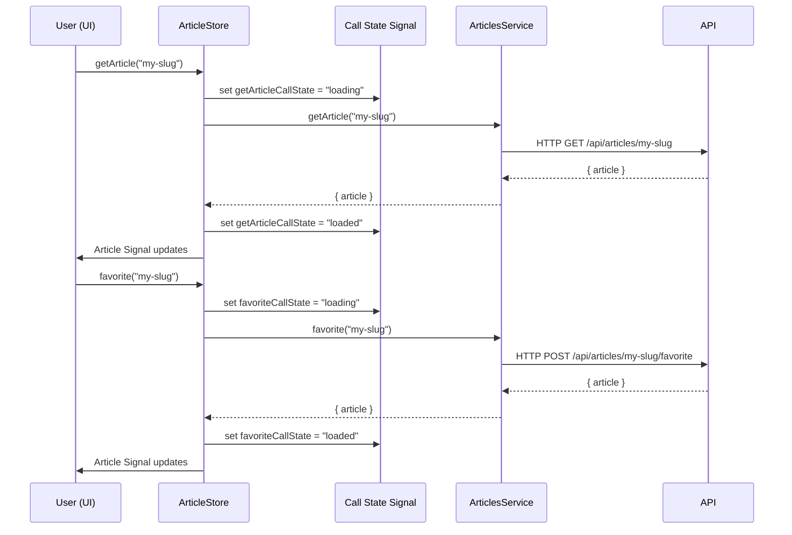

# Chapter 5: Call State Abstraction (withCallState Feature)

[← Signal Store Pattern (NgRx Signal Store)](04_signal_store_pattern__ngrx_signal_store_.md)

---

## Motivation: Why Standardize Loading, Error, and Success States?

Imagine you’re building the Article page for Conduit. The user can:

- Load the article from the backend,
- Load comments,
- Favorite/unfavorite the article,
- Post a comment,
- Delete an article,
- Follow or unfollow the author.

For each user action, the UI must accurately reflect:

- **Loading states:** show spinners or disable buttons when actions are in-flight,
- **Success states:** remove spinners, update UI,
- **Error states:** display precise error messages when things go wrong.

**The Problem:**  
Too often, dev teams end up hand-rolling dozens of `isLoading`, `isLoaded`, and `error` flags for each async action. Each feature handles them differently—sometimes as booleans, sometimes as enums, sometimes as side-effect flags sprinkled around components or services.

This leads to:

- Repetitive code, fragile state updates, copy-paste bugs,
- Inconsistent UX (some calls forget to clear errors/loading),
- Scattered logic—where is the `favoriteError` set? What about `commentLoading`?

**The Solution:**  
Introduce a **call state abstraction**: one standard way—used everywhere—to express, read, and react to the state of any async call. The `withCallState` feature brings this to every Signal Store, supporting as many independent operations as your feature needs.

---

## Central Use Case: The Loading and Error Status “Dashboard”—At the Signal Level

Picture your UI as an air traffic controller’s dashboard:

- Each async operation (load article, favorite, post comment) is a status light.
  - **Green**: Loaded/Success,
  - **Yellow**: Loading,
  - **Red**: Error, with details.
- The UI simply “reads the lights”: Should I show a spinner? Should I show an error message? Has the op succeeded or failed?

Your goal as a developer:  

- **Never hand-roll per-operation flags.**
- **Expose status per call as idiomatic Signals, with consistent names.**
- **Handle as many independent operations as needed (not just one global “loading”).**

---

## Key Concepts: Building Blocks of Call State Abstraction

Let’s break down the `withCallState` abstraction into logical pieces:

### 1. **Call State Model**

Represents the status of *one* async operation.  

```typescript
type CallState = 'init' | 'loading' | 'loaded' | { error: string };
```

- `init`: untouched, never started
- `loading`: operation is in progress
- `loaded`: finished successfully
- `{ error: string }`: failed, with an error string

### 2. **Call State Slice**

A Signal Store manages call states via a “slice” of state.  

- For a single operation: `{ callState: CallState }`
- For multiple named operations: `{ loadArticleCallState, favoriteCallState, postCommentCallState, ... }`

Each operation gets a named slot.

### 3. **Call State Signals**

For every call state slice, the feature auto-generates:

- **Loading Signal:** `loading()` or `loadArticleLoading()`
- **Loaded Signal:** `loaded()` or `loadArticleLoaded()`
- **Error Signal:** `error()` or `loadArticleError()`

Each is a **Signal** computed from the underlying state.

### 4. **Standard Mutators**

Helpers like `setLoading`, `setLoaded`, and `setError` let you update the state slice in a single line, for any operation.

---

## How To Use: Adding Robust Call State To Your Signal Store

Let’s walk through a real-world scenario—*robustly managing loading and error state for `getArticle` and `favorite` actions in an article store*.

### **1. Add withCallState to your Signal Store**

Suppose you have a Signal Store for articles.

```typescript
import { signalStore, withState, withMethods } from '@ngrx/signals';
import { withCallState, setLoading, setLoaded, setError } from '@realworld/core/data-access';
import { ArticleState, articleInitialState } from './models/article.model';
import { ArticlesService } from './services/articles.service';

export const ArticleStore = signalStore(
  { providedIn: 'root' },
  withState<ArticleState>(articleInitialState),
  // Add call state for the "getArticle" async operation
  withCallState({ collection: 'getArticle' }),
  withCallState({ collection: 'favorite' }),
  withMethods((store, articlesService = inject(ArticlesService)) => ({
    getArticle: (slug: string) => {
      // Update call state to loading
      store.patchState(setLoading('getArticle'));
      articlesService.getArticle(slug).subscribe({
        next: ({ article }) => {
          store.patchState({ data: article, ...setLoaded('getArticle') });
        },
        error: (err) => {
          store.patchState(setError(err.message, 'getArticle'));
        }
      });
    },
    favorite: (slug: string) => {
      store.patchState(setLoading('favorite'));
      articlesService.favorite(slug).subscribe({
        next: ({ article }) => {
          store.patchState({ data: article, ...setLoaded('favorite') });
        },
        error: (err) => {
          store.patchState(setError(err.message, 'favorite'));
        }
      });
    },
    // ... more methods
  })),
);
```

**Explanation:**  

- `withCallState({ collection: 'getArticle' })` adds a `getArticleCallState` plus Signals: `getArticleLoading`, `getArticleLoaded`, `getArticleError`.
- You can add as many named call states as you need (for each async operation).
- Call state is updated with a single line (`setLoading`, `setLoaded`, `setError`)—no messy code.

### **2. Use the Signals in Your UI or Smart Features**

```typescript
import { Component, inject } from '@angular/core';
import { ArticleStore } from '@realworld/articles/data-access';

@Component({
  // ...boilerplate
})
export class ArticleComponent {
  private store = inject(ArticleStore);

  $loadingArticle = this.store.getArticleLoading;   // Signal<boolean>
  $getArticleError = this.store.getArticleError;    // Signal<string | null>
  $favoriting = this.store.favoriteLoading;         // Signal<boolean>
  $favoriteError = this.store.favoriteError;        // Signal<string | null>

  // ...component logic
}
```

When you want to show a loader for article fetch:

```html
<div *ngIf="$loadingArticle()">Loading article...</div>
<div *ngIf="$getArticleError()">Failed: {{ $getArticleError() }}</div>
```

When you want to disable the favorite button during operation:

```html
<button [disabled]="$favoriting()" (click)="onFavorite(article.slug)">
  Favorite
</button>
<div *ngIf="$favoriteError()">Favorite failed: {{ $favoriteError() }}</div>
```

**Explanation:**  

- The UI doesn’t *care* how the call state is managed—just reacts to the right named signal.
- No boolean flags floating around; no repeating yourself!

---

### Tip: Single vs. Multi-Operation Call State

- Need only **one** call state for the whole store? Use `withCallState()`—you get `callState`, `loading`, `loaded`, `error` as signals.
- Need **many** parallel operations? Use `withCallState({ collection: '<name>' })` to namespace per operation.

---

## Example: Complete Flow in a Real Feature

**Let’s drive the point home with a usage scenario.**

- User lands on `ArticleComponent`.
- `getArticle('my-slug')` is invoked.
- After loading article, user hits "Favorite".
- We want two *independent* sets of status indicators.

### **Store Setup**

```typescript
export const ArticleStore = signalStore(
  { providedIn: 'root' },
  withState<ArticleState>(articleInitialState),
  withCallState({ collection: 'getArticle' }),
  withCallState({ collection: 'favorite' }),
  // ...methods
);
```

### **UI Layer**

```html
<!-- Inside article.component.html -->
<div *ngIf="$loadingArticle()">Loading article...</div>
<div *ngIf="$getArticleError()">{{ $getArticleError() }}</div>

<!-- ... article display ... -->

<button [disabled]="$favoriting()" (click)="onFavorite(slug)">
  Favorite
</button>
<div *ngIf="$favoriteError()">{{ $favoriteError() }}</div>
```

### **Behind the Scenes: What Actually Happens?**

Let’s visualize the sequence for "get article" then "favorite":



**Explanation:**  

- Each operation sets and clears its own call state (no cross-contamination).
- UI instantly reflects loading/error/success via Signals.
- No risk of UI “stuck” showing loading if a network error occurs—error is also signaled.

---

## Internal Implementation: How `withCallState` Works

### **Design Overview**

1. **Feature Registration**
    - Store is enhanced with a call state slice (e.g. `getArticleCallState`).
    - Adds matching computed Signals for loading, loaded, error.
2. **Standard Mutators**
    - Functions like `setLoading('getArticle')`, `setError(err, 'getArticle')`, etc. update the slice immutably.
3. **Signal Auto-Generation**
    - Each time the slice changes (e.g., to `'loading'`, `'loaded'`, or `{ error }`), computed Signals recalculate.
    - UI components just subscribe to e.g. `getArticleLoading()`, which will be `true` if state is `'loading'` and `false` otherwise.

### **Code (Implementation Walkthrough)**

#### **Feature Registration (`withCallState`)**

```typescript
import { signalStoreFeature, withState, withComputed } from '@ngrx/signals';
import { computed, Signal } from '@angular/core';

export function withCallState<Collection extends string>(config?: { collection: Collection }) {
  const key = config?.collection;
  const callStateKey = key ? `${key}CallState` : 'callState';
  const loadingKey = key ? `${key}Loading` : 'loading';
  const loadedKey = key ? `${key}Loaded` : 'loaded';
  const errorKey = key ? `${key}Error` : 'error';

  return signalStoreFeature(
    withState({ [callStateKey]: 'init' }),
    withComputed((state: Record<string, Signal<unknown>>) => {
      const callState = state[callStateKey] as Signal<CallState>;
      return {
        [loadingKey]: computed(() => callState() === 'loading'),
        [loadedKey]: computed(() => callState() === 'loaded'),
        [errorKey]: computed(() => typeof callState() === 'object' ? callState().error : null),
      };
    }),
  );
}
```

**Explanation:**  

- **withState:** Adds the chosen call state slice (named for each op).
- **withComputed:** Dynamically generates `loading`, `loaded`, and `error` signals for that operation.
- **Naming is consistent:** e.g., `getArticleCallState`, `getArticleLoading`, `getArticleError`, etc.

#### **State Mutators**

```typescript
export function setLoading<Prop extends string>(prop?: Prop): NamedCallStateSlice<Prop> | CallStateSlice {
  if (prop) return { [`${prop}CallState`]: 'loading' } as NamedCallStateSlice<Prop>;
  return { callState: 'loading' };
}
export function setLoaded<Prop extends string>(prop?: Prop): NamedCallStateSlice<Prop> | CallStateSlice {
  if (prop) return { [`${prop}CallState`]: 'loaded' } as NamedCallStateSlice<Prop>;
  return { callState: 'loaded' };
}
export function setError<Prop extends string>(error: string, prop?: Prop): NamedCallStateSlice<Prop> | CallStateSlice {
  if (prop) return { [`${prop}CallState`]: { error } } as NamedCallStateSlice<Prop>;
  return { callState: { error } };
}
```

**Explanation:**  

- Always returns an object to merge immutably into the state; never mutates in place.
- Combine with `.patchState()` in store methods, e.g. `store.patchState(setLoading('getArticle'))`.

---

## Analogy: Industrial Status Lights

**Think of each call state abstraction like the bank of lights in a control room:**

- Rather than wiring up your own bulbs, switches, and colored gels for each machine, you add a **standard pre-made indicator module** for each process.
- Every operator (the UI) knows: green means all’s well, yellow means loading, red means something’s wrong.
- If you add a new machine (operation), just slot in another indicator module—no custom wiring.

---

## Best Practices and Gotchas

**DO:**

- Create one call state slice per independently trackable operation (load, submit, etc.).
- Use the generated Signals directly in your UI (never duplicate flags).
- Reset or re-initialize call state on teardown or navigation away, if needed.
- Centralize all async logic in the Signal Store’s methods, *never* in components.

**DON’T:**

- Mix multiple operations in a single call state (unless you really have only one async op).
- Write new custom flags or side-channel loading/error variables.
- Omit error handling; always set an error (and clear loading) on failure.

---

## Advanced: Deals with Multi-Operation Scenarios

Suppose your **Profile page** loads articles you wrote and articles you favorited—two parallel async queries. You want two *completely independent* loading and error indicators, and the UI should be able to accurately reflect loading for each tab.

```typescript
withCallState({ collection: 'userArticles' }),   // For "my articles"
withCallState({ collection: 'favoriteArticles' }) // For "my favorites"
```

Now in your UI:

```typescript
$myArticlesLoading = this.store.userArticlesLoading;    // true/false
$myArticlesError = this.store.userArticlesError;        // string|null

$favoritedLoading = this.store.favoriteArticlesLoading; // true/false
$favoritedError = this.store.favoriteArticlesError;     // string|null
```

---

## How This Ties Into the Rest of the Architecture

- Used **universally** in all Signal Stores: see [Signal Store Pattern (NgRx Signal Store)](04_signal_store_pattern__ngrx_signal_store_.md).
- Encapsulates per-operation async status robustly—never leaks into UI.
- Works hand-in-hand with UI/presentational component patterns: see [Standalone Smart and Presentational Components Pattern](03_standalone_smart_and_presentational_components_pattern.md).
- Forms the backbone of consistent, user-friendly feedback everywhere, and informs error-handling domains: see [Error Handling Interceptor and Store](08_error_handling_interceptor_and_store.md).

---

## Summary and Transition

**In this chapter, you have learned:**

- The importance of *standardizing* async operation status using the `withCallState` abstraction,
- How to wire robust loading and error signals—by operation—into smart components,
- How to **eliminate manual, error-prone per-operation loading/error flags**,
- Both the implementation and the practical UI usage pattern.

**This abstraction means the UI always “knows what’s happening” for every backend process, reinforcing a world-class user experience.**

---

Ready to take your async robustness further? Next, we’ll see how the project **tackles form error handling**—ensuring detailed, user-friendly validation and error display across your application with a reusable, architecture-integrated pattern.

[→ Form Error Handling Abstraction](06_form_error_handling_abstraction.md)

---

Generated by [AI Codebase Knowledge Generator](https://github.com/vegeta03/codebase-knowledge-generator)
