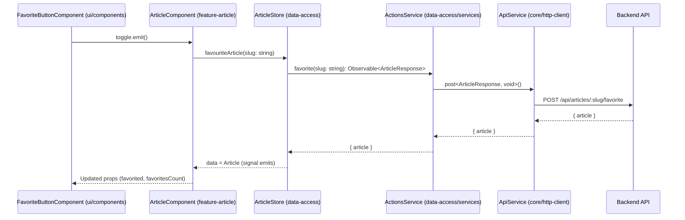

# Chapter 9: API Types (Domain Model Contracts)

[← Error Handling Interceptor and Store](08_error_handling_interceptor_and_store.md)

---

## Motivation: Enforcing Trust with Strongly Typed Domain Model Contracts

As your Angular/Nx RealWorld app grows—team by team, feature by feature—successful communication between client and backend is **mission-critical**. Every feature depends on accurate, up-to-date data:

- Articles, in all their detail
- Users and their credentials
- Profiles, with following/favorited state
- Comments, tags, settings...

A single typo, misspelling, or mismatch in an object shape between layers can lead to:

- Subtle UI bugs (“Why is this field blank?”),
- Catastrophic runtime crashes (“Cannot read property ‘favorited’ of undefined”), or
- Slow, inconsistent onboarding (“Wait, which shape are we using for Article again?”).

**Central Use Case:**  
Suppose you are building the “Favorite Article” feature. Your smart component needs to:

1. Display a list of articles, showing whether each is favorited and how many have favorited it.
2. When a user clicks the ★ button, POST to the backend, get back the updated article, and reflect new favorite status in the UI.

If the **type** for Article—its fields and their types—is not enforced from backend, through API calls, through state stores, and down to the UI, you will ship bugs and create friction for every new developer.

---

## What Are API Types (Domain Model Contracts)?

**API Types** are TypeScript interfaces and types that describe the shape of every domain object in your app, **especially** those exchanged with backend APIs.  
They act as **blueprints** and **legal contracts** between:

- The backend (and its OpenAPI spec, if present),
- Data access services (API Layer),
- State management (Signal Stores),
- Smart components,
- UI/presentational components.

**They are the _single source of truth_ for all data flowing across your architecture.**

---

## Key Concepts

Let's break down API Types into digestible, concrete concepts:

1. **TypeScript Interfaces as Contracts**  
   - Every entity (Article, User, Profile, Comment, etc.) is defined _once_, with all required and optional fields, types, and shapes.
2. **Uniformity Across the Stack**  
   - Every team, every layer, every feature imports types from the same source—no duplication, no hand-written copies, no local tweaks.
3. **Separation from Logic**  
   - API Types do **not** implement business logic. They **only** define data shapes.
4. **Centralized, Version-Controllable Source**  
   - Contracts live in `libs/core/api-types/`—one place, visible to all domains, reviewed and versioned in Git.
5. **Testability and Refactoring Safety**  
   - If models change, TypeScript's type checking and Nx's graph ensure every affected code path fails to compile—enforcing correctness _by design_.

---

## Using API Types: The “Favorite Article” Example E2E

Let’s walk through how API Types flow from backend, through the Data Access Service, Signal Store, Smart Component, and UI for the **Favorite Article** use case.

### 1. API Type Definition: Article

**File: `libs/core/api-types/src/lib/article.ts`**

```typescript
import { Profile } from './profile';

export interface Article {
  slug: string;
  title: string;
  description: string;
  body: string;
  tagList: string[];
  createdAt: string;
  updatedAt: string;
  favorited: boolean;
  favoritesCount: number;
  author: Profile;
}

export interface ArticleResponse {
  article: Article;
}
```

**Explanation:**  

- Defines _exactly_ what fields an Article has, and their types.
- If the backend adds or removes fields, only this file (and downstream dependents) needs changing.
- Other files import from here, ensuring DRYness and accuracy.

### 2. Data Access Service: Using the Contract

**File: `libs/articles/data-access/src/services/actions.service.ts`**

```typescript
import { Injectable, inject } from '@angular/core';
import { ApiService } from '@realworld/core/http-client';
import { ArticleResponse } from '@realworld/core/api-types';
import { Observable } from 'rxjs';

@Injectable({ providedIn: 'root' })
export class ActionsService {
  private readonly apiService = inject(ApiService);

  favorite(slug: string): Observable<ArticleResponse> {
    return this.apiService.post<ArticleResponse, void>(`/articles/${slug}/favorite`);
  }

  unfavorite(slug: string): Observable<ArticleResponse> {
    return this.apiService.delete<ArticleResponse>(`/articles/${slug}/favorite`);
  }
}
```

**Explanation:**  

- The methods’ return values are **strongly typed as `Observable<ArticleResponse>`**.
- All consumers know exactly what fields to expect, with zero ambiguity.

### 3. Signal Store: Storing and Emitting Typed Data

**File: `libs/articles/data-access/src/article.store.ts`**

```typescript
import { signalStore, withState, withMethods, patchState } from '@ngrx/signals';
import { Article } from '@realworld/core/api-types';
import { ActionsService } from './services/actions.service';

interface ArticleState {
  data: Article | null;
}

const initialState: ArticleState = { data: null };

export const ArticleStore = signalStore(
  { providedIn: 'root' },
  withState(initialState),
  withMethods((store, actionsService = inject(ActionsService)) => ({
    favouriteArticle: (slug: string) => {
      actionsService.favorite(slug).subscribe({
        next: ({ article }) => patchState(store, { data: article }),
      });
    },
    // ...other methods
  })),
);
```

**Explanation:**  

- `.data` in the state is always `Article | null`—cannot be arbitrary JSON.
- TS tooling protects you everywhere downstream: only `Article`-shaped objects flow through the store.

### 4. Smart Component: Consuming Article Type

**File: `libs/articles/feature-article/src/article.component.ts`**

```typescript
import { Component, inject } from '@angular/core';
import { ArticleStore } from '@realworld/articles/data-access';
import { Article } from '@realworld/core/api-types';

@Component({
  selector: 'cdt-article',
  template: `
    <button (click)="toggleFavorite($article().slug)">
      <span *ngIf="$article().favorited">★</span>
      <span *ngIf="!$article().favorited">☆</span>
      {{ $article().favoritesCount }}
    </button>
  `
})
export class ArticleComponent {
  private articleStore = inject(ArticleStore);

  $article = this.articleStore.data; // Signal<Article | null>

  toggleFavorite(slug: string) {
    if (this.$article()?.favorited) {
      this.articleStore.unFavouriteArticle(slug);
    } else {
      this.articleStore.favouriteArticle(slug);
    }
  }
}
```

**Explanation:**  

- The smart component receives an `Article` (with all fields, properly typed).
- No guessing or branching on "does `favoritesCount` exist?"—all code is type-safe.

### 5. Presentational UI: Consuming via Type

**File: `libs/ui/components/src/favorite-button.component.ts`**

```typescript
import { Component, Input, Output, EventEmitter } from '@angular/core';

@Component({
  selector: 'cdt-favorite-button',
  template: `
    <button (click)="toggle.emit()">
      <span *ngIf="favorited">★</span>
      <span *ngIf="!favorited">☆</span>
      {{count}}
    </button>
  `
})
export class FavoriteButtonComponent {
  @Input() favorited = false;
  @Input() count = 0;
  @Output() toggle = new EventEmitter<void>();
}
```

**Explanation:**  

- Even in pure UI, documentation and usage are clear: `favorited` and `count` are well-understood properties, derived directly (and correctly typed) from `Article`.

---

## Internal Implementation: What's Actually Happening?

### **Step-by-Step Walkthrough: "Favoriting an Article"—Enforced by Domain Model Contracts**



### **Key Points:**

- At every arrow, **Article** is always **statically** typed—enforced at compile time.
- If the backend adds/removes a field, the API Types contract is updated, and all consumers are **instantly type-checked**.
- There is no risk of consuming the wrong shape—the contract is king.

---

## API Types in the Monorepo: Architecture & Location

### **Where do API Types live?**

```plaintext
libs/
  core/
    api-types/
      src/
        lib/
          article.ts          // Article, ArticleResponse, NewArticle, etc.
          profile.ts          // Profile, ProfileResponse
          comment.ts          // Comment, CommentResponse, etc.
          user.ts             // User, UserResponse
          auth.ts             // Registration, Login, Auth types
        index.ts              // Barrel file exporting all domain models
```

- Every domain or shared entity has its own file.
- `index.ts` publicly (re-)exports all the types for clean root-level importing.

### **How are they referenced?**

All Data Access Services/stores/components import via their TypeScript path alias:

```typescript
import { ArticleResponse, Profile } from '@realworld/core/api-types';
```

- **_Never_ deep import directly from `article.ts`, always from the published API.**
- The Nx project graph tracks these dependencies for reliable boundaries.

---

## Internal Implementation: Example API Types

Let’s review a few foundational type definitions:

### **Article and Profile:**

```typescript
// libs/core/api-types/src/lib/article.ts
import { Profile } from './profile';

export interface Article {
  slug: string;
  title: string;
  description: string;
  body: string;
  tagList: string[];
  createdAt: string;
  updatedAt: string;
  favorited: boolean;
  favoritesCount: number;
  author: Profile;
}
```

### **Profile:**

```typescript
// libs/core/api-types/src/lib/profile.ts
export interface Profile {
  username: string;
  bio: string;
  image: string;
  following: boolean;
  loading: boolean;
}

export interface ProfileResponse {
  profile: Profile;
}
```

### **Comment:**

```typescript
// libs/core/api-types/src/lib/comment.ts
import { Profile } from './profile';

export interface Comment {
  id: number;
  body: string;
  createdAt: string;
  author: Profile;
}
```

### **User:**

```typescript
// libs/core/api-types/src/lib/user.ts
export interface User {
  email: string;
  password: string;
  username: string;
  bio: string;
  image: string;
}
```

### **Auth Requests:**

```typescript
// libs/core/api-types/src/lib/auth.ts
export interface NewUser {
  username: string;
  email: string;
  password: string;
}

export interface LoginUser {
  email: string;
  password: string;
}

export interface NewUserRequest {
  user: NewUser;
}

export interface LoginUserRequest {
  user: LoginUser;
}
```

### **Why do these contracts include both raw entities and "envelope" types (e.g., `Article`, `ArticleResponse`)?**

Because backend REST APIs often wrap entities in structures (e.g., `{ article: Article }`). This enforces exact adherence to the backend's real shape, even if it evolves.

---

## Analogy: API Types as a Legal Contract—Notarized and Public

Think of API Types as the legal document everyone in your company (and the server side!) must sign. Imagine:

- The **backend**: acts as the government registry—publishes rules ("An Article must have a slug, title, author, etc.").
- The **data access layer**: acts as your trusted intermediary ("I will only communicate on forms signed by both parties").
- The **state store**: holds only contract-compliant entities—never forgeries or partials.
- The **UI**: expects to render only forms signed and approved by the contract.

If the law (contract) changes, every part of the company affected must update their practice or risk legal action (compile-time error!). This ensures trust, safety, and predictable operation.

---

## How Backed-Up By Nx & TypeScript

- TypeScript _enforces_ structure:  
  You cannot assign `{}` to an `Article`—it must define all required fields.
- Nx project graph _enforces_ contract location:  
  If anyone tries to redefine `Article` elsewhere, or import across a forbidden boundary, you get a build/lint error.

---

## Beyond API: How API Types Enable Modularization

- [Domain Modularization and Nx Monorepo Structure](01_domain_modularization_and_nx_monorepo_structure.md):
  - API Types are the _common language_ allowing each domain to interoperate without tight coupling—a clean, dependency-inverted boundary.
- [Data Access Services (API Layer)](07_data_access_services__api_layer_.md):
  - Every service returns API Types, never raw JSON.
- [Signal Store Pattern (NgRx Signal Store)](04_signal_store_pattern__ngrx_signal_store_.md):
  - Signal store state is strongly typed; errors or business rules emerge at compile time, early.
- [Standalone Smart and Presentational Components Pattern](03_standalone_smart_and_presentational_components_pattern.md):
  - UI components expect only contract-defined props; reusable in any feature or context.

---

## Best Practices and Gotchas

- **Always import from `@realworld/core/api-types` barrel file!**  
  Never import by deep file path—this ensures API contract changes are visible everywhere.

- **Only API Types should traverse domain boundaries!**  
  Never leak store-internal or UI-specific structures across boundaries.

- **Keep up with backend changes!**  
  Whenever the backend’s API changes shape, immediately update the contract type, triggering faster feedback via TypeScript/Nx.

- **Write types to match the API, even if awkward!**  
  Sometimes backend APIs are “enveloped”: e.g., `{ article: Article }`. Model exactly as received—don’t “helpfully” flatten unless you can control both sides.

- **Document types!**  
  Add comments to clarify tricky fields, relationships, or “gotchas” for onboarding developers.

---

## Summary and Transition

You’ve now seen how **API Types (Domain Model Contracts)** provide the crucial "lingua franca" for every layer of your modern Angular Nx monorepo:

- **Ensuring trust and accuracy**: All data is statically typed across backend, API Layer, Store, and UI.
- **Radically improving maintainability**: All model/contract changes surface at compile time.
- **Speeding up onboarding and collaboration**: Every field, every data shape, is one click away and reliably shareable between teams.
- **Supporting safe, independent evolution**: Backend and frontend can evolve without fear—so long as contracts remain in sync.

By making your API contracts **central, public, and enforced**, you guarantee interoperability and future-proof scaling.

---

With the foundation of strongly typed domain models in place, your teams can build features, refactor, and scale with confidence—knowing that every part of your system "speaks the same language."

---

**Congratulations on mastering the heart of robust Angular monorepo architecture!**

---

**End of Guide.**  
You’ve reached the final chapter. Review earlier chapters or dive deeper into [Nx documentation](https://nx.dev/) and [RealWorld example app code](https://github.com/nenadicm/angular-ngrx-nx-realworld-example-app).

---

---

Generated by [AI Codebase Knowledge Generator](https://github.com/vegeta03/codebase-knowledge-generator)
