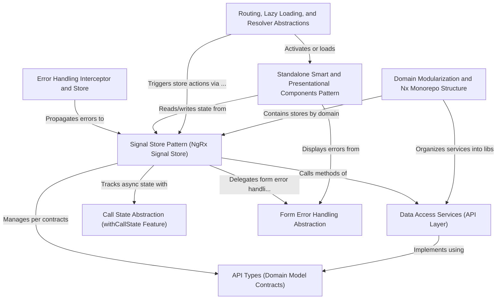

# Tutorial: angular-ngrx-nx-realworld-example-app

This project implements a **real-world Medium-like blogging platform** using *modern Angular*, demonstrating advanced architectural patterns. It leverages a **Signal Store Pattern** (NgRx Signals) for *reactive, immutable state management* and *domain-driven design* in an Nx monorepo. The app features **modular API contracts**, **data access abstraction** (service/repository), centralized **call state** and **form error handling**, and a strict separation of *smart (feature)* and *dumb (presentational)* components. The platform is completely modularized via **Nx** for scalability, uses *zoneless* and *standalone* Angular features, and shows patterns for **lazy loading, resolvers, and global error interception** for robust user experience and maintainability. **API typed contracts** ensure strong TypeScript consistency across all layers.

**Source Repository:** [https://github.com/stefanoslig/angular-ngrx-nx-realworld-example-app](https://github.com/stefanoslig/angular-ngrx-nx-realworld-example-app)

## Chapters

1. [Domain Modularization and Nx Monorepo Structure](01_domain_modularization_and_nx_monorepo_structure.md)
2. [Routing, Lazy Loading, and Resolver Abstractions](02_routing__lazy_loading__and_resolver_abstractions.md)
3. [Standalone Smart and Presentational Components Pattern](03_standalone_smart_and_presentational_components_pattern.md)
4. [Signal Store Pattern (NgRx Signal Store)](04_signal_store_pattern__ngrx_signal_store_.md)
5. [Call State Abstraction (withCallState Feature)](05_call_state_abstraction__withcallstate_feature_.md)
6. [Form Error Handling Abstraction](06_form_error_handling_abstraction.md)
7. [Data Access Services (API Layer)](07_data_access_services__api_layer_.md)
8. [Error Handling Interceptor and Store](08_error_handling_interceptor_and_store.md)
9. [API Types (Domain Model Contracts)](09_api_types__domain_model_contracts_.md)

---

Generated by [AI Codebase Knowledge Generator](https://github.com/vegeta03/codebase-knowledge-generator)
