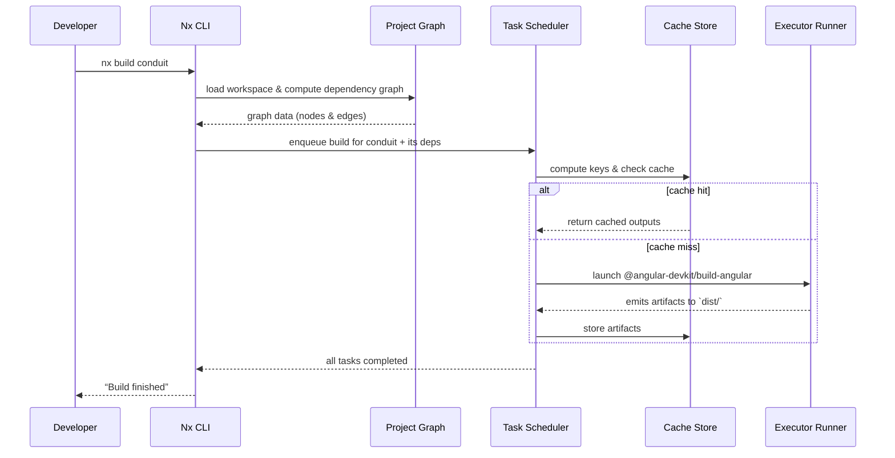
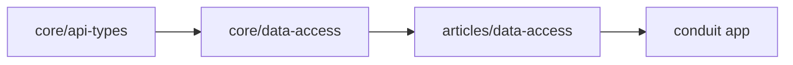

# Chapter 1: Nx Monorepo Workspace

## Motivation: The Many-Repos Problem

Imagine you’re on a team building a RealWorld-style Conduit application in Angular. You’ll need:

- Core API types  
- Data-access libraries for articles, auth, profiles  
- Shared UI components  
- The `conduit` app that glues everything together  

If each of these lived in its own Git repo, you’d end up with:

- Diverging configs (tsconfig, lint, build)  
- Version drift in shared types  
- Painful CI/CD choreographing  
- Harder code sharing and refactoring  

Nx solves this by consolidating **all** apps and libraries under **one workspace**—a Monorepo. Think of it as a university campus:

- **Workspace root** = administration building  
- **Apps** = large lecture halls (runnable Angular/web applications)  
- **Libs** = specialized departments (data-access, UI, features)  
- **Campus map** (`nx.json`, `tsconfig.base.json`) + **Syllabus** (`package.json`) ensure consistent standards and tooling across the board.

### Central Use Case

> You just added a new optional field to the `Article` interface in `libs/core/api-types`. You need to rebuild only the parts of your workspace that depend on that change—not everything.  

With Nx, you simply run:  

```bash
npm run affected:build -- --base=origin/main
```  

Nx will:

1. Compute a **project graph** of imports and dependencies  
2. Identify which projects are affected by your change  
3. Rebuild **only** those projects (and their dependents)  
4. Cache artifacts so future builds are even faster  

---

## 1. Anatomy of an Nx Workspace

```plaintext
.
├── apps
│   └── conduit
│       ├── src
│       ├── project.json
│       └── tsconfig.app.json
├── libs
│   ├── core
│   │   ├── api-types
│   │   │   └── src/index.ts
│   │   └── data-access
│   ├── auth
│   │   └── data-access
│   └── ui
│       └── components
├── nx.json
├── tsconfig.base.json
└── package.json
```

- **apps/**: runnable Angular (or web) applications.  
- **libs/**: shareable Angular libraries (feature, data-access, UI).  
- **project.json** (per project): declares project type, root, targets (build, serve, test).  
- **nx.json**: global defaults for generators, caching rules, named inputs, default project.  
- **tsconfig.base.json**: shared TypeScript compiler options & path aliases.  
- **package.json**: centralized dependencies and Nx scripts.

### 1.1 `nx.json`

Controls generators, caching, and dependency behavior.

```json
{
  "defaultProject": "conduit",
  "generators": {
    "@nx/angular:application": { "style": "css", "linter": "eslint" },
    "@nx/angular:library":     { "linter": "eslint", "unitTestRunner": "jest" }
  },
  "targetDefaults": {
    "build": {
      "dependsOn": ["^build"],
      "inputs":    ["production", "^production"],
      "cache":     true
    },
    "test": {
      "inputs": ["default", "^production", "{workspaceRoot}/jest.preset.js"],
      "cache":  true
    }
  },
  "namedInputs": {
    "default":       ["{projectRoot}/**/*", "sharedGlobals"],
    "sharedGlobals": ["{workspaceRoot}/nx.json", "{workspaceRoot}/tsconfig.base.json"],
    "production":    ["default", "!{projectRoot}/**/*.{spec,test}.*"]
  },
  "parallel":    3,
  "defaultBase": "main"
}
```

- **defaultProject**: used by some Nx commands when no project is specified.  
- **targetDefaults**: `dependsOn` ensures that if you build a lib, its deps are built first.  
- **namedInputs**: groups of files that form the cache key.  

### 1.2 `tsconfig.base.json`

Centralizes TS options and path aliases for imports across apps/libs:

```json
{
  "compilerOptions": {
    "baseUrl": ".",
    "paths": {
      "@realworld/*":                ["libs/*"],
      "@realworld/core/api-types":   ["libs/core/api-types/src/index.ts"],
      "@realworld/articles/data-access": ["libs/articles/data-access/src/index.ts"],
      "...":                         ["..."]
    },
    "strict": true
  }
}
```

- Path aliases let you `import { Article } from '@realworld/core/api-types'` instead of long relative paths.

### 1.3 `package.json`

Defines workspace scripts that wrap `nx` commands:

```json
{
  "scripts": {
    "start":           "nx run conduit:serve",
    "build":           "nx build conduit",
    "test":            "nx test conduit",
    "lint":            "nx lint",
    "dep-graph":       "nx dep-graph",
    "affected:build":  "nx affected:build",
    "affected:test":   "nx affected:test",
    "affected:lint":   "nx affected:lint",
    "format":          "nx format:write --base=main"
  },
  "dependencies": {
    "@angular/core": "19.2.1",
    "@ngrx/signals": "19.0.0-rc.0",
    "@nx/angular":   "20.5.0",
    "...":           "..."
  },
  "devDependencies": {
    "nx":            "20.5.0",
    "@nx/jest":      "20.5.0",
    "@nx/eslint":    "20.5.0",
    "@nx/playwright":"^20.5.0",
    "...":           "..."
  }
}
```

---

## 2. The Nx Execution Pipeline

When you run an Nx command (`nx build`, `nx test`, `nx serve`, or `nx affected:*`), here’s what happens:



- **Project Graph**: built by scanning `project.json` and source imports.  
- **Task Scheduler**: respects `targetDefaults.dependsOn` (e.g. libs built before apps) and concurrency (`parallel: 3`).  
- **Cache**: keyed on file hashes defined in `namedInputs`.  

---

## 3. Practical Walk-Through

### 3.1 Scenario: Updating an API Type

You add a new field to `Article`:

```ts
// libs/core/api-types/src/index.ts
export interface Article {
  id: string;
  title: string;
  description?: string; // ← you added this
}
```

Run:

```bash
npm run affected:build -- --base=origin/main
```

**What happens:**

1. Nx computes the diff between your branch and `origin/main`.  
2. It finds that `libs/core/api-types` changed.  
3. It walks the graph to find dependents—e.g. `core-data-access`, `articles-data-access`, `conduit`.  
4. It enqueues and runs `build` on those projects only.  

**Sample output:**

```bash
>  NX   Running target build for projects:
>    - core-api-types
>    - core-data-access
>    - articles-data-access
>    - conduit
...
>  NX   Build succeeded
```

### 3.2 Generating a New Library

Say you need a `feature-comments` lib under `libs/comments`.

```bash
nx g @nx/angular:library comments-feature-comments \
  --directory=comments \
  --style=scss \
  --unitTestRunner=jest \
  --linter=eslint
```

This creates:

```plaintext
libs/comments/feature-comments/
├── project.json
├── tsconfig.lib.json
└── src
    ├── lib
    │   ├── feature-comments.module.ts
    │   └── feature-comments.component.ts
    └── index.ts
```

- **project.json** is automatically wired into your workspace graph.  
- You can immediately do:  

  ```ts
  import { FeatureCommentsModule } 
    from '@realworld/comments/feature-comments';
  ```

---

## 4. Under the Hood: Graph & Caching Details

### 4.1 Building the Dependency Graph

Nx parses each `project.json` and scans your TypeScript imports, producing a directed graph:



- **Nodes**: each app or lib.  
- **Edges**: “import” relationships (via path aliases or relative imports).

### 4.2 Named Inputs & Cache Keys

Nx uses named inputs to figure out what changes should invalidate the cache:

```json
"namedInputs": {
  "default":       ["{projectRoot}/**/*", "sharedGlobals"],
  "sharedGlobals": ["{workspaceRoot}/nx.json", "{workspaceRoot}/tsconfig.base.json"],
  "production":    ["default", "!{projectRoot}/**/*.{spec,test}.*"]
}
```

- **default**: all files in the project + shared globals.  
- **production**: same as default, but excludes tests/specs.  

Each target’s `inputs` (from `targetDefaults`) choose which named inputs to hash. If the hash matches a previous run, Nx serves the cached output instead of rebuilding.

---

## Conclusion

In this chapter, you learned how Nx:

- Structures your code into a **monorepo** of apps and libs.  
- Centralizes configuration in `nx.json`, `tsconfig.base.json`, and `package.json`.  
- Builds a **dependency graph** to power **affected builds**, **parallelism**, and **caching**.  
- Provides a unified CLI that scales from small projects to large enterprise codebases.

Armed with this foundation, you’re ready to manage application state at scale. In the next chapter we’ll explore [NgRx Signals Store](02_ngrx_signals_store.md), wiring reactive state into our Conduit example.

---

Generated by [AI Codebase Knowledge Generator](https://github.com/vegeta03/codebase-knowledge-generator)
