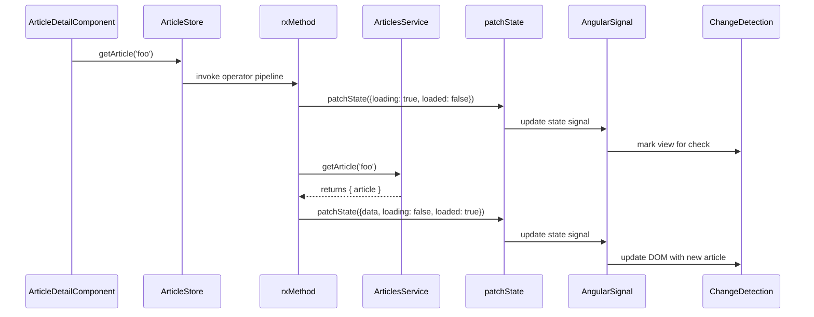

# Chapter 2: NgRx Signals Store

In [Chapter 1: Nx Monorepo Workspace](01_nx_monorepo_workspace.md) we set up our workspace and project structure. Now, let’s tackle the heart of our client-side logic: managing application state with **NgRx Signals Store**, a reactive, type-safe abstraction built on Angular Signals and `@ngrx/signals`.

## Motivation & Central Use Case

In a RealWorld™-style Conduit app, you often need to:

1. Fetch an article by slug.
2. Show a loading spinner while the request is in flight.
3. Render the article once it arrives.
4. Handle errors or retries automatically.

Without a solid abstraction, you end up juggling:

- Component-level `BehaviorSubject`s or `Observable`s.
- Manual subscription/unsubscription.
- Imperative `NgZone.run()` or `markForCheck()` calls.
- Ad-hoc loading flags scattered across components.

**NgRx Signals Store** solves this by centralizing state in injectable “stores” composed of:

- A **signal** holding the current state.
- **Methods** to modify that state (including async RxJS-powered methods).
- **Computed** signals for derived data.
- Automatic change detection via Angular Signals.

Imagine an orchestra conductor (the store) coordinating musicians (signals). When the conductor signals a change, every musician adjusts immediately in perfect harmony.

---

## Key Concepts

1. **signalStore**  
   Defines a new injectable store class.

2. **withState**  
   Bootstraps your store with an initial state signal.

3. **withMethods**  
   Attaches synchronous or asynchronous operations.  
   - Async methods use **rxMethod** to wrap an RxJS operator pipeline.
   - They call **patchState** to immutably update your store’s signal.

4. **withComputed** (optional)  
   Creates derived signals via Angular’s `computed()`.

5. **withCallState** (optional, see [Chapter 3: CallState Feature](03_callstate_feature.md))  
   Tracks loading/loaded/error flags per method collection.

6. **patchState**  
   Safely merges partial updates into your state signal.

7. **Component Subscription**  
   Components simply read signals—no manual subscriptions or `async` pipe needed.

---

## Defining a Store: ArticleStore

Below is a **simplified** ArticleStore focusing on the core pieces. We’ll fetch an article, track loading, and store data.

```ts
// libs/articles/data-access/src/article.store.ts
import { signalStore, withState, withMethods, patchState } from '@ngrx/signals';
import { rxMethod } from '@ngrx/signals/rxjs-interop';
import { switchMap, tap } from 'rxjs';
import { inject } from '@angular/core';
import { ArticlesService } from './services/articles.service';
import { Article } from '@realworld/core/api-types';

// 1) Define the shape of our state
export interface ArticleState {
  data: Article | null;
  loading: boolean;
  loaded: boolean;
}

// 2) Initial state
const initialArticleState: ArticleState = {
  data: null,
  loading: false,
  loaded: false,
};

// 3) Create the store
export const ArticleStore = signalStore(
  { providedIn: 'root' },

  // a) Boot with state signal
  withState<ArticleState>(initialArticleState),

  // b) Attach methods
  withMethods((store) => ({
    // Async Rx-powered method
    getArticle: rxMethod<string>(
      pipe(
        // Before the HTTP call: set loading flag
        tap(() => patchState(store, { loading: true, loaded: false })),
        // Perform HTTP call
        switchMap((slug) => store['articlesService'].getArticle(slug)),
        // On success: patch both data & flags
        tap((response) =>
          patchState(store, {
            data: response.article,
            loading: false,
            loaded: true,
          })
        )
      )
    ),
  }))
);
```

**Explanation**  

- `signalStore(...)` declares a new injectable.  
- `withState` creates an internal `state` signal initialized to `initialArticleState`.  
- `withMethods` adds a `getArticle(slug: string)` method. Under the hood, `rxMethod` wraps the RxJS pipeline and automatically `subscribe()`s.  
- We call `patchState(store, {...})` to replace part of the state immutably.

---

## Using the Store in a Component

Components consume signals directly. No `async` pipe or manual `subscribe` is required:

```ts
// apps/conduit/src/app/article-detail/article-detail.component.ts
import { Component, OnInit, computed, inject } from '@angular/core';
import { ActivatedRoute } from '@angular/router';
import { ArticleStore } from '@realworld/articles/data-access';

@Component({
  selector: 'app-article-detail',
  standalone: true,
  template: `
    <div *ngIf="isLoading(); else showArticle">
      Loading article…
    </div>
    <ng-template #showArticle>
      <h1>{{ article()?.title }}</h1>
      <p>{{ article()?.description }}</p>
    </ng-template>
  `,
})
export class ArticleDetailComponent implements OnInit {
  private route = inject(ActivatedRoute);
  private articleStore = inject(ArticleStore);

  // Signals from the store
  readonly article = computed(() => this.articleStore.state().data);
  readonly isLoading = computed(() => this.articleStore.state().loading);

  ngOnInit() {
    const slug = this.route.snapshot.paramMap.get('slug')!;
    this.articleStore.getArticle(slug); // triggers HTTP + state updates
  }
}
```

- `article()` and `isLoading()` are reactive signals.  
- When `getArticle` patches the state, Angular automatically schedules change detection.

---

## Under the Hood: Execution Flow

Here’s a high-level view of what happens when `getArticle('foo')` is called:



- **rxMethod** wraps your RxJS operators and merges results into `state` via `patchState`.  
- Angular Signals track dependencies and notify the framework to re-render only affected components.

---

## Internal Implementation Sketch

Below is a **simplified** view of how `signalStore`, `withState`, `withMethods`, and `patchState` might be wired together. This is not production code but illustrates the core ideas:

```ts
// @ngrx/signals/src/lib/signal-store.ts
export function signalStore(meta: InjectableConfig, ...features: FeatureFn[]) {
  @Injectable(meta)
  class NgRxSignalStore {
    private _signals = new Map<string, any>();
    constructor() {
      // apply each feature (state, methods, computed, callState)
      for (const feature of features) {
        feature(this);
      }
      // run onInit hooks if any
      this._signals.forEach((sig: any) => sig.onInit?.());
    }
  }
  return NgRxSignalStore;
}

// withState feature
export function withState<T>(initial: T): FeatureFn {
  return (store: any) => {
    const stateSignal = signal(initial);
    store.state = () => stateSignal();            // getter
    (store as any)._signals.set('state', stateSignal);
  };
}

// patchState helper
export function patchState(store: any, patch: Partial<any>) {
  const current = store.state();
  store._signals.get('state').set({ ...current, ...patch });
}

// withMethods feature
export function withMethods(factory: (store: any) => Record<string, any>): FeatureFn {
  return (store: any) => {
    const methods = factory(store);
    Object.assign(store, methods);
  };
}

// rxMethod wrapper
export function rxMethod<T>(ops: OperatorFunction<T, any>) {
  return (store: any, ...args: any[]) => {
    return (input: T) => {
      of(input).pipe(ops).subscribe();
    };
  };
}
```

- `signalStore` composes features into one injectable class.  
- `withState` sets up a private `signal(initial)` and exposes a getter.  
- `patchState` merges and `.set()`s a new value.  
- `withMethods` attaches your methods—`rxMethod` is just a helper to wrap an RxJS pipeline.

---

## Conclusion

In this chapter you learned how to:

- Define an NgRx Signals Store with `signalStore`, `withState`, `withMethods`, and `patchState`.  
- Use `rxMethod` to handle asynchronous logic and immutably update your store.  
- Consume reactive signals in components without manual subscriptions.  
- Peek under the hood at the feature-based architecture of NgRx Signals Store.

Next up, we’ll explore how to track loading, success, and error states per call using **[CallState Feature](03_callstate_feature.md)**.

---

Generated by [AI Codebase Knowledge Generator](https://github.com/vegeta03/codebase-knowledge-generator)
