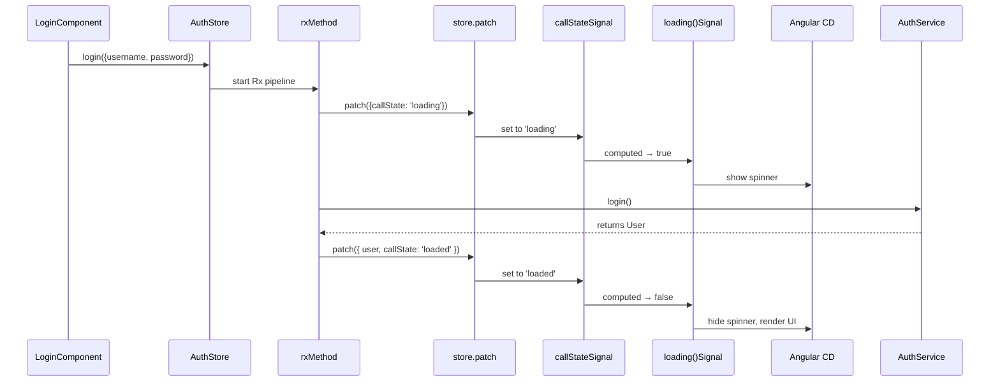

# Chapter 3: CallState Feature

Building on our stores from [Chapter 2: NgRx Signals Store](02_ngrx_signals_store.md), the **CallState Feature** gives you a standardized way to track the lifecycle of asynchronous operations across your application—no more ad-hoc loading flags, error messages, or duplicated boilerplate.

## Motivation & Central Use Case

In any RealWorld-style app, you’ll frequently need to:

- Show a spinner or disable a form button while a request is in flight.
- Render data when the request succeeds.
- Display an error banner if the request fails.

Without a shared abstraction, each feature ends up rolling its own `isLoading`, `isLoaded`, and `errorMessage` logic. The result? Inconsistent UX, scattered code, and a lot of copy-pasta.

**CallState Feature** solves this by modeling each request as a tiny state machine—just like a traffic light:

- “Init” (no request yet)
- “Yellow” (`loading`)
- “Green” (`loaded`)
- “Red” (`error` + message)

It then bundles that raw state with three computed signals—`loading`, `loaded`, `error`—and helper patch functions (`setLoading`, `setLoaded`, `setError`). Your components simply read `store.loading()` or `store.error()`, and the rest “just works.”

---

## Key Concepts

1. **CallState**  
   The core union type:

   ```ts
   type CallState = 'init' | 'loading' | 'loaded' | { error: string };
   ```

2. **State Slice & Keys**  
   - Default slice:

     ```ts
     interface CallStateSlice {
       callState: CallState;
     }
     ```

   - Named slice (for multiple parallel calls):

     ```ts
     interface NamedCallStateSlice<'articles'> {
       articlesCallState: CallState;
     }
     ```

   - `getCallStateKeys(config?)` computes the property names for you:

     ```ts
     // no config
     {
       callStateKey: 'callState',
       loadingKey:   'loading',
       loadedKey:    'loaded',
       errorKey:     'error'
     }

     // config = { collection: 'login' }
     {
       callStateKey: 'loginCallState',
       loadingKey:   'loginLoading',
       loadedKey:    'loginLoaded',
       errorKey:     'loginError'
     }
     ```

3. **Computed Signals**  
   `withCallState()` uses Angular’s `computed()` under the hood to derive:
   - `loading` → `callState === 'loading'`
   - `loaded`  → `callState === 'loaded'`
   - `error`   → `typeof callState === 'object' ? callState.error : null`

4. **Helpers**  

   ```ts
   setLoading(prop?)   // → { callState: 'loading' } or { <prop>CallState: 'loading' }
   setLoaded(prop?)    // → { callState: 'loaded' }  or { <prop>CallState: 'loaded' }
   setError(msg, prop?)// → { callState: {error: msg} } or { <prop>CallState: {error: msg} }
   ```

---

## Integrating CallState into a Store

Here’s a complete example: adding login call‐tracking to an `AuthStore`.

```ts
// libs/auth/data-access/src/lib/auth.store.ts
import { signalStore, withState, withMethods } from '@ngrx/signals';
import { rxMethod } from '@ngrx/signals/rxjs-interop';
import { tap, switchMap, catchError } from 'rxjs/operators';
import { withCallState, setLoading, setLoaded, setError } from '@realworld/core/data-access';
import { AuthService, User } from './auth.service';

export interface AuthState {
  user: User | null;
  // callState + loading(), loaded(), error() come from withCallState()
}

// 1) Initial state
const initialAuthState: AuthState = { user: null };

// 2) Store definition
export const AuthStore = signalStore(
  { providedIn: 'root' },

  // a) Base state
  withState<AuthState>(initialAuthState),

  // b) Add call state machinery
  withCallState(),

  // c) Define methods
  withMethods((store) => ({
    login: rxMethod<{ username: string; password: string }>(
      pipe(
        // ▲ start: turn the light yellow
        tap(() => store.patch(setLoading())),

        // ▲ perform HTTP call
        switchMap((creds) => store.authService.login(creds)),

        // ▲ on success: save user + green light
        tap((user) => {
          store.patch({ user });
          store.patch(setLoaded());
        }),

        // ▲ on error: red light with message
        catchError((err) => {
          store.patch(setError(err.message));
          return EMPTY;
        })
      )
    ),

    logout: () => {
      store.patch({ user: null, ...setLoaded() });
    }
  }))
);
```

Explanation:

- `withCallState()` injects:
  - A raw `callState` signal (initially `'init'`)
  - Computed `loading()`, `loaded()`, and `error()` signals
- Inside your `rxMethod` pipeline you simply:
  1. `store.patch(setLoading())`
  2. Issue API call
  3. On success: `store.patch(setLoaded())`
  4. On error: `store.patch(setError(...))`
- Components then read `authStore.loading()` and `authStore.error()` directly.

---

## Step-by-Step Execution Flow



- **rxMethod** wires your RxJS pipeline to calls to `store.patch()`.
- **withCallState**’s computed signals fire instantly when the raw state updates.
- Angular’s change detection picks up those signals and updates your template.

---

## Under the Hood: Internal Implementation

The logic lives in  
`libs/core/data-access/src/lib/data-access/call-state.feature.ts`.  

### getCallStateKeys

```ts
export function getCallStateKeys(config?: { collection?: string }) {
  const prop = config?.collection;
  return {
    callStateKey: prop ? `${prop}CallState` : 'callState',
    loadingKey:   prop ? `${prop}Loading`   : 'loading',
    loadedKey:    prop ? `${prop}Loaded`    : 'loaded',
    errorKey:     prop ? `${prop}Error`     : 'error',
  };
}
```

### withCallState

```ts
export function withCallState<Collection extends string>(config?: { collection: Collection }) {
  const { callStateKey, loadingKey, loadedKey, errorKey } = getCallStateKeys(config);

  return signalStoreFeature(
    // 1) Add raw state
    withState({ [callStateKey]: 'init' } as Record<string, CallState>),

    // 2) Derive computed props
    withComputed((signals) => {
      const raw = signals[callStateKey] as Signal<CallState>;
      return {
        [loadingKey]: computed(() => raw() === 'loading'),
        [loadedKey]:  computed(() => raw() === 'loaded'),
        [errorKey]:   computed(() => {
          const v = raw();
          return typeof v === 'object' ? v.error : null;
        })
      };
    })
  );
}
```

### Helper Patches

```ts
export function setLoading<Prop extends string>(prop?: Prop) {
  return prop
    ? { [`${prop}CallState`]: 'loading' } as NamedCallStateSlice<Prop>
    : { callState: 'loading' };
}

export function setLoaded<Prop extends string>(prop?: Prop) {
  return prop
    ? { [`${prop}CallState`]: 'loaded' }  as NamedCallStateSlice<Prop>
    : { callState: 'loaded' };
}

export function setError<Prop extends string>(msg: string, prop?: Prop) {
  return prop
    ? { [`${prop}CallState`]: { error: msg } } as NamedCallStateSlice<Prop>
    : { callState: { error: msg } };
}
```

These helpers return the minimal patch object to update your call state, automatically handling default vs. named slices.

---

## Conclusion

With the **CallState Feature** you now have a unified, boilerplate-free system for tracking async request lifecycles:

- Raw `callState` + computed `loading()`, `loaded()`, `error()`
- Helper patches: `setLoading()`, `setLoaded()`, `setError()`
- Consistent UI patterns for spinners, disabled buttons, and error banners

Next up, we’ll encapsulate HTTP calls behind a clean abstraction in our services layer: [API Client Abstraction](04_api_client_abstraction.md).

---

Generated by [AI Codebase Knowledge Generator](https://github.com/vegeta03/codebase-knowledge-generator)
