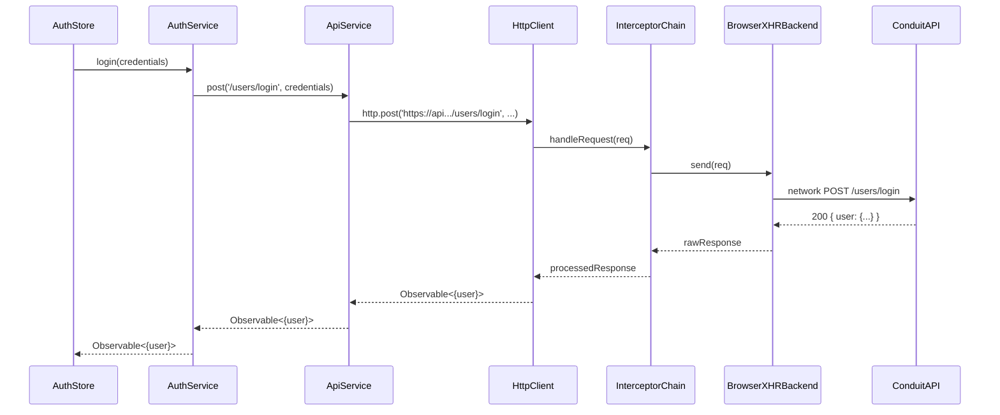

# Chapter 4: API Client Abstraction

Building on the [CallState Feature](03_callstate_feature.md), in this chapter we centralize **all** HTTP interactions behind a single injectable service. Instead of scattering `HttpClient` calls across services and stores (risking mismatched endpoints, forgotten headers, or inconsistent `withCredentials` flags), we’ll use an `ApiService` paired with an `API_URL` injection token. Think of it as a dedicated postal service for your app: every request is stamped with the correct return address (the base URL), packaged under uniform regulations (JSON headers), and delivered via the same courier network (Angular’s `HttpClient` + interceptors).

---

## Motivation & Central Use Case

Imagine implementing an authentication flow in your Conduit app:

1. User submits login form.
2. You call `HttpClient.post('https://api.realworld.com/users/login', { ... })` with JSON headers and `withCredentials: true`.
3. You parse and type the response.
4. Later you call another endpoint, e.g. `GET https://api.realworld.com/user`, but forget to include cookies.
5. A 401 is returned and you waste hours debugging missing headers.

With an **API client abstraction**, you:

- Provide the base URL once via `API_URL`.
- Automagically attach JSON headers & cookies.
- Get strong typing on request and response shapes.
- Never repeat `.get(...)`, `.post(...)` boilerplate.

Let’s build it.

---

## Key Concepts

1. **API_URL Injection Token**  
   A simple `InjectionToken<string>` that holds your API’s base URL.

2. **provideHttpClient + Interceptors**  
   We register Angular’s new standalone HTTP client and any interceptors (e.g. global error handling).

3. **ApiService Wrapper**  
   A small class with typed `get<T>`, `post<T,D>`, `put<T,D>`, and `delete<T>` methods.  
   - Prefixes every URL with `API_URL`.  
   - Sets `Content-Type: application/json` and `Accept: application/json`.  
   - Enables `withCredentials: true` for cookie-based auth.

4. **Strong Typing & DI Safety**  
   Consumers `inject(ApiService)` and call methods like `api.post<LoginResponse, LoginPayload>('/users/login', payload)`—never a raw URL string again.

---

## 1. Supplying the Base URL in App Config

In `apps/conduit/src/app/app.config.ts`, register both the HTTP client and the `API_URL` provider:

```ts
// apps/conduit/src/app/app.config.ts
import { ApplicationConfig, provideExperimentalZonelessChangeDetection } from '@angular/core';
import { provideRouter, withComponentInputBinding, withViewTransitions } from '@angular/router';
import { provideHttpClient, withInterceptors } from '@angular/common/http';
import { errorHandlingInterceptor } from '@realworld/core/error-handler';
import { API_URL } from '@realworld/core/http-client';
import { environment } from '../environments/environment';
import { authGuard } from '@realworld/auth/data-access';

export const appConfig: ApplicationConfig = {
  providers: [
    // Enable zoneless change detection
    provideExperimentalZonelessChangeDetection(),

    // Register routes, guards, and view transitions
    provideRouter(
      [
        // ... your routes here ...
      ],
      withViewTransitions(),
      withComponentInputBinding()
    ),

    // Attach Angular’s standalone HTTP client + a global error interceptor
    provideHttpClient(withInterceptors([errorHandlingInterceptor])),

    // Supply the base URL for ApiService
    { provide: API_URL, useValue: environment.api_url },

    // Any other global providers...
  ],
};
```

Explanation  

- `provideHttpClient(withInterceptors([...]))` sets up `HttpClient`.  
- `{ provide: API_URL, useValue: environment.api_url }` binds your environment’s API URL to the injection token.

---

## 2. Defining the API_URL Token

Create a lightweight injection token in `libs/core/http-client/src/lib/api-url.token.ts`:

```ts
// libs/core/http-client/src/lib/api-url.token.ts
import { InjectionToken } from '@angular/core';

export const API_URL = new InjectionToken<string>('API_URL');
```

Explanation  

- Clients will `inject(API_URL)` to retrieve the base URL.  
- Using a token avoids hard-coding strings throughout your code.

---

## 3. Implementing ApiService

In `libs/core/http-client/src/lib/api.service.ts` we wrap Angular’s `HttpClient`:

```ts
// libs/core/http-client/src/lib/api.service.ts
import { Injectable, inject } from '@angular/core';
import { HttpClient, HttpParams, HttpHeaders } from '@angular/common/http';
import { Observable } from 'rxjs';
import { API_URL } from './api-url.token';

@Injectable({ providedIn: 'root' })
export class ApiService {
  // Inject the standalone HttpClient and the base URL token
  private readonly http = inject(HttpClient);
  private readonly apiUrl = inject(API_URL);

  /** GET request with typed response T and optional query params */
  get<T>(url: string, params: HttpParams = new HttpParams()): Observable<T> {
    return this.http.get<T>(`${this.apiUrl}${url}`, {
      headers: this.headers,
      params,
      withCredentials: true,
    });
  }

  /** POST with request body D and response T */
  post<T, D>(url: string, data?: D): Observable<T> {
    return this.http.post<T>(
      `${this.apiUrl}${url}`,
      JSON.stringify(data),
      { headers: this.headers, withCredentials: true }
    );
  }

  /** PUT with request body D and response T */
  put<T, D>(url: string, data: D): Observable<T> {
    return this.http.put<T>(
      `${this.apiUrl}${url}`,
      JSON.stringify(data),
      { headers: this.headers, withCredentials: true }
    );
  }

  /** DELETE request with typed response T */
  delete<T>(url: string): Observable<T> {
    return this.http.delete<T>(`${this.apiUrl}${url}`, {
      headers: this.headers,
      withCredentials: true,
    });
  }

  /** Common JSON headers */
  private get headers(): HttpHeaders {
    return new HttpHeaders({
      'Content-Type': 'application/json',
      Accept: 'application/json',
    });
  }
}
```

Explanation  

- Every method prefixes `url` with `this.apiUrl`.  
- We `stringify` JSON bodies and set `withCredentials: true` to include cookies.  
- Consumers never need to remember headers or base URLs themselves.

---

## 4. Using ApiService in a Feature Service

Let’s build an `AuthService` in `libs/auth/data-access/src/lib/auth.service.ts`:

```ts
// libs/auth/data-access/src/lib/auth.service.ts
import { Injectable, inject } from '@angular/core';
import { ApiService } from '@realworld/core/http-client';
import {
  ILoginRequest,
  ILoginResponse,
  IRegisterRequest,
  IRegisterResponse,
  IProfileResponse,
  IUpdateUserRequest,
  IUpdateUserResponse
} from '@realworld/core/api-types';
import { Observable } from 'rxjs';

@Injectable({ providedIn: 'root' })
export class AuthService {
  private readonly api = inject(ApiService);

  // Login user and receive a typed response
  login(data: ILoginRequest): Observable<ILoginResponse> {
    return this.api.post<ILoginResponse, ILoginRequest>('/users/login', data);
  }

  // Register a new user
  register(data: IRegisterRequest): Observable<IRegisterResponse> {
    return this.api.post<IRegisterResponse, IRegisterRequest>('/users', data);
  }

  // Fetch current user profile
  getCurrentUser(): Observable<IProfileResponse> {
    return this.api.get<IProfileResponse>('/user');
  }

  // Update user data
  updateUser(data: IUpdateUserRequest): Observable<IUpdateUserResponse> {
    return this.api.put<IUpdateUserResponse, IUpdateUserRequest>('/user', data);
  }
}
```

Explanation  

- `AuthService` delegates every HTTP call to `ApiService`.  
- Strong typing ensures you can’t mix up request and response shapes.

---

## 5. High-Level Flow: Sequence Diagram

Here’s what happens under the hood when `authService.login(...)` is called:



- **AuthStore** triggers the call.  
- **AuthService** delegates to **ApiService**.  
- **ApiService** calls **HttpClient**, which flows through interceptors to the network and back.

---

## 6. Internal Implementation Recap

- **App Config** (`apps/conduit/src/app/app.config.ts`) wires up `provideHttpClient` + `API_URL`.  
- **API_URL Token** lives in `libs/core/http-client/src/lib/api-url.token.ts`.  
- **ApiService** implements `get`, `post`, `put`, and `delete` in `libs/core/http-client/src/lib/api.service.ts`.  
- Consumers simply inject and call typed methods; no manual URL concatenation or header management.

---

## Conclusion

You now have:

- A single place to configure your API’s base URL.
- A typed, consistent wrapper over Angular’s `HttpClient`.
- Automatic JSON headers and cookie support.
- Reduced duplication, fewer runtime mistakes, and stronger compile-time guarantees.

With HTTP calls cleanly abstracted, you’re ready to implement your authentication state in [Authentication Store & Service](05_authentication_store___service.md).

---

Generated by [AI Codebase Knowledge Generator](https://github.com/vegeta03/codebase-knowledge-generator)
