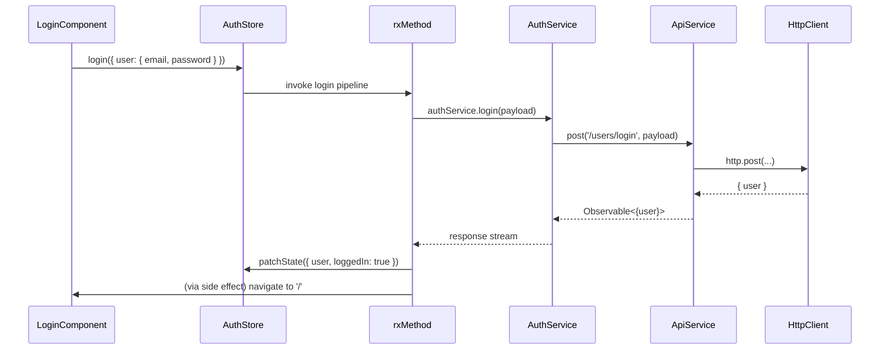

# Chapter 5: Authentication Store & Service

Building on our HTTP abstraction in [Chapter 4: API Client Abstraction](04_api_client_abstraction.md), we now need a unified system to manage user identity: fetching the current user, registering, logging in, logging out, and protecting routes. This chapter shows how to couple an **AuthStore** with an **AuthService** and an **authGuard**, leveraging NgRx Signals Store and the CallState feature.

---

## Motivation & Central Use Case

In a RealWorld™‐style Conduit app, you typically need to:

1. On app startup, check if the visitor already has a valid session (via cookie/JWT) and load the current user profile.
2. Present login and registration forms, handle server‐side validation errors, and navigate to the home page on success.
3. Maintain a reactive, global `loggedIn` flag and `currentUser` object.
4. Protect certain routes—like the article editor—from unauthorized access.

Think of this like an airport security system:

- **Passenger credential check**: the user presents login details (AuthService).
- **Identity verification**: the backend validates and returns a JWT cookie plus a user profile (AuthService).
- **Boarding pass issuance**: we store `loggedIn = true` and the `currentUser` (AuthStore).
- **Gate checks**: route guards read the store’s `loggedIn` flag before allowing access (authGuard).
- **Lounge access**: only authenticated users can visit restricted routes.

We’ll implement:

- An **AuthService** that calls our REST API via the `ApiService`.
- An **AuthStore** that wraps calls in `rxMethod` pipelines, patches state, dispatches side effects, and tracks a “get user” lifecycle with CallState.
- An **authGuard** that blocks or redirects unauthorized route activation.
- Optional integration with a **FormErrorsStore** (see [Chapter 10: Form Error Handling Mechanism](10_form_error_handling_mechanism.md)) to display validation errors in forms.

---

## 1. Defining the Auth State

First, let’s define our in-memory state shape. We’ll keep a `User` record and a simple `loggedIn` boolean. We’ll also export an initial empty‐user value for resetting on logout.

```ts
// libs/auth/data-access/src/lib/auth.model.ts
import { User } from '@realworld/core/api-types';

export interface AuthState {
  user: User;
  loggedIn: boolean;
}

// A blank/default user shape (no real data)
export const initialUserValue: User = {
  email: '',
  token: '',
  username: '',
  bio: null,
  image: null,
};

export const authInitialState: AuthState = {
  user: initialUserValue,
  loggedIn: false,
};
```

Explanation  

- We never store `User | null`—we always have a `user` object (initially empty).  
- `loggedIn` flips to `true` only after a successful fetch or login.  

---

## 2. AuthService: Communicating with the Backend

Our `AuthService` wraps the low-level `ApiService` calls to the `/users` endpoints.

```ts
// libs/auth/data-access/src/services/auth.service.ts
import { Injectable, inject } from '@angular/core';
import { ApiService } from '@realworld/core/http-client';
import {
  ILoginRequest,
  ILoginResponse,
  IRegisterRequest,
  IRegisterResponse,
  IUserUpdateRequest,
  IUserUpdateResponse,
  IProfileResponse
} from '@realworld/core/api-types';
import { Observable } from 'rxjs';

@Injectable({ providedIn: 'root' })
export class AuthService {
  private readonly api = inject(ApiService);

  // Fetch the current user (requires a valid cookie/JWT)
  getCurrentUser(): Observable<IProfileResponse> {
    return this.api.get<IProfileResponse>('/user');
  }

  // Update the logged-in user’s profile
  updateUser(data: IUserUpdateRequest): Observable<IUserUpdateResponse> {
    return this.api.put<IUserUpdateResponse, IUserUpdateRequest>('/user', data);
  }

  // Login: returns the user and sets a cookie/JWT
  login(data: ILoginRequest): Observable<ILoginResponse> {
    return this.api.post<ILoginResponse, ILoginRequest>('/users/login', data);
  }

  // Register a new account
  register(data: IRegisterRequest): Observable<IRegisterResponse> {
    return this.api.post<IRegisterResponse, IRegisterRequest>('/users', data);
  }

  // Logout: invalidates the session on the server
  logout(): Observable<{ message: string }> {
    return this.api.post<{ message: string }, void>('/users/logout');
  }
}
```

Explanation  

- Each method returns a typed `Observable<…>`.  
- We don’t manage HTTP headers or base URLs here—that’s in the `ApiService` from [Chapter 4](04_api_client_abstraction.md).  

---

## 3. AuthStore: State, Methods & CallState

We now build our `AuthStore` using `signalStore`, `withState`, `withMethods`, and `withCallState`. We’ll:

- Initialize state from `authInitialState`.  
- Add methods for `getUser`, `login`, `register`, `updateUser`, and `logout`.  
- Track the “getUser” call lifecycle (loading/loaded/error) via `withCallState({ collection: 'getUser' })`.  
- On error, delegate to a `FormErrorsStore` (see [Chapter 10](10_form_error_handling_mechanism.md)).  
- On success, patch state and navigate using Angular’s `Router`.

```ts
// libs/auth/data-access/src/auth.store.ts
import { signalStore, withState, withMethods, patchState } from '@ngrx/signals';
import { rxMethod } from '@ngrx/signals/rxjs-interop';
import { exhaustMap, switchMap } from 'rxjs/operators';
import { tapResponse } from '@ngrx/operators';
import { AuthState, authInitialState, initialUserValue } from './auth.model';
import { AuthService } from './services/auth.service';
import { FormErrorsStore } from '@realworld/core/forms';
import { Router } from '@angular/router';
import { withCallState, setLoaded } from '@realworld/core/data-access';

export const AuthStore = signalStore(
  { providedIn: 'root' },

  // 1) Base state
  withState<AuthState>(authInitialState),

  // 2) CallState for getUser
  withCallState({ collection: 'getUser' }),

  // 3) Methods
  withMethods((store,
               formErrorsStore = inject(FormErrorsStore),
               authService = inject(AuthService),
               router = inject(Router)) => ({

    // Fetch current user on app init
    getUser: rxMethod<void>(
      pipe(
        // SwitchMap ensures previous in-flight getUser is cancelled
        switchMap(() => authService.getCurrentUser()),
        tapResponse({
          next: ({ user }) => {
            patchState(store, { user, loggedIn: true, ...setLoaded('getUser') });
          },
          error: () => {
            // keep loggedIn=false on error
            patchState(store, setLoaded('getUser'));
          }
        })
      )
    ),

    // Login form submission
    login: rxMethod<{ user: { email: string; password: string } }>(
      pipe(
        exhaustMap((payload) =>
          authService.login(payload).pipe(
            tapResponse({
              next: ({ user }) => {
                patchState(store, { user, loggedIn: true });
                router.navigateByUrl('/');
              },
              error: ({ error }) => formErrorsStore.setErrors(error.errors)
            })
          )
        )
      )
    ),

    // Register new user
    register: rxMethod<{ user: { username: string; email: string; password: string } }>(
      pipe(
        exhaustMap((payload) =>
          authService.register(payload).pipe(
            tapResponse({
              next: ({ user }) => {
                patchState(store, { user, loggedIn: true });
                router.navigateByUrl('/');
              },
              error: ({ error }) => formErrorsStore.setErrors(error.errors)
            })
          )
        )
      )
    ),

    // Update existing user
    updateUser: rxMethod<{ user: Partial<{ email: string; username: string; bio: string; image: string }> }>(
      pipe(
        exhaustMap((payload) =>
          authService.updateUser(payload).pipe(
            tapResponse({
              next: ({ user }) => {
                patchState(store, { user });
                router.navigate(['profile', user.username]);
              },
              error: ({ error }) => formErrorsStore.setErrors(error.errors)
            })
          )
        )
      )
    ),

    // Logout and reset state
    logout: rxMethod<void>(
      pipe(
        exhaustMap(() =>
          authService.logout().pipe(
            tapResponse({
              next: () => {
                patchState(store, { user: initialUserValue, loggedIn: false });
                router.navigateByUrl('/login');
              },
              error: ({ error }) => formErrorsStore.setErrors(error.errors)
            })
          )
        )
      )
    ),
  }))
);
```

Explanation  

- `withState` bootstraps `state()` with `{ user, loggedIn }`.  
- `withCallState({ collection: 'getUser' })` adds:
  - a raw `getUserCallState` signal,
  - computed `getUserLoading()`, `getUserLoaded()`, `getUserError()`.
- Each `rxMethod` wraps an RxJS pipeline:
  - `tapResponse` cleanly splits success and error handlers.
  - On success we `patchState` and navigate.
  - On error we feed server‐side field errors into `FormErrorsStore`.  
- `logout` resets the user to `initialUserValue` and flips `loggedIn` off.

---

## 4. Protecting Routes with authGuard

Finally, we wire up a guard that reads `AuthStore`’s `loggedIn()` signal. Unauthenticated users are redirected to `/login`.

```ts
// libs/auth/data-access/src/services/auth-guard.ts
import { inject } from '@angular/core';
import { Router, UrlTree } from '@angular/router';
import { AuthStore } from '../auth.store';

export const authGuard = (): boolean | UrlTree => {
  const router = inject(Router);
  const authStore = inject(AuthStore);

  return authStore.state().loggedIn
    ? true
    : router.parseUrl('/login');
};
```

Usage in your app routes (e.g. in `app.config.ts`):

```ts
import { provideRouter } from '@angular/router';
import { authGuard } from '@realworld/auth/data-access';

const routes = [
  { path: '', component: HomeComponent },
  { path: 'editor', component: EditorComponent, canActivate: [authGuard] },
  // ...
];

export const appConfig = {
  providers: [
    provideRouter(routes),
    // ...
  ]
};
```

---

## 5. Sequence Diagram: Login Flow

Here’s a step-by-step view of what happens when a component calls `authStore.login(...)`:



---

## 6. Under the Hood: Key Building Blocks

Much of `AuthStore`’s wiring relies on primitives from **NgRx Signals Store** and **CallState Feature**:

- **signalStore**: composes state, methods, computed, and callState into one injectable class.  
- **withState**: creates an internal `signal(initialState)` + a `state()` getter.  
- **withMethods**: attaches your custom methods onto the store instance.  
- **rxMethod**: wraps an RxJS operator pipeline, auto-subscribes, and scopes it to the store.  
- **patchState(store, patch)**: immutably merges a partial patch into the current state signal.  
- **withCallState(config)**: injects a call-lifecycle signal + computed `loading()`, `loaded()`, `error()` helpers.

If you peek at `@ngrx/signals` and `@realworld/core/data-access`, you’ll see these utilities under the hood:

```ts
// Simplified rxMethod
function rxMethod<T>(ops: OperatorFunction<T, any>) {
  return (store: any, ...args: T[]) => {
    of(...args)
      .pipe(ops)
      .subscribe(); // auto-subscribe to drive side effects
  };
}

// Simplified patchState
function patchState(store: any, patch: Partial<any>) {
  const current = store.state();
  store._signals.get('state').set({ ...current, ...patch });
}
```

All together, this makes your Auth flow:

- **Declarative**: define intent in one place.
- **Reactive**: state is a signal; components read `authStore.state()` or computed selectors.
- **Self-contained**: HTTP calls, loading/error tracking, side-effects, and routing logic live in the store.

---

## 7. Using AuthStore in Components

### 7.1 AppComponent: Fetch Current User on Startup

```ts
@Component({ selector: 'app-root', template: `<router-outlet/>` })
export class AppComponent implements OnInit {
  constructor(private authStore: AuthStore) {}

  ngOnInit() {
    // Kick off "who am I?" request
    this.authStore.getUser();
  }
}
```

### 7.2 LoginComponent: Trigger Login & Display Errors

```ts
@Component({
  selector: 'login-page',
  template: `
    <form (ngSubmit)="onSubmit()">
      <!-- form fields -->
      <button [disabled]="authStore.getUserLoading()">
        Login
      </button>
    </form>
    <app-form-errors [errors]="formErrors.errors$"></app-form-errors>
  `
})
export class LoginComponent {
  readonly formErrors = inject(FormErrorsStore);
  constructor(public authStore: AuthStore) {}

  onSubmit() {
    // Suppose we have a formGroup with controls `email` and `password`
    const payload = { user: this.loginForm.value };
    this.authStore.login(payload);
  }
}
```

---

## Conclusion

In this chapter you learned how to:

- Define an **AuthService** that hides HTTP details behind `ApiService`.  
- Build a comprehensive **AuthStore** with NgRx Signals Store, `rxMethod` pipelines, and CallState for the “get current user” flow.  
- Handle server-side form errors via `FormErrorsStore` and navigate on success.  
- Protect routes with a simple `authGuard` that reads from the store.

With authentication fully wired up, we can now turn our attention to managing **article data** in [Chapter 6: Articles Data Stores & Services](06_articles_data_stores___services.md).

---

Generated by [AI Codebase Knowledge Generator](https://github.com/vegeta03/codebase-knowledge-generator)
