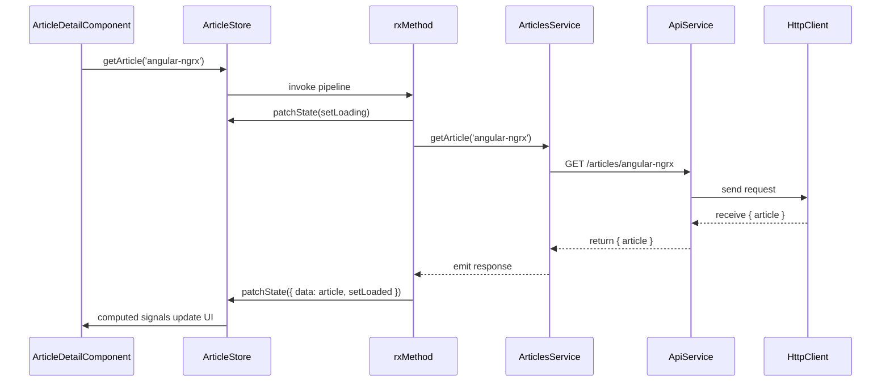

# Chapter 6: Articles Data Stores & Services

Building on [Chapter 5: Authentication Store & Service](05_authentication_store___service.md), we now tackle the heart of article-related features in our Conduit app. We’ll introduce two NgRx Signals stores—**ArticleStore** for a single-article view (and its comments) and **ArticlesListStore** for paginated lists—and two services—**ArticlesService** for CRUD operations and **ActionsService** for follow/favorite side effects.

---

## Motivation & Central Use Case

Imagine you’re an editor in a digital newsroom:

- **News feed desk** curates headlines, paginates stories, filters by author or tag.
- **Detailed reporting desk** focuses on one story—fetching the article, loading its comments, and updating metadata (favorites, follows).
- **Actions desk** updates publication metadata (following authors, favoriting articles).

In our app:

1. **Browse the feed**: see a list of articles, page through, filter by tag or author.
2. **Read an article**: click a headline, load its content and comments.
3. **Interact**: favorite/unfavorite, follow/unfollow, add or delete comments.
4. **Edit or delete** (if you’re the author).

We need a clean abstraction to:

- Fetch and cache data.
- Track loading/error state per operation.
- Expose a simple API to components.
- Keep HTTP details in one place.

Enter **ArticleStore**, **ArticlesListStore**, **ArticlesService**, and **ActionsService**, all wired up with **rxMethod** pipelines and **CallState** from [Chapter 2: NgRx Signals Store](02_ngrx_signals_store.md) & [Chapter 3: CallState Feature](03_callstate_feature.md).

---

## Key Concepts

1. **ArticleStore**  
   - Manages one article (`data`) and its comments array.  
   - Tracks two call-states: `getArticle` and `getComments`.  
   - Exposes methods:  
     - `getArticle(slug)`, `getComments(slug)`  
     - `followUser(username)`, `unfollowUser(username)`  
     - `favouriteArticle(slug)`, `unFavouriteArticle(slug)`  
     - `addComment(text)`, `deleteComment({ commentId, slug })`  
     - `deleteArticle(slug)`, `publishArticle(article)`, `editArticle(article)`  
     - `initializeArticle()` (reset to initial state)

2. **ArticlesListStore**  
   - Holds a paginated list of articles and a `listConfig` (filters, page).  
   - Computes `totalPages` from `articlesCount` and `limit`.  
   - Tracks one call-state: `getArticles`.  
   - Methods:  
     - `loadArticles(config)`  
     - `setListConfig(config)`, `setListPage(page)`  
     - `favouriteArticle(slug)`, `unFavouriteArticle(slug)`

3. **ArticlesService** (in `libs/articles/data-access`)  
   - Pure HTTP calls via our `ApiService` (see [Chapter 4: API Client Abstraction](04_api_client_abstraction.md)).  
   - Methods: `getArticle`, `getComments`, `query`, `publishArticle`, `editArticle`, `deleteArticle`, `deleteComment`, `addComment`.

4. **ActionsService**  
   - Side-effect endpoints that wrap profile follow/unfollow and article favorite/unfavorite calls.

5. **CallState & rxMethod**  
   - From [Chapter 2](02_ngrx_signals_store.md) & [Chapter 3](03_callstate_feature.md), letting us track per-operation loading/loaded/error flags and wire up RxJS pipelines that auto-subscribe and patch state.

---

## 1. ArticleStore: Managing One Story

### 1.1 State Shape & Initial State

```ts
// libs/articles/data-access/src/models/article.model.ts
import { Comment, Article } from '@realworld/core/api-types';

export interface ArticleState {
  data: Article | null;
  comments: Comment[];
  getArticleCallState: CallState;   // from CallState feature
  getCommentsCallState: CallState;  // from CallState feature
}

export const articleInitialState: ArticleState = {
  data: null,
  comments: [],
  getArticleCallState: 'init',
  getCommentsCallState: 'init',
};
```

> We always keep a `data` slot (null or Article) and a `comments` array, plus two `CallState` flags.

### 1.2 Store Definition

```ts
// libs/articles/data-access/src/article.store.ts
import { signalStore, withState, withMethods, patchState } from '@ngrx/signals';
import { withCallState, setLoading, setLoaded } from '@realworld/core/data-access';
import { rxMethod } from '@ngrx/signals/rxjs-interop';
import { tapResponse } from '@ngrx/operators';
import { switchMap, concatMap, tap } from 'rxjs/operators';
import { ArticleState, articleInitialState } from './models/article.model';
import { ArticlesService } from './services/articles.service';
import { ActionsService } from './services/actions.service';
import { FormErrorsStore } from '@realworld/core/forms';
import { Router } from '@angular/router';

export const ArticleStore = signalStore(
  { providedIn: 'root' },

  // 1) Base state
  withState<ArticleState>(articleInitialState),

  // 2) Two call states: getArticle & getComments
  withCallState({ collection: 'getArticle' }),
  withCallState({ collection: 'getComments' }),

  // 3) Methods
  withMethods((store,
               articlesService = inject(ArticlesService),
               actionsService = inject(ActionsService),
               router = inject(Router),
               formErrorsStore = inject(FormErrorsStore)) => ({

    // Fetch article by slug
    getArticle: rxMethod<string>(
      pipe(
        // Switch loading flag on
        tap(() => patchState(store, { ...setLoading('getArticle') })),
        switchMap((slug) => articlesService.getArticle(slug)),
        tapResponse({
          next: ({ article }) => patchState(store, {
            data: article,
            ...setLoaded('getArticle')
          }),
          error: () => patchState(store, {
            data: null,
            ...setLoaded('getArticle')
          })
        })
      )
    ),

    // Load its comments
    getComments: rxMethod<string>(
      pipe(
        tap(() => patchState(store, { ...setLoading('getComments') })),
        switchMap((slug) => articlesService.getComments(slug)),
        tapResponse({
          next: ({ comments }) => patchState(store, {
            comments,
            ...setLoaded('getComments')
          }),
          error: () => patchState(store, {
            comments: [],
            ...setLoaded('getComments')
          })
        })
      )
    ),

    // Follow or unfollow the article’s author
    followUser: rxMethod<string>(
      pipe(
        switchMap((username) => actionsService.followUser(username)),
        tap(({ profile }) => patchState(store, {
          data: { ...store.data()!, author: profile }
        }))
      )
    ),
    unfollowUser: rxMethod<string>(
      pipe(
        switchMap((username) => actionsService.unfollowUser(username)),
        tap(({ profile }) => patchState(store, {
          data: { ...store.data()!, author: profile }
        }))
      )
    ),

    // Favorite / unfavorite the article
    favouriteArticle: rxMethod<string>(
      pipe(
        concatMap((slug) => actionsService.favorite(slug)),
        tapResponse({
          next: ({ article }) => patchState(store, { data: article }),
          error: () => {/* keep old data on error */}
        })
      )
    ),
    unFavouriteArticle: rxMethod<string>(
      pipe(
        concatMap((slug) => actionsService.unfavorite(slug)),
        tapResponse({
          next: ({ article }) => patchState(store, { data: article }),
          error: () => {}
        })
      )
    ),

    // Add or delete a comment
    addComment: rxMethod<string>(
      pipe(
        switchMap((body) =>
          articlesService.addComment(store.data()!.slug, body)
        ),
        tapResponse({
          next: ({ comment }) => patchState(store, {
            comments: [comment, ...store.comments()]
          }),
          error: ({ error }) => formErrorsStore.setErrors(error.errors)
        })
      )
    ),
    deleteComment: rxMethod<{ commentId: number; slug: string }>(
      pipe(
        switchMap(({ commentId, slug }) =>
          articlesService.deleteComment(commentId, slug)
        ),
        tap(() => patchState(store, {
          comments: store.comments().filter(c => c.id !== commentId)
        }))
      )
    ),

    // Publish, edit, or remove article
    publishArticle: rxMethod<NewArticle>(
      pipe(
        switchMap((newArt) => articlesService.publishArticle(newArt)),
        tapResponse({
          next: ({ article }) => router.navigate(['article', article.slug]),
          error: ({ error }) => formErrorsStore.setErrors({ errors: error.errors })
        })
      )
    ),
    editArticle: rxMethod<Article>(
      pipe(
        switchMap((art) => articlesService.editArticle(art)),
        tapResponse({
          next: ({ article }) => router.navigate(['article', article.slug]),
          error: ({ error }) => formErrorsStore.setErrors(error.errors)
        })
      )
    ),
    deleteArticle: rxMethod<string>(
      pipe(
        switchMap((slug) => articlesService.deleteArticle(slug)),
        tapResponse({
          next: () => router.navigate(['/']),
          error: () => patchState(store, articleInitialState)
        })
      )
    ),

    // Reset store (e.g. on leave page)
    initializeArticle: () => patchState(store, articleInitialState)
  }))
);
```

> **Explanation**  
>
> - We compose our store with `signalStore(...)`.  
> - `withState` + two `withCallState` calls set up raw and computed flags.  
> - Each method uses `rxMethod` to wrap an RxJS pipeline, toggles CallState, calls the HTTP service, and `tapResponse` to update the state (or capture field errors via `FormErrorsStore`).  
> - Side-effects like navigation live right inside the pipeline.

---

## 2. ArticlesListStore: Paging & Filtering

### 2.1 State & Computed

```ts
// libs/articles/data-access/src/models/articles-list.model.ts
import { Article } from '@realworld/core/api-types';

export interface ArticlesListConfig {
  type: 'GLOBAL' | 'FEED' | 'AUTHOR' | 'TAG';
  filters: { limit: number; offset: number; author?: string; tag?: string };
  currentPage: number;
}

export interface ArticlesListState {
  articles: { entities: Article[]; articlesCount: number };
  listConfig: ArticlesListConfig;
  getArticlesCallState: CallState;
}

export const articlesListInitialState: ArticlesListState = {
  articles: { entities: [], articlesCount: 0 },
  listConfig: {
    type: 'GLOBAL',
    filters: { limit: 10, offset: 0 },
    currentPage: 1
  },
  getArticlesCallState: 'init',
};
```

```ts
// libs/articles/data-access/src/articles-list.store.ts
import { signalStore, withState, withMethods, patchState, withComputed } from '@ngrx/signals';
import { withCallState, setLoading, setLoaded } from '@realworld/core/data-access';
import { rxMethod } from '@ngrx/signals/rxjs-interop';
import { tapResponse } from '@ngrx/operators';
import { concatMap, tap } from 'rxjs/operators';
import { ArticlesService } from './services/articles.service';
import { ActionsService } from './services/actions.service';
import { ArticlesListState, articlesListInitialState, ArticlesListConfig } from './models/articles-list.model';

export const ArticlesListStore = signalStore(
  { providedIn: 'root' },

  // 1) Base state
  withState<ArticlesListState>(articlesListInitialState),

  // 2) Computed: total pages for pagination
  withComputed(({ articles, listConfig }) => ({
    totalPages: computed(() => {
      const count = articles().articlesCount;
      const limit = listConfig().filters.limit;
      return Math.ceil(count / limit);
    })
  })),

  // 3) Methods
  withMethods((store,
               articlesService = inject(ArticlesService),
               actionsService = inject(ActionsService)) => ({

    // Load page of articles
    loadArticles: rxMethod<ArticlesListConfig>(
      pipe(
        tap(() => patchState(store, { ...setLoading('getArticles') })),
        concatMap((config) =>
          articlesService.query(config)
        ),
        tapResponse({
          next: ({ articles, articlesCount }) => patchState(store, {
            articles: { entities: articles, articlesCount },
            ...setLoaded('getArticles')
          }),
          error: () => patchState(store, {
            ...articlesListInitialState,
            ...setLoaded('getArticles')
          })
        })
      )
    ),

    // Favorite / unfavorite in list updates the matching entity
    favouriteArticle: rxMethod<string>(
      pipe(
        concatMap((slug) => actionsService.favorite(slug)),
        tapResponse({
          next: ({ article }) => patchState(store, {
            articles: replaceArticle(store.articles(), article)
          }),
          error: () => {}
        })
      )
    ),
    unFavouriteArticle: rxMethod<string>(/* similar */),

    // Change filters or page
    setListConfig: (config: ArticlesListConfig) => patchState(store, { listConfig: config }),
    setListPage: (page: number) => {
      const cfg = store.listConfig();
      patchState(store, {
        listConfig: {
          ...cfg,
          currentPage: page,
          filters: { ...cfg.filters, offset: cfg.filters.limit * (page - 1) }
        }
      });
    }
  })),

  // 4) Track loading state for getArticles
  withCallState({ collection: 'getArticles' })
);

// Utility to replace a single article in the entities array
function replaceArticle(state: ArticlesListState['articles'], updated: Article) {
  const idx = state.entities.findIndex(a => a.slug === updated.slug);
  const entities = [...state.entities];
  entities[idx] = updated;
  return { ...state, entities };
}
```

> **Explanation**  
>
> - We bootstrap state, add a `totalPages` computed signal, then methods using `rxMethod` + `tapResponse`.  
> - Pagination or filter changes simply patch `listConfig`.  
> - Favoriting/unfavoriting in the list updates only the matching article.

---

## 3. Services: HTTP Endpoints

### 3.1 ArticlesService (CRUD)

```ts
// libs/articles/data-access/src/services/articles.service.ts
@Injectable({ providedIn: 'root' })
export class ArticlesService {
  private api = inject(ApiService);

  getArticle(slug: string) {
    return this.api.get<ArticleResponse>(`/articles/${slug}`);
  }

  getComments(slug: string) {
    return this.api.get<MultipleCommentsResponse>(`/articles/${slug}/comments`);
  }

  query(config: ArticlesListConfig) {
    // Build HttpParams from config.filters...
    return this.api.get<{ articles: Article[]; articlesCount: number }>(
      config.type === 'FEED' ? '/articles/feed' : '/articles',
      this.toHttpParams(config.filters)
    );
  }

  publishArticle(article: NewArticle) {
    return this.api.post<ArticleResponse, NewArticle>('/articles', article);
  }

  editArticle(article: Article) {
    return this.api.put<ArticleResponse, Article>('/articles/' + article.slug, { article });
  }

  deleteArticle(slug: string) {
    return this.api.delete<void>('/articles/' + slug);
  }

  addComment(slug: string, body: string) {
    return this.api.post<SingleCommentResponse, { comment: { body: string } }>(
      `/articles/${slug}/comments`, { comment: { body } }
    );
  }

  deleteComment(commentId: number, slug: string) {
    return this.api.delete<void>(`/articles/${slug}/comments/${commentId}`);
  }

  private toHttpParams(filters: any): HttpParams {
    return Object.keys(filters)
      .reduce((p, key) => p.set(key, filters[key]), new HttpParams());
  }
}
```

### 3.2 ActionsService (Follow & Favorite)

```ts
// libs/articles/data-access/src/services/actions.service.ts
@Injectable({ providedIn: 'root' })
export class ActionsService {
  private api = inject(ApiService);

  followUser(username: string) {
    return this.api.post<ProfileResponse, void>(`/profiles/${username}/follow`);
  }

  unfollowUser(username: string) {
    return this.api.delete<ProfileResponse>(`/profiles/${username}/follow`);
  }

  favorite(slug: string) {
    return this.api.post<ArticleResponse, void>(`/articles/${slug}/favorite`);
  }

  unfavorite(slug: string) {
    return this.api.delete<ArticleResponse>(`/articles/${slug}/favorite`);
  }
}
```

> **Explanation**  
>
> - Both services simply wrap REST endpoints via our `ApiService` from [Chapter 4: API Client Abstraction](04_api_client_abstraction.md).  
> - No loading logic here—stores handle it.

---

## 4. Consuming in Components

### 4.1 ArticleDetailComponent

```ts
@Component({
  selector: 'app-article-detail',
  standalone: true,
  template: `
    <ng-container *ngIf="articleLoading(); else show">
      <p>Loading article…</p>
    </ng-container>
    <ng-template #show>
      <h1>{{ article()?.title }}</h1>
      <button (click)="toggleFavorite()">
        {{ article()?.favorited ? 'Unfavorite' : 'Favorite' }}
      </button>
      <button (click)="toggleFollow()">
        {{ article()?.author.following ? 'Unfollow' : 'Follow' }}
      </button>
      <p>{{ article()?.body }}</p>

      <section>
        <h2>Comments</h2>
        <ng-container *ngIf="commentsLoading(); else list">
          <p>Loading comments…</p>
        </ng-container>
        <ng-template #list>
          <div *ngFor="let c of comments()">
            <p>{{ c.body }}</p>
            <button (click)="deleteComment(c.id)">Delete</button>
          </div>
        </ng-template>
      </section>
    </ng-template>
  `
})
export class ArticleDetailComponent implements OnInit {
  private store = inject(ArticleStore);
  private route = inject(ActivatedRoute);

  readonly article = computed(() => this.store.state().data);
  readonly articleLoading = computed(() => this.store.getArticleLoading());
  readonly comments = computed(() => this.store.state().comments);
  readonly commentsLoading = computed(() => this.store.getCommentsLoading());

  ngOnInit() {
    const slug = this.route.snapshot.paramMap.get('slug')!;
    this.store.initializeArticle();
    this.store.getArticle(slug);
    this.store.getComments(slug);
  }

  toggleFavorite() {
    this.store.state().data!.favorited
      ? this.store.unFavouriteArticle(this.store.state().data!.slug)
      : this.store.favouriteArticle(this.store.state().data!.slug);
  }

  toggleFollow() {
    const author = this.store.state().data!.author.username;
    author.following
      ? this.store.unfollowUser(author)
      : this.store.followUser(author);
  }

  deleteComment(commentId: number) {
    this.store.deleteComment({ commentId, slug: this.article()!.slug });
  }
}
```

### 4.2 ArticlesListComponent

```ts
@Component({
  selector: 'app-articles-list',
  standalone: true,
  template: `
    <nav>
      <button (click)="loadGlobal()">Global Feed</button>
      <button (click)="loadYourFeed()">Your Feed</button>
    </nav>
    <p *ngIf="loading()">Loading articles…</p>
    <div *ngFor="let art of articles()">
      <h3>{{ art.title }}</h3>
      <small>by {{ art.author.username }}</small>
      <button (click)="toggleFav(art.slug)">
        {{ art.favorited ? '♥' : '♡' }} {{ art.favoritesCount }}
      </button>
    </div>
    <footer>
      <button *ngFor="let p of pages()" (click)="gotoPage(p)">{{ p }}</button>
    </footer>
  `
})
export class ArticlesListComponent implements OnInit {
  private store = inject(ArticlesListStore);

  readonly articles = computed(() => this.store.state().articles.entities);
  readonly loading = computed(() => this.store.getArticlesLoading());
  readonly pages = computed(() => Array.from({ length: this.store.totalPages() }, (_, i) => i + 1));

  ngOnInit() {
    this.load({ type: 'GLOBAL', filters: { limit: 10, offset: 0 }, currentPage: 1 });
  }

  load(config: ArticlesListConfig) {
    this.store.setListConfig(config);
    this.store.loadArticles(config);
  }

  loadGlobal() { this.load({ type: 'GLOBAL', filters: { limit: 10, offset: 0 }, currentPage: 1 }); }
  loadYourFeed() { this.load({ type: 'FEED', filters: { limit: 10, offset: 0 }, currentPage: 1 }); }

  toggleFav(slug: string) {
    this.store.state().articles.entities.find(a => a.slug === slug)!.favorited
      ? this.store.unFavouriteArticle(slug)
      : this.store.favouriteArticle(slug);
  }

  gotoPage(page: number) {
    this.store.setListPage(page);
    this.store.loadArticles(this.store.state().listConfig);
  }
}
```

---

## 5. Step-by-Step: getArticle Flow



> **Explanation**  
>
> 1. Component calls `store.getArticle(slug)`.  
> 2. `rxMethod` pipeline patches loading, delegates to `ArticlesService`.  
> 3. HTTP client fetches data.  
> 4. On success, `tapResponse.next` patches state with the article and flips loaded.  
> 5. Angular Signals re-render only the subscribers.

---

## 6. Under the Hood: signalStore Composition

Here’s a distilled view of how `signalStore` wires it all together:

```ts
function signalStore(meta, ...features) {
  @Injectable(meta)
  class Store {
    private _signals = new Map<string, any>();
    constructor() {
      for (const feature of features) feature(this);
    }
  }
  return Store;
}

// withState adds a `state()` signal
function withState(initial) {
  return store => {
    const sig = signal(initial);
    store.state = () => sig();
    store['_signals'].set('state', sig);
  };
}

// withCallState adds raw + computed loading/loaded/error
function withCallState(config) { /* see Chapter 3 */ }

// withMethods attaches your business logic
function withMethods(factory) {
  return store => {
    const methods = factory(store);
    Object.assign(store, methods);
  };
}

// rxMethod wraps an RxJS pipeline, auto-subscribes, and runs it
function rxMethod(ops) {
  return (store, ...args) => of(...args).pipe(ops).subscribe();
}
```

> **Insight**: All stores are just Angular injectables with a private Map of signals, composed by feature functions. Methods (via `withMethods`) dispatch state changes via `patchState`, which merges partial updates into the main signal.

---

## Conclusion

In this chapter you learned how to:

- Architect **ArticleStore** and **ArticlesListStore** to handle single-article and list views.  
- Leverage **rxMethod** and **CallState** for declarative, boilerplate-free async handling.  
- Keep HTTP details in **ArticlesService** and **ActionsService**, and isolate side-effects (navigation, form errors) in your stores.  
- Consume reactive signals in standalone components without manual subscriptions.

Next, we’ll wire up route guards and resolvers to lazily load data on navigation in [Chapter 7: Router Configuration with Guards & Resolvers](07_router_configuration_with_guards___resolvers.md).

---

Generated by [AI Codebase Knowledge Generator](https://github.com/vegeta03/codebase-knowledge-generator)
