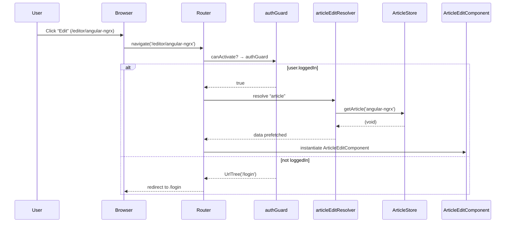

# Chapter 7: Router Configuration with Guards & Resolvers

In the previous chapter we wired up our article stores and services for data fetching and mutation. Now it’s time to orchestrate **navigation**: setting up routes, protecting them with guards, and pre‐fetching data with resolvers so our components arrive fully hydrated. Think of your application as a railway network:

- **Stations** = routes  
- **Tracks** = lazy‐loaded modules (loadChildren)  
- **Conductors** = guards checking tickets (authentication)  
- **Station staff** = resolvers ensuring passengers have the right schedule (data)  

This chapter shows you how to use Angular’s **provideRouter** in a zoneless, standalone context with **loadComponent**/​**loadChildren**, **authGuard**, **ResolveFn** resolvers (`articleEditResolver`, `profileResolver`, etc.), and UX sugar like **withViewTransitions** and **withComponentInputBinding**.

## Motivation & Central Use Case

Imagine a user clicking “Edit Article” from the article detail page. We want to ensure:

1. They’re **logged in** (`authGuard`).  
2. We **prefetch** the article data into `ArticleStore` before the editor component loads (`articleEditResolver`).  
3. The route transition feels **smooth** (`withViewTransitions`).  
4. Any route parameters or resolved data bind **automatically** to component inputs (`withComponentInputBinding`).

Without this setup, you’d manually subscribe to route params, call your store or service in `ngOnInit`, and manage loading flags and redirects imperatively. With guards and resolvers, routing becomes **declarative** and **consistent**.

## Key Concepts

1. **provideRouter**: configure routes in a zoneless, standalone app.  
2. **loadComponent** & **loadChildren**: lazy‐load components or child route arrays.  
3. **Guards (canActivate)**: e.g. `authGuard` to block unauthorized access.  
4. **Resolvers (ResolveFn)**: prefetch data via injection and store dispatch.  
5. **withViewTransitions**: wrap navigation in native view transitions.  
6. **withComponentInputBinding**: map route params/data to component `@Input()`s.

---

## 1. App‐Level Routing: provideRouter

In `apps/conduit/src/app/app.config.ts` we register Angular’s standalone router and global providers:

```ts
// apps/conduit/src/app/app.config.ts
import { ApplicationConfig } from '@angular/core';
import {
  provideRouter,
  withComponentInputBinding,
  withViewTransitions
} from '@angular/router';
import { provideHttpClient, withInterceptors } from '@angular/common/http';
import { API_URL } from '@realworld/core/http-client';
import { errorHandlingInterceptor } from '@realworld/core/error-handler';
import { authGuard } from '@realworld/auth/data-access';
import { environment } from '../environments/environment';

export const appConfig: ApplicationConfig = {
  providers: [
    // 1) Root router with UX enhancements
    provideRouter(
      [
        { path: '', redirectTo: 'home', pathMatch: 'full' },
        {
          path: 'home',
          loadComponent: () =>
            import('@realworld/home/feature-home').then(m => m.HomeComponent),
        },
        {
          path: 'login',
          loadComponent: () =>
            import('@realworld/auth/feature-auth').then(m => m.LoginComponent),
        },
        {
          path: 'register',
          loadComponent: () =>
            import('@realworld/auth/feature-auth').then(m => m.RegisterComponent),
        },
        {
          path: 'article',
          loadChildren: () =>
            import('@realworld/articles/feature-article').then(m => m.ARTICLE_ROUTES),
        },
        {
          path: 'editor',
          loadChildren: () =>
            import('@realworld/articles/feature-article-edit').then(m => m.ARTICLE_EDIT_ROUTES),
          canActivate: [authGuard],  // protect editor
        },
        {
          path: 'profile',
          loadChildren: () =>
            import('@realworld/profile/feature-profile').then(m => m.PROFILE_ROUTES),
        },
        {
          path: 'settings',
          loadComponent: () =>
            import('@realworld/settings/feature-settings').then(m => m.SettingsComponent),
          canActivate: [authGuard],
        },
      ],
      withViewTransitions(),          // enable smooth transitions
      withComponentInputBinding()     // auto-bind @Input()s
    ),

    // 2) HTTP client + global error interceptor
    provideHttpClient(withInterceptors([errorHandlingInterceptor])),

    // 3) Base API URL for ApiService
    { provide: API_URL, useValue: environment.api_url },
  ],
};
```

Explanation  

- `provideRouter(routes, …)` replaces `RouterModule.forRoot(...)` in a standalone context.  
- We lazy‐load feature modules via `loadChildren` or `loadComponent`.  
- `canActivate: [authGuard]` ensures only authenticated users reach certain paths.  
- `withViewTransitions` and `withComponentInputBinding` are optional enhancements for UX and wiring.

---

## 2. Protecting Routes: authGuard

A guard is just a function returning `boolean | UrlTree`. We inject `AuthStore` to check `loggedIn`:

```ts
// libs/auth/data-access/src/services/auth-guard.ts
import { inject } from '@angular/core';
import { Router, UrlTree } from '@angular/router';
import { AuthStore } from '../auth.store';

export const authGuard = (): boolean | UrlTree => {
  const router = inject(Router);
  const authStore = inject(AuthStore);

  return authStore.state().loggedIn
    ? true                          // allow activation
    : router.parseUrl('/login');    // redirect to /login
};
```

Explanation  

- `inject(AuthStore)` gives you direct access to your auth state signal.  
- Returning a `UrlTree` tells the router to navigate elsewhere.

---

## 3. Prefetching Data: Resolvers

Resolvers run _before_ route activation, ideal for dispatching store calls.

### 3.1 Article Edit Resolver

```ts
// libs/articles/feature-article-edit/src/resolvers/article-edit-resolver.ts
import { inject } from '@angular/core';
import { ResolveFn, ActivatedRouteSnapshot } from '@angular/router';
import { ArticleStore } from '@realworld/articles/data-access';

export const articleEditResolver: ResolveFn<boolean> = (
  route: ActivatedRouteSnapshot
) => {
  const slug = route.params['slug'];
  const articleStore = inject(ArticleStore);

  if (slug) {
    articleStore.getArticle(slug);  // dispatch store call
  }

  return true; // or of(true) if you need an Observable
};
```

And in your feature‐route:

```ts
// libs/articles/feature-article-edit/src/article-edit.routes.ts
import { Routes } from '@angular/router';
import { ArticleEditComponent } from './article-edit.component';
import { authGuard } from '@realworld/auth/data-access';
import { articleEditResolver } from './resolvers/article-edit-resolver';

export const ARTICLE_EDIT_ROUTES: Routes = [
  {
    path: '',
    component: ArticleEditComponent,
    canActivate: [authGuard],
  },
  {
    path: ':slug',
    component: ArticleEditComponent,
    resolve: { article: articleEditResolver },
    canActivate: [authGuard],
  },
];
```

### 3.2 Profile Resolvers

```ts
// libs/profile/data-access/src/resolvers/profile-resolver.ts
import { inject } from '@angular/core';
import { ResolveFn, ActivatedRouteSnapshot } from '@angular/router';
import { ProfileStore } from '../profile.store';

export const profileResolver: ResolveFn<boolean> = (route) => {
  const username = route.params['username'];
  inject(ProfileStore).getProfile(username);
  return true;
};

// src/resolvers/profile-articles-resolver.ts
import { inject } from '@angular/core';
import { ArticlesListStore, articlesListInitialState } from '@realworld/articles/data-access';

export const profileArticlesResolver: ResolveFn<boolean> = (route) => {
  const user = route.params['username'];
  const store = inject(ArticlesListStore);
  const cfg = {
    ...articlesListInitialState.listConfig,
    filters: { ...articlesListInitialState.listConfig.filters, author: user },
  };
  store.setListConfig(cfg);
  store.loadArticles(cfg);
  return true;
};

// src/resolvers/profile-favorites-resolver.ts
export const profileFavoritesResolver: ResolveFn<boolean> = (route) => {
  const user = route.parent!.params['username'];
  const store = inject(ArticlesListStore);
  const cfg = {
    ...articlesListInitialState.listConfig,
    filters: { ...articlesListInitialState.listConfig.filters, favorited: user },
  };
  store.setListConfig(cfg);
  store.loadArticles(cfg);
  return true;
};
```

And wire them in `PROFILE_ROUTES`:

```ts
// libs/profile/feature-profile/src/profile.routes.ts
import { Routes } from '@angular/router';
import { ProfileComponent } from './profile.component';
import { authGuard } from '@realworld/auth/data-access';
import {
  profileResolver,
  profileArticlesResolver,
  profileFavoritesResolver
} from '@realworld/profile/data-access';
import { ArticleListComponent } from '@realworld/articles/feature-articles-list';

export const PROFILE_ROUTES: Routes = [
  {
    path: ':username',
    component: ProfileComponent,
    canActivate: [authGuard],
    resolve: { profile: profileResolver },
    children: [
      {
        path: '',
        component: ArticleListComponent,
        resolve: { articles: profileArticlesResolver },
      },
      {
        path: 'favorites',
        component: ArticleListComponent,
        resolve: { favorites: profileFavoritesResolver },
      },
    ],
  },
];
```

Explanation  

- Each resolver injects a store and dispatches a data‐fetch method.  
- Returning `true` (or `of(true)`) tells the router to proceed immediately.

---

## 4. Navigation Flow: Sequence Diagram

Here’s what happens under the hood when a user navigates to edit an article:



Explanation  

- **Guard** runs first—blocks or allows.  
- On success, **Resolver** dispatches `getArticle`.  
- Finally, the **Component** loads, bound to the already‐fetched store state.

---

## 5. Under the Hood: provideRouter

Internally, `provideRouter(routes, …)` sets up:

- The `Router` service and `RouterModule`  
- A `RouteReuseStrategy` for standalone components  
- Options from `withComponentInputBinding()` and `withViewTransitions()`  

Roughly equivalent to:

```ts
@NgModule({
  imports: [
    BrowserAnimationsModule,          // for view transitions
    RouterModule.forRoot(routes, {
      bindComponentInputs: true,      // from withComponentInputBinding
      // ...other flags from withViewTransitions
    }),
  ],
  providers: [
    // global interceptors, guards, etc.
  ]
})
export class AppRouterModule {}
```

By using the standalone API, you avoid boilerplate NgModules, and you get a more functional, provider-based setup.

---

## Conclusion

In this chapter you learned how to:

- Configure top‐level and feature routes with **provideRouter**.  
- Lazy‐load components (`loadComponent`) and child routes (`loadChildren`).  
- Protect routes via the declarative `authGuard`.  
- Prefetch data in `ResolveFn` resolvers (`articleEditResolver`, `profileResolver`, etc.).  
- Enhance UX with **withViewTransitions** and **withComponentInputBinding**.  

With your navigation, security, and data hydration all declared up front, your components can focus purely on rendering reactive signals. Next up, we’ll package UI pieces into reusable, standalone libraries in [Feature Standalone Component Libraries](08_feature_standalone_component_libraries.md).

---

Generated by [AI Codebase Knowledge Generator](https://github.com/vegeta03/codebase-knowledge-generator)
