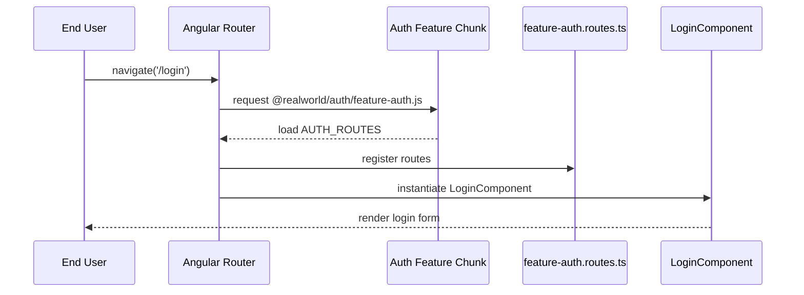
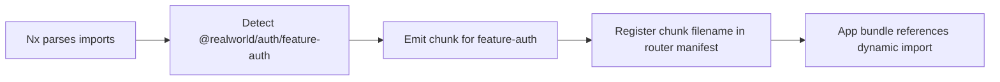

# Chapter 8: Feature Standalone Component Libraries

In [Chapter 7: Router Configuration with Guards & Resolvers](07_router_configuration_with_guards___resolvers.md) we wired up lazy routes, guards, and resolvers. Now we’ll package each feature domain—authentication, home, articles, profile, settings—into its own **standalone component library**, complete with routes. This produces clear boundaries, reusable units, and improves initial load performance by lazy‐loading only the code you need when you navigate there.

## Motivation & Central Use Case

Imagine you’re adding a **Profile** feature to the Conduit app. Without a feature library, you’d:

- Drop components, services, and route definitions directly into `apps/conduit`.
- Risk entangling Profile logic with other features.
- Increase your main bundle size, slowing initial load.

With a **Profile Standalone Component Library** you can:

- Keep `ProfileComponent`, its child views, styles and route defs in `libs/profile/feature-profile`.
- Lazy‐load that code only when the user navigates to `/profile/:username`.
- Reuse the same library in another Angular app without change.

Think of your workspace as a **modular mall**:

- **Stores** = feature libraries  
- **Storefront** = standalone components + templates + styles  
- **Inventory** = services, resolvers, route defs  
- **Customers** = users, who only visit the store they need  

## Key Concepts

1. Standalone Components  
   Angular components that don’t require an `NgModule`. Declared with `standalone: true` and list their own `imports`.

2. Feature Libraries  
   Nx libraries under `libs/<domain>/feature-<name>`, each housing one feature’s components, routes, and assets.

3. Library Routing  
   Each feature library exports a `ROUTES` array. The root router uses `loadComponent` or `loadChildren` to lazy‐load it.

4. Lazy Loading  
   Angular’s router splits each library into its own chunk. The code ships only when you navigate to that feature path.

5. Path Aliases  
   `tsconfig.base.json` maps `@realworld/<domain>/feature-<name>` to the library’s `src/index.ts`, simplifying imports.

---

## 1. Generating a Feature Library with Nx

Use the Nx generator to scaffold a standalone, routable library:

```bash
nx g @nx/angular:library feature-auth \
  --directory=auth \
  --standalone \
  --routing \
  --lazy
```

This produces:

```plaintext
libs/auth/feature-auth/
├── project.json
├── tsconfig.lib.json
└── src
    ├── index.ts
    └── lib
        ├── login
        │   ├── login.component.ts
        │   └── login.component.html
        ├── register
        │   ├── register.component.ts
        │   └── register.component.html
        └── feature-auth.routes.ts
```

- `--standalone` makes components standalone.  
- `--routing` adds a `feature-auth.routes.ts` file.  
- `--lazy` prepares the library for router lazy loading.

---

## 2. Anatomy of a Feature Library

Let’s walk through `libs/auth/feature-auth/src`.

### 2.1 Entry Point: `src/index.ts`

```ts
// libs/auth/feature-auth/src/index.ts
export * from './lib/login/login.component';
export * from './lib/register/register.component';
export * from './lib/feature-auth.routes';
```

This barrel file lets the root router import the routes and components via the path alias:

```ts
import('@realworld/auth/feature-auth').then(m => m.AUTH_ROUTES)
```

### 2.2 Standalone Component Example

```ts
// libs/auth/feature-auth/src/lib/login/login.component.ts
import { Component, inject } from '@angular/core';
import { Router } from '@angular/router';
import { FormGroup, ReactiveFormsModule } from '@angular/forms';
import { AuthStore } from '@realworld/auth/data-access';

@Component({
  selector: 'app-login',
  standalone: true,
  imports: [ReactiveFormsModule],
  templateUrl: './login.component.html',
})
export class LoginComponent {
  router = inject(Router);
  authStore = inject(AuthStore);

  form = new FormGroup({
    email: new FormControl('', { nonNullable: true }),
    password: new FormControl('', { nonNullable: true }),
  });

  submit() {
    const payload = { user: this.form.value };
    this.authStore.login(payload);
  }
}
```

- `standalone: true` means no NgModule is needed.  
- `imports: [...]` lists Angular modules or other standalone components needed by this component.  

### 2.3 Feature Routes

```ts
// libs/auth/feature-auth/src/lib/feature-auth.routes.ts
import { Routes } from '@angular/router';
import { LoginComponent } from './login/login.component';
import { RegisterComponent } from './register/register.component';

export const AUTH_ROUTES: Routes = [
  { path: 'login', component: LoginComponent },
  { path: 'register', component: RegisterComponent },
];
```

This routes array is exported in `src/index.ts` so the root router can import it lazily.

---

## 3. Root Router Integration

In `apps/conduit/src/app/app.config.ts` (see [Chapter 7](07_router_configuration_with_guards___resolvers.md)) add:

```ts
provideRouter(
  [
    // … other routes …
    {
      path: '',
      loadChildren: () =>
        import('@realworld/auth/feature-auth').then(m => m.AUTH_ROUTES),
    },
    {
      path: 'settings',
      loadComponent: () =>
        import('@realworld/settings/feature-settings')
          .then(m => m.SettingsComponent),
      canActivate: [authGuard],
    },
    // … articles, profile, home …
  ],
  withViewTransitions(),
  withComponentInputBinding()
),
```

- `loadChildren` for multi‐route feature libraries (AUTH_ROUTES).  
- `loadComponent` for single‐component libraries (Settings).

---

## 4. Navigation & Lazy‐Load Flow

Here’s what happens when a user clicks “Login” in the nav bar:



- The router downloads the **Auth** feature chunk only at navigation time.  
- Components, templates, and route definitions arrive together.  

---

## 5. Under the Hood: Build & Packaging

1. **Nx Project Graph**  
   Each `feature-<name>` library is a node in the Nx graph.  
2. **tsconfig Paths**  
   In `tsconfig.base.json`:

   ```json
   {
     "paths": {
       "@realworld/auth/feature-auth": ["libs/auth/feature-auth/src/index.ts"]
     }
   }
   ```

3. **Build Output**  
   Production build emits separate JS bundles per lazy library (one per feature). Webpack code‐splits at the dynamic `import()` in `loadChildren`/`loadComponent`.

### 5.1 Simplified build-time sequence



- The dynamic `import('@realworld/auth/feature-auth')` tells Webpack to treat the library as a separate entry point.  
- At runtime, the router calls that import, triggering the actual network fetch.

---

## 6. Best Practices & Tips

- Organize each **feature library** as its own Nx project with clear boundaries: components, services, routes.  
- Use **index.ts** to re-export only the public API (components, routes).  
- Keep **shared UI** and **data-access** concerns in separate libraries (`libs/ui`, `libs/core`, `libs/articles/data-access`).  
- Prefer `loadComponent` for single‐component pages (Settings, Home) and `loadChildren` for multi‐route features (Auth, Profile, Article).  
- Use `withComponentInputBinding()` so you can declare `@Input()`s on components and have route params bound automatically.  

---

## Conclusion

In this chapter you learned how to:

- Scaffold and structure **feature standalone component libraries** with Nx.  
- Write **standalone components** and export them with feature‐specific route definitions.  
- Lazy‐load feature libraries using `loadChildren` and `loadComponent`.  
- Leverage path aliases, NgRx state libraries, and Angular’s router to keep your code modular and performant.

Up next, we’ll explore the **Smart vs. Dumb Component Pattern** to further decouple UI and business logic: [Chapter 9: Smart vs. Dumb Component Pattern](09_smart_vs__dumb_component_pattern.md).

---

Generated by [AI Codebase Knowledge Generator](https://github.com/vegeta03/codebase-knowledge-generator)
