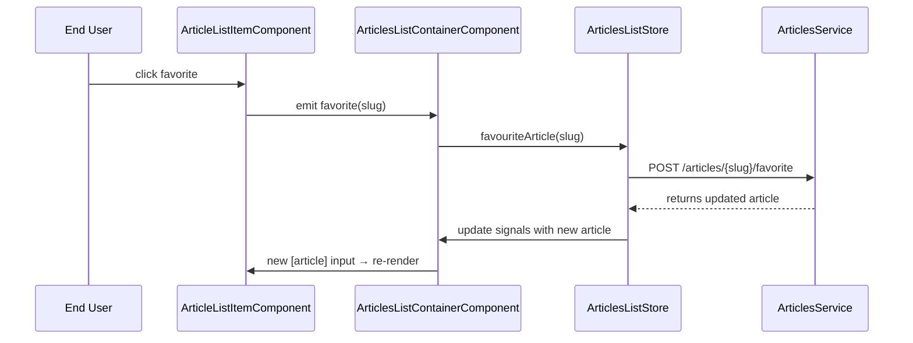

# Chapter 9: Smart vs. Dumb Component Pattern

In [Chapter 8: Feature Standalone Component Libraries](08_feature_standalone_component_libraries.md) we learned how to break our app into lazy-loaded feature libraries. Now we’ll refine our UI layer by splitting components into **smart** (containers) and **dumb** (presentational)–a pattern that keeps business logic out of pure UI, makes testing easier, and maximizes reusability.

## Motivation & Central Use Case

Imagine you’re building the **Articles List** page:

- You need to fetch pages of articles from the store, track loading state, handle pagination.
- You need to let users favorite/unfavorite articles and navigate to detail pages.

If you put all that logic in one big component template, it quickly becomes unwieldy:

- Hard to unit-test the UI without mocking HTTP or store.
- You can’t easily reuse the article-list UI elsewhere (e.g. profile feed vs. global feed).
- Change detection and styling concerns get tangled with state management.

With the **Smart vs. Dumb** pattern you:

1. Create **dumb** presentational components that only:
   - Render inputs (`@Input()`).
   - Emit user interactions (`@Output()`).
   - Use `ChangeDetectionStrategy.OnPush`.
2. Create **smart** container components that:
   - Inject stores or services.
   - Expose reactive signals/computed data.
   - Handle inputs from dumb components and call store methods.
   - Glue everything together.

Think of it like a restaurant:

- **Chefs (smart components)** do all the cooking (data fetching, business logic).
- **Servers (dumb components)** deliver prepared plates to customers without altering the food.

## Key Concepts

- **Separation of concerns**: logic in containers, markup in presentational.
- **Reusability**: presentational components know nothing about stores; you can drop them anywhere.
- **Testability**: you can shallow-render dumb components with mocked inputs/outputs.
- **Performance**: OnPush change detection on dumb components only re-renders when their inputs change.

## 1. The Dumb (Presentational) Components

Below are examples of dumb components already implemented in this workspace. They declare only `@Input()` and `@Output()`, use `OnPush`, and never inject services.

### 1.1 ArticleListItemComponent

File: `libs/articles/feature-articles-list/src/article-list-item/article-list-item.component.ts`

```ts
import { Component, ChangeDetectionStrategy, input, output } from '@angular/core';
import { RouterModule } from '@angular/router';
import { NgClass, DatePipe } from '@angular/common';
import { Article } from '@realworld/core/api-types';

@Component({
  selector: 'cdt-article-list-item',
  standalone: true,
  imports: [RouterModule, NgClass, DatePipe],
  changeDetection: ChangeDetectionStrategy.OnPush,
  templateUrl: './article-list-item.component.html',
})
export class ArticleListItemComponent {
  // 1) Data in
  article = input.required<Article>();

  // 2) User events out
  favorite = output<string>();
  unFavorite = output<string>();
  navigateToArticle = output<string>();

  toggleFavorite(article: Article) {
    if (article.favorited) {
      this.unFavorite.emit(article.slug);
    } else {
      this.favorite.emit(article.slug);
    }
  }
}
```

Explanation  

- `@Input() article`: all display data comes from the parent.  
- Three `@Output()` emitters signal user actions—no internal logic or HTTP calls.  
- `OnPush` ensures re-render only when `article` reference changes.

### 1.2 PagerComponent

File: `libs/ui/components/src/pager/pager.component.ts`

```ts
import { Component, ChangeDetectionStrategy, input, output } from '@angular/core';
import { NgClass } from '@angular/common';

@Component({
  selector: 'cdt-pager',
  standalone: true,
  imports: [NgClass],
  changeDetection: ChangeDetectionStrategy.OnPush,
  templateUrl: './pager.component.html',
  styleUrls: ['./pager.component.css'],
})
export class PagerComponent {
  currentPage = input.required<number>();
  totalPages = input.required<number[]>();  // e.g. [1,2,3,4]
  setPage = output<number>();
}
```

Explanation  

- Presents pagination UI (buttons or links).  
- Emits a page number on click—nothing else.

## 2. The Smart (Container) Component

Now we write a smart container that:

- Injects `ArticlesListStore`.
- Exposes reactive signals for `articles`, `loading`, `pages`.
- Handles events from the dumb `ArticleListItemComponent` and `PagerComponent`.
- Calls store methods to load data or navigate.

File: `libs/articles/feature-articles-list/src/article-list-container/article-list-container.component.ts`

```ts
import {
  Component,
  ChangeDetectionStrategy,
  OnInit,
  computed,
  inject
} from '@angular/core';
import { CommonModule } from '@angular/common';
import { Router, RouterModule } from '@angular/router';
import { ArticlesListStore } from '@realworld/articles/data-access';
import { ArticleListItemComponent } from '../article-list-item/article-list-item.component';
import { PagerComponent } from '@realworld/ui/components';

@Component({
  selector: 'cdt-articles-list-container',
  standalone: true,
  imports: [
    CommonModule,
    RouterModule,
    ArticleListItemComponent,
    PagerComponent
  ],
  changeDetection: ChangeDetectionStrategy.OnPush,
  template: `
    <ng-container *ngIf="loading(); else list">
      <p>Loading articles…</p>
    </ng-container>
    <ng-template #list>
      <cdt-article-list-item
        *ngFor="let art of articles()"
        [article]="art"
        (favorite)="onFavorite($event)"
        (unFavorite)="onUnFavorite($event)"
        (navigateToArticle)="onNavigate($event)"
      ></cdt-article-list-item>

      <cdt-pager
        [currentPage]="currentPage()"
        [totalPages]="pages()"
        (setPage)="onPageChange($event)"
      ></cdt-pager>
    </ng-template>
  `
})
export class ArticlesListContainerComponent implements OnInit {
  private store = inject(ArticlesListStore);
  private router = inject(Router);

  // Reactive view signals
  articles = computed(() => this.store.state().articles.entities);
  loading = computed(() => this.store.getArticlesLoading());
  currentPage = computed(() => this.store.state().listConfig.currentPage);
  pages = computed(() => {
    const total = this.store.totalPages();
    return Array.from({ length: total }, (_, i) => i + 1);
  });

  ngOnInit() {
    // Initial load with default config
    this.store.loadArticles(this.store.state().listConfig);
  }

  onFavorite(slug: string) {
    this.store.favouriteArticle(slug);
  }

  onUnFavorite(slug: string) {
    this.store.unFavouriteArticle(slug);
  }

  onNavigate(slug: string) {
    this.router.navigate(['article', slug]);
  }

  onPageChange(page: number) {
    this.store.setListPage(page);
    this.store.loadArticles(this.store.state().listConfig);
  }
}
```

Explanation  

- The container knows **how** to fetch and paginate articles via `ArticlesListStore`.  
- It never contains raw HTML for items or pager—that’s left to dumb components.  
- OnPush on the container means change detection only happens when its own signals change.

## 3. Event Flow: Sequence Diagram

Below is a high-level view of what happens when a user clicks the “Favorite” button in the dumb component:



- The dumb component purely emits an event.  
- The smart container responds by calling the store.  
- The store does HTTP work, patches its state, and exposes a new signal.  
- OnPush change detection on both smart and dumb kicks in automatically.

## 4. Under the Hood: Angular Input & Output

### 4.1 Presentational Component Internals

```ts
// Simplified ArticleListItemComponent
@Component({ /* … */ })
export class ArticleListItemComponent {
  @Input() article!: Article;           // Input binding
  @Output() favorite = new EventEmitter<string>();  // Output emitter

  toggleFavorite() {
    this.favorite.emit(this.article.slug);
  }
}
```

- Angular sets the `article` property on change.  
- With `OnPush`, Angular marks the component for check when `article` reference changes.  
- `EventEmitter` extends RxJS `Subject` under the hood.

### 4.2 Container Component Internals

```ts
// Simplified ArticlesListContainerComponent
@Component({ /* … */ })
export class ArticlesListContainerComponent {
  articles = computed(() => this.store.state().articles.entities);

  // This template binds [article]="art" on each iteration
}
```

- `computed()` creates an Angular signal.  
- Template reading `articles()` registers a view dependency.  
- When the store patches state, Angular schedules change detection for this container and its children.

## 5. Why This Pattern Matters

- **Unit testability**: you can test `ArticleListItemComponent` by passing an `article` object and spying on `favorite` events—no store mocks needed.  
- **Reusability**: the same `cdt-pager` can paginate any list, not just articles.  
- **Maintainability**: containers evolve as business requirements change; presentational components stay focused on markup and styles.  
- **Performance**: OnPush and fine-grained signals avoid full component tree checks.

## Conclusion

In this chapter you learned how to:

- Divide UI into **smart** (container) and **dumb** (presentational) components.  
- Use `@Input()` and `@Output()` to pass data and events.  
- Keep all store or service injections in smart components.  
- Wire the event flow between dumb → smart → store → API → store → smart → dumb.  
- Leverage Angular Signals and OnPush for efficient re-rendering.

With this pattern in place, your UI is cleaner, more testable, and highly reusable. Next up, we’ll tackle a robust [Form Error Handling Mechanism](10_form_error_handling_mechanism.md) to lift server-side validation errors into your forms.

---

Generated by [AI Codebase Knowledge Generator](https://github.com/vegeta03/codebase-knowledge-generator)
