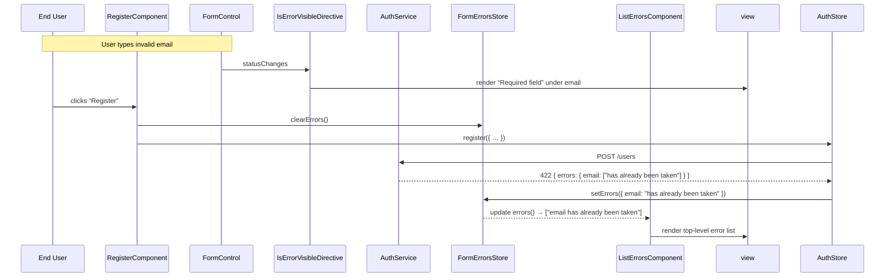

# Chapter 10: Form Error Handling Mechanism

In [Chapter 9: Smart vs. Dumb Component Pattern](09_smart_vs__dumb_component_pattern.md) we separated UI into containers and presentational pieces. Now it’s time to unify how we handle **both** client-side validation errors and server-side response errors in our forms. The **Form Error Handling Mechanism** collects all these issues into one place and provides reusable components and directives to display them consistently across the app.

## Motivation & Central Use Case

Imagine a registration form where:

- You have required fields, email format checks, minimum‐length rules.
- You submit the form and the server replies with 422 Unprocessable Entity plus a JSON body like:

  ```json
  {
    "errors": {
      "email": ["has already been taken"],
      "password": ["is too weak"]
    }
  }
  ```
  
Without a shared abstraction, you’d end up with:

- Inline `*ngIf` checks for each validator in your template.
- Manual parsing of server response and setting component‐level error flags.
- Duplication of “render field errors” logic in every form.

With our **Form Error Handling Mechanism**, you get:

- A central `FormErrorsStore` that holds the latest server errors.
- An `InputErrorsComponent` + `IsErrorVisibleDirective` pair to underline and list client validation problems.
- A `ListErrorsComponent` to render top‐level server validation failures.
- An `ErrorMapperPipe` that turns Angular error keys (`required`, `email`, `minlength`) into human-friendly messages.
- Clear separation: client errors appear under each control, server errors show at the top, all without boilerplate.

---

## Key Concepts

- **FormErrorsStore**  
  A Signal‐based store that holds a map of field → message, exposes a computed array of messages, and provides methods to set or clear errors.
- **InputErrorsComponent**  
  A standalone component that takes an `AbstractControl`, watches its `errors` object, maps each error key/value to a message, and displays them when the control is dirty and invalid.
- **ListErrorsComponent**  
  A standalone component that subscribes to `FormErrorsStore.errors()` and renders a list of server‐side error messages.
- **ErrorMapperPipe**  
  Transforms a validation error key and its payload into a formatted string via a token‐provided map of functions.
- **IsErrorVisibleDirective**  
  A structural directive that conditionally instantiates its template when the associated `AbstractControl` is invalid **and** dirty.

---

## 1. Defining the FormErrorsStore

File: **libs/core/forms/src/lib/forms-errors.store.ts**

```ts
import { computed } from '@angular/core';
import {
  patchState,
  signalStore,
  withComputed,
  withMethods,
  withState
} from '@ngrx/signals';

export interface Errors {
  [field: string]: string;
}

export const FormErrorsStore = signalStore(
  { providedIn: 'root' },

  // 1) Base state: a map from field → message
  withState<{ _errors: Errors }>({
    _errors: {},
  }),

  // 2) Computed: expose errors as an array of strings
  withComputed(({ _errors }) => ({
    errors: computed(() =>
      Object.keys(_errors()).map(key => `${key} ${_errors()[key]}`)
    ),
  })),

  // 3) Methods: set or clear the entire error map
  withMethods(store => ({
    setErrors(errors: Errors): void {
      patchState(store, { _errors: errors });
    },
    clearErrors(): void {
      patchState(store, { _errors: {} });
    },
  }))
);
```

**Explanation**  

- `_errors` holds the raw server errors keyed by field name.  
- `errors()` is a computed signal returning `["email has already been taken", "password is too weak"]`.  
- `setErrors` replaces the map; `clearErrors` wipes it out.

---

## 2. Mapping & Displaying Errors

### 2.1 Error-Messages Injection Token

File: **libs/core/forms/src/lib/input-errors/error-messages.ts**

```ts
import { InjectionToken } from '@angular/core';

export const ERROR_MESSAGES: { [key: string]: (args?: any) => string } = {
  required: () => `Required field`,
  email: () => `Not a valid email`,
  minlength: ({ requiredLength }) => `At least ${requiredLength} characters`,
};

export const VALIDATION_ERROR_MESSAGES = new InjectionToken(
  'VALIDATION_ERROR_MESSAGES',
  {
    providedIn: 'root',
    factory: () => ERROR_MESSAGES,
  }
);
```

**Explanation**  

- A map of Angular validator keys to human-friendly functions.  
- E.g. `minlength` receives `{ requiredLength: 6 }` and returns “At least 6 characters.”

### 2.2 ErrorMapperPipe

File: **libs/core/forms/src/lib/input-errors/error-mapper-pipe.ts**

```ts
import { inject, Pipe, PipeTransform } from '@angular/core';
import { VALIDATION_ERROR_MESSAGES } from './error-messages';

@Pipe({ name: 'errorMapper', standalone: true })
export class ErrorMapperPipe implements PipeTransform {
  private messages = inject(VALIDATION_ERROR_MESSAGES);

  transform(key: string, value: any): string {
    const fn = this.messages[key];
    return fn ? fn(value) : '';
  }
}
```

**Explanation**  

- Reads the injection token, looks up the formatter, and returns the final string.

---

## 3. Showing Field-Level Errors

### 3.1 IsErrorVisibleDirective

File: **libs/core/forms/src/lib/input-errors/is-error-visible.directive.ts**

```ts
import {
  AfterViewInit,
  Directive,
  TemplateRef,
  ViewContainerRef,
  input,
  inject,
  DestroyRef
} from '@angular/core';
import { AbstractControl } from '@angular/forms';
import { takeUntilDestroyed } from '@angular/core/rxjs-interop';

@Directive({ selector: '[isErrorVisible]', standalone: true })
export class IsErrorVisibleDirective implements AfterViewInit {
  readonly control = input<() => AbstractControl>();
  private tmpl = inject(TemplateRef<unknown>);
  private vc = inject(ViewContainerRef);
  private destroyRef = inject(DestroyRef);

  ngAfterViewInit() {
    this.control()?.statusChanges
      .pipe(takeUntilDestroyed(this.destroyRef))
      .subscribe(() => {
        this.vc.clear();
        if (this.control()?.invalid && this.control()?.dirty) {
          this.vc.createEmbeddedView(this.tmpl);
        }
      });
  }
}
```

**Explanation**  

- Watches `statusChanges` of a form control.  
- When `invalid && dirty`, it stamps out the error `<ng-template>`.

### 3.2 InputErrorsComponent

File: **libs/core/forms/src/lib/input-errors/input-errors.component.ts**

```ts
import { Component, ChangeDetectionStrategy, input } from '@angular/core';
import { KeyValuePipe } from '@angular/common';
import { AbstractControl } from '@angular/forms';
import { ErrorMapperPipe } from './error-mapper-pipe';
import { IsErrorVisibleDirective } from './is-error-visible.directive';

@Component({
  selector: 'cdt-input-errors',
  standalone: true,
  imports: [KeyValuePipe, ErrorMapperPipe, IsErrorVisibleDirective],
  changeDetection: ChangeDetectionStrategy.OnPush,
  template: `
    <ng-template *isErrorVisible="control">
      <ul class="error-messages">
        <li *ngFor="let err of control().errors | keyvalue">
          {{ err.key | errorMapper: err.value }}
        </li>
      </ul>
    </ng-template>
  `
})
export class InputErrorsComponent {
  control = input.required<() => AbstractControl>();
}
```

**Explanation**  

- Takes a `() => AbstractControl` input, so you can bind `[control]="form.get('email')"` easily.  
- Renders a UL of messages, each piped through `errorMapper`.

---

## 4. Listing Server-Side Errors

File: **libs/core/forms/src/lib/list-errors/list-errors.component.ts**

```ts
import { Component, ChangeDetectionStrategy, OnDestroy, inject } from '@angular/core';
import { FormErrorsStore } from '../forms-errors.store';

@Component({
  selector: 'cdt-list-errors',
  standalone: true,
  changeDetection: ChangeDetectionStrategy.OnPush,
  template: `
    <ul *ngIf="errors.length" class="error-list">
      <li *ngFor="let err of errors" data-testid="error">{{ err }}</li>
    </ul>
  `
})
export class ListErrorsComponent implements OnDestroy {
  private store = inject(FormErrorsStore);
  errors = this.store.errors();

  ngOnDestroy() {
    // Clear errors when leaving the form
    this.store.clearErrors();
  }
}
```

**Explanation**  

- Subscribes to the computed `errors()` signal from `FormErrorsStore`.  
- Automatically clears server errors when the component is torn down (e.g. navigating away).

---

## 5. Putting It All Together: Registration Form Example

```ts
// feature-auth/src/lib/register/register.component.ts
import { Component, inject } from '@angular/core';
import {
  FormGroup,
  FormControl,
  Validators,
  ReactiveFormsModule
} from '@angular/forms';
import { AuthStore } from '@realworld/auth/data-access';
import { FormErrorsStore } from '@realworld/core/forms';
import { InputErrorsComponent } from '@realworld/core/forms';
import { ListErrorsComponent } from '@realworld/core/forms';

@Component({
  selector: 'register-page',
  standalone: true,
  imports: [
    ReactiveFormsModule,
    InputErrorsComponent,
    ListErrorsComponent
  ],
  template: `
    <form [formGroup]="form" (ngSubmit)="onSubmit()">
      <!-- Top‐level server errors -->
      <cdt-list-errors></cdt-list-errors>

      <label>Email</label>
      <input formControlName="email" />
      <cdt-input-errors [control]="() => form.controls.email"></cdt-input-errors>

      <label>Password</label>
      <input type="password" formControlName="password" />
      <cdt-input-errors [control]="() => form.controls.password"></cdt-input-errors>

      <button type="submit">Register</button>
    </form>
  `
})
export class RegisterComponent {
  form = new FormGroup({
    email: new FormControl('', {
      nonNullable: true,
      validators: [Validators.required, Validators.email]
    }),
    password: new FormControl('', {
      nonNullable: true,
      validators: [Validators.required, Validators.minLength(6)]
    })
  });

  private formErrors = inject(FormErrorsStore);
  private authStore = inject(AuthStore);

  onSubmit() {
    if (this.form.invalid) {
      this.form.markAllAsTouched();
      return;
    }
    // 1) Clear old server errors
    this.formErrors.clearErrors();
    // 2) Dispatch registration; on error, AuthStore will call formErrors.setErrors(...)
    this.authStore.register({ user: this.form.value });
  }
}
```

**Explanation**  

- `<cdt-list-errors>` shows any server‐side failures.  
- Each `<cdt-input-errors>` under an `<input>` shows client validation problems (e.g. empty, bad email, too short).  
- `onSubmit()` prevents submission if the form is invalid, clearing old server flags and letting the AuthStore pipeline handle server errors.

---

## 6. Execution Flow



- **Client errors**: handled by `IsErrorVisibleDirective` + `InputErrorsComponent`.  
- **Server errors**: channeled into `FormErrorsStore`, displayed by `ListErrorsComponent`.

---

## 7. Under the Hood

1. **signalStore**  
   - `FormErrorsStore` is a Signal‐powered injectable composed via `withState`, `withComputed`, and `withMethods`.
2. **patchState**  
   - Merges new `_errors` map into the existing state signal, triggering recomputation of `errors()`.
3. **ErrorMapperPipe**  
   - Looks up formatting functions in the `VALIDATION_ERROR_MESSAGES` token.
4. **IsErrorVisibleDirective**  
   - Uses `statusChanges` on the control to insert or remove the `<ng-template>` error block.
5. **Component Subscriptions**  
   - `ListErrorsComponent` reads `errors()` signal; Angular’s change detection (OnPush) updates the list when the signal changes.

Together, these pieces prevent scattered `*ngIf` blocks, ad-hoc server error parsing, and inconsistent UX. All form features—client and server—now follow the same pattern.

---

## Conclusion

You’ve now learned how to:

- Centralize server‐side errors in a **FormErrorsStore**.  
- Display client validation issues via **InputErrorsComponent** and **IsErrorVisibleDirective**.  
- List server errors at the top with **ListErrorsComponent**.  
- Map raw error keys to user-friendly messages using **ErrorMapperPipe**.  

This unified form error handling keeps your templates clean and your UX consistent across login, registration, profile editing, and more. Next up, we’ll automate end-to-end validation of these flows in [Chapter 11: E2E Testing with Playwright](11_e2e_testing_with_playwright.md).

---

Generated by [AI Codebase Knowledge Generator](https://github.com/vegeta03/codebase-knowledge-generator)
