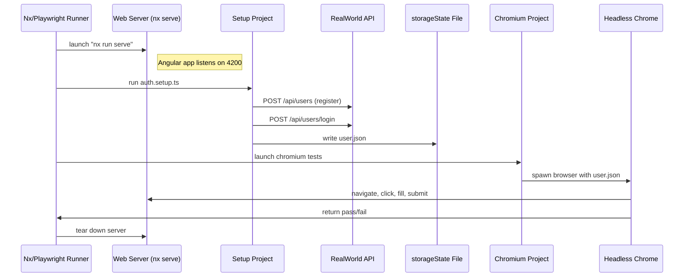

# Chapter 11: E2E Testing with Playwright

_In the previous chapter we unified form validations in our app ([Form Error Handling Mechanism](10_form_error_handling_mechanism.md)). Now let’s drive the whole stack—API, state, UI, routing—through real browsers using Playwright, so we can catch regressions in user flows before they ever reach production._

## Motivation & Central Use Case

Unit and integration tests verify your business logic, but only an end-to-end (E2E) test can confirm that:

- Your dev server actually starts
- Routes render the right components
- Authentication cookies are sent
- NgRx signals update the UI
- Forms submit and errors display correctly
- Navigation, view transitions, and UI elements all behave as expected

Imagine a drone that delivers software quality rather than packages:  

1. It first spins up a fresh user via direct API calls (setup).  
2. It stores that user’s cookie/JWT in a “storageState” file.  
3. Then it flies through the actual Angular app in a real browser (chromium), clicking links, filling forms, and asserting every step.  

In this chapter you’ll learn how to configure and write these tests in the `apps/conduit-e2e` project using the `@nx/playwright` preset. You’ll see how to isolate test runs with random users, authenticate via helpers, and organize tests into a setup phase and real-browser phase.

## Key Concepts

1. **Nx Playwright Preset**  
   A helper from `@nx/playwright` that wires Playwright into our Nx workspace—knows about your dev server, paths, and test targets.

2. **Web Server Management**  
   Playwright will automatically launch your Angular app (`nx serve`) before tests and tear it down afterward.

3. **Setup Project**  
   A special Playwright “project” that runs only API calls (`.setup.ts`), registers and logs in a random user, then writes a `storageState` file.

4. **Browser-Specific Tests**  
   A separate Playwright project (e.g. `chromium`) that loads the saved `storageState` and executes UI tests in a real browser context.

5. **API Helper Scripts**  
   Simple functions (`registerUserApi`, `loginUserApi`) that talk to a hosted Conduit API to create and authenticate users.

6. **Storage State**  
   Playwright’s mechanism for persisting cookies/local storage between contexts—so your tests start already logged in.

7. **Test Isolation**  
   Each test run uses a brand-new user ID (via `generateRandomString()`), preventing collisions and ensuring a clean slate.

---

## 1. Understanding the Playwright Configuration

Open `apps/conduit-e2e/playwright.config.ts`. It’s where we define the E2E “recipe”:

```typescript
// apps/conduit-e2e/playwright.config.ts
import { defineConfig, devices } from '@playwright/test';
import { nxE2EPreset }           from '@nx/playwright/preset';
import { workspaceRoot }         from '@nx/devkit';

// Base URL for UI tests (override with CI env if needed)
const baseURL = process.env['BASE_URL'] || 'http://localhost:4200';

export default defineConfig({
  // 1) Use the Nx E2E preset for testDir, reporters, timeouts, etc.
  ...nxE2EPreset(__filename, { testDir: './src' }),

  // 2) Default settings for all tests
  use: {
    baseURL,
    trace: 'on-first-retry', // collect trace on first failure
  },

  // 3) Spin up our Angular dev server before tests
  webServer: {
    command: 'npx nx run conduit:serve',      // the Nx serve target
    url: 'http://localhost:4200',             // wait for this URL
    reuseExistingServer: !process.env.CI,     // speed up local dev
    cwd: workspaceRoot,
  },

  // 4) Define two projects: setup and chromium
  projects: [
    {
      name: 'setup',
      testMatch: /.*\.setup\.ts/,            // only run *.setup.ts here
    },
    {
      name: 'chromium',
      use: {
        ...devices['Desktop Chrome'],        // real desktop Chrome
        storageState: 'playwright/.auth/user.json', // reuse auth
      },
      dependencies: ['setup'],               // run setup first
    },
  ],
});
```

Explanation:

- `nxE2EPreset` bootstraps Playwright for an Nx workspace (maps `tsconfig`, `jest.preset.js`, etc.).
- `webServer` tells Playwright to launch `nx serve` and wait on `http://localhost:4200`.
- We declare a **setup** project (runs our API‐only scripts) and a **chromium** project (the real UI tests).
- `storageState` points to a file where authentication cookies will live.

---

## 2. Creating & Authenticating a User (Setup)

In `apps/conduit-e2e/src/auth/auth.setup.ts` we register and log in a random user via direct API calls:

```typescript
// apps/conduit-e2e/src/auth/auth.setup.ts
import { test as setup, request }       from '@playwright/test';
import { generateRandomString }         from '../helpers/generate-random-string';
import { registerUserApi }              from '../helpers/register-user';
import { loginUserApi }                 from '../helpers/login-user';

const authFile = 'playwright/.auth/user.json';

setup('authenticate', async () => {
  // 1) Generate an unguessable user ID
  const userId = generateRandomString();

  // 2) Create a new request context (no browser)
  const requestContext = await request.newContext();

  // 3) Register & log in via our hosted Conduit API
  await registerUserApi(userId, requestContext);
  await loginUserApi(userId, requestContext);

  // 4) Persist cookies & localStorage for browser tests
  await requestContext.storageState({ path: authFile });
});
```

Explanation:

- `test as setup` registers a single E2E test in the **setup** project.
- We call `registerUserApi` and `loginUserApi` (below), then write `user.json`, which Playwright’s chromium project will load.
- By isolating setup in its own project, we ensure our real UI tests don’t run until we have valid auth.

---

## 3. Helper Scripts: registerUserApi & loginUserApi

These live under `apps/conduit-e2e/src/helpers/` and call the hosted API:

```typescript
// apps/conduit-e2e/src/helpers/register-user.ts
import { APIRequestContext } from '@playwright/test';

export async function registerUserApi(userId: string, ctx: APIRequestContext) {
  const response = await ctx.post(
    'https://real-world-app-39656dff2ddc.herokuapp.com/api/users',
    { data: { user: { email: `${userId}@example.com`, password: userId, username: userId } } }
  );
  if (!response.ok()) {
    throw new Error(`Registration failed: ${await response.text()}`);
  }
}
```

```typescript
// apps/conduit-e2e/src/helpers/login-user.ts
import { APIRequestContext } from '@playwright/test';

export async function loginUserApi(userId: string, ctx: APIRequestContext) {
  const response = await ctx.post(
    'https://real-world-app-39656dff2ddc.herokuapp.com/api/users/login',
    { data: { user: { email: `${userId}@example.com`, password: userId } } }
  );
  if (!response.ok()) {
    throw new Error(`Login failed: ${await response.text()}`);
  }
}
```

Explanation:

- We avoid hard-coding test credentials by generating a fresh `userId`.
- The hosted API takes care of storing a JWT cookie.
- After `loginUserApi`, we call `storageState`, so our browser tests start already authenticated.

---

## 4. Writing Your First UI Test

Create a file `apps/conduit-e2e/src/create-article.spec.ts`:

```typescript
// apps/conduit-e2e/src/create-article.spec.ts
import { test, expect } from '@playwright/test';

test.describe('Article Flow', () => {
  test('should allow a logged-in user to create an article', async ({ page }) => {
    // 1) Navigate to the home page
    await page.goto('/');

    // 2) Click the "New Article" link (visible only when authenticated)
    await page.click('a[href="/editor"]');

    // 3) Fill out the article form
    await page.fill('input[placeholder="Article Title"]', 'E2E with Playwright');
    await page.fill('input[placeholder*="this article about"]', 'Playwright testing');
    await page.fill('textarea[placeholder*="Write your article"]', 'Full stack E2E test flows.');

    // 4) Publish and assert navigation to the article page
    await page.click('button:has-text("Publish Article")');
    await expect(page).toHaveURL(/\/article\/e2e-with-playwright/);

    // 5) Verify the title rendered
    await expect(page.locator('h1')).toHaveText('E2E with Playwright');
  });
});
```

Explanation:

- Because `chromium` project uses the saved `storageState`, `New Article` is visible immediately.
- We fill inputs by CSS selectors reflecting our form in the Angular app.
- After publishing, we assert the URL and heading—end-to-end verification complete.

---

## 5. End-to-End Flow Diagram

Here’s a step‐by‐step view of what happens when you run `nx e2e conduit-e2e`:



---

## 6. Under the Hood: Nx & Playwright Integration

### 6.1 nxE2EPreset

The call to `nxE2EPreset(__filename, { testDir: './src' })`:

- Reads your `project.json` for `conduit-e2e:e2e` target.
- Sets up `testDir`, `outputDir`, jest‐style reporters, and CI integration.
- Automatically includes your root `tsconfig.json` and `nx.json` for path mapping.

### 6.2 Web Server Orchestration

The `webServer` block in Playwright config:

- Launches `npx nx run conduit:serve` as a child process.
- Polls `http://localhost:4200` until it returns 200.
- After tests finish, it kills the process (unless `reuseExistingServer` is true in local dev).

### 6.3 Multi-Project Testing

Playwright’s **projects** mechanism:

- **setup** runs only files matching `*.setup.ts`.
- **chromium** waits for `setup` to finish (dependency), then runs real UI tests.
- Each project can have custom fixtures—**chromium** uses real Chrome and loads `storageState`.

---

## 7. Running & Debugging Your E2E Suite

- **Locally**  

  ```bash
  # Start dev server & run all E2E
  nx e2e conduit-e2e
  # Run only browser tests (skips setup)
  npx playwright test --project=chromium
  ```

- **In CI**  
  Ensure `CI=true` so `reuseExistingServer` is false, forcing a fresh server.

- **View traces**  
  On first retry of a failed test, Playwright will record a trace. Use:

  ```bash
  npx playwright show-trace trace.zip
  ```

- **Record video/screenshots**  
  You can augment `use` in config to capture more artifacts for debugging.

---

## Conclusion

In this chapter you’ve learned how to:

- Leverage the **@nx/playwright preset** to integrate Playwright into an Nx monorepo.  
- Organize tests into a **setup** project (API-only) and a **chromium** project (real-browser).  
- Use **API helper scripts** to register and log in a random user, storing auth in Playwright’s **storageState**.  
- Write **UI tests** that navigate your Angular app, interact with forms, and assert on routes and content.  
- Visualize the **end-to-end flow** from test runner through server, API, storageState, browser, and back.

With these E2E tests in place, you can confidently ship features—knowing that from registration to article creation, every user journey is verified in a real browser. Happy testing!

---

Generated by [AI Codebase Knowledge Generator](https://github.com/vegeta03/codebase-knowledge-generator)
