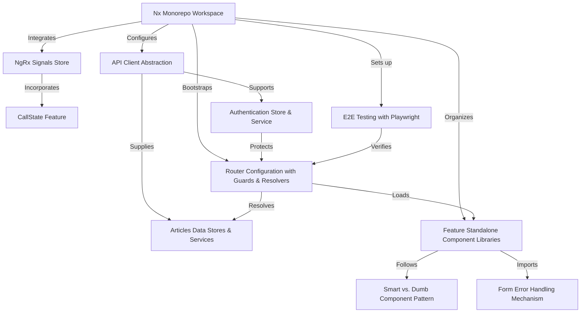

# Tutorial: angular-ngrx-nx-realworld-example-app

**RealWorld Example**: an Angular application in an **Nx Monorepo** that uses **NgRx Signals** to drive reactive state, enhanced by *CallState* for async status tracking, and a shared **API Client** for HTTP. Features are implemented as **lazy-loaded**, standalone libraries following a *smart/dumb* component pattern and unified **form error handling**. Routing employs a **zoneless** router with *guards* and *resolvers*, and end-to-end journeys are validated using **Playwright** tests.

**Source Repository:** [https://github.com/stefanoslig/angular-ngrx-nx-realworld-example-app](https://github.com/stefanoslig/angular-ngrx-nx-realworld-example-app)

## Chapters

1. [Nx Monorepo Workspace](01_nx_monorepo_workspace.md)
2. [NgRx Signals Store](02_ngrx_signals_store.md)
3. [CallState Feature](03_callstate_feature.md)
4. [API Client Abstraction](04_api_client_abstraction.md)
5. [Authentication Store & Service](05_authentication_store___service.md)
6. [Articles Data Stores & Services](06_articles_data_stores___services.md)
7. [Router Configuration with Guards & Resolvers](07_router_configuration_with_guards___resolvers.md)
8. [Feature Standalone Component Libraries](08_feature_standalone_component_libraries.md)
9. [Smart vs. Dumb Component Pattern](09_smart_vs__dumb_component_pattern.md)
10. [Form Error Handling Mechanism](10_form_error_handling_mechanism.md)
11. [E2E Testing with Playwright](11_e2e_testing_with_playwright.md)

---

Generated by [AI Codebase Knowledge Generator](https://github.com/vegeta03/codebase-knowledge-generator)
