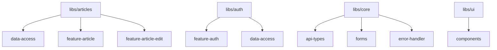
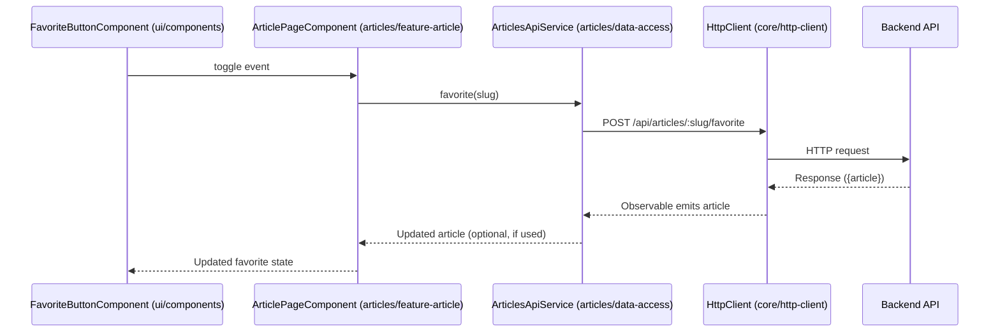
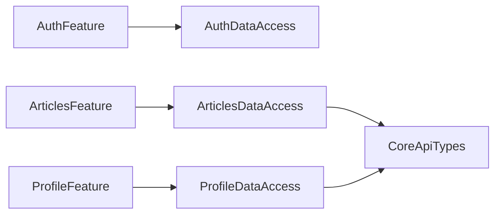

# Chapter 1: Domain Modularization and Nx Monorepo Structure

## Motivation: The Scaling Problem in Real World Angular Apps

Imagine you are building "Conduit": a real-world, Medium.com-like social blogging platform. Over time, the app will grow:

- Authentication evolves (e.g., 2FA, OAuth),
- Articles require new features (e.g., reactions, analytics),
- The UI expands with new forms, error displays, and widgets,
- Multiple teams work in parallel (auth, articles, profile, etc.).

**How do you ensure that:**

- Every team works without stepping on another team's toes?
- Features can grow in isolation, be reused, tested, and released independently?
- Code is navigable and maintainable a year from now, not just next week?
- Builds, tests, and deployments remain fast, even as the codebase grows?

Traditional Angular "monolith" approaches break down here. What you need is an architecture that naturally enforces boundaries and organizes complexity—**Domain Modularization**, supercharged by the Nx Monorepo toolkit.

This chapter introduces how the [`angular-ngrx-nx-realworld-example-app`](https://github.com/nenadicm/angular-ngrx-nx-realworld-example-app) achieves precisely this, via deliberate domain-driven modularity and Nx-powered enforcement.

---

## Key Concepts

Let's break down the main architectural principles:

### 1. **Domain Modularization**

**Simple Analogy:**  
Think of your app as a company. Each "department" (Articles, Auth, Profile, Core) has clear responsibilities, private files, shared APIs, and a few connections to others.

**In code:**  
Each domain (e.g., `articles`, `auth`, `profile`, `core`) is a *folder* under `/libs`, owning submodules by concern (data-access, features, UI, API contracts, etc.).

> "If it doesn't belong to your department/domain, you don't see or use it unless explicitly exposed!"

### 2. **Nx Monorepo Structure**

**Simple Analogy:**  
Nx acts as the HR and Security division—it enforces:

- Who can import what,
- When and what to build/test (via dependency graphs),
- Teams' boundaries,
- Project-wide consistency.

**In code:**  
Nx workspaces treat everything (apps, libs, tools) as separate *projects* under the hood:

- `/apps` contains entry points (like your "Conduit" SPA),
- `/libs/<domain>/<concern>` contains libraries, slice by slice,
- `nx.json` & `workspace.json` orchestrate builds, linting, test, and enforce dependency rules.

---

## Structure Overview: How the Project is Organized

A simplified view:

```plaintext
├── apps/
│   └── conduit/         # Main Angular app entry point ("the orchestrator")
│
├── libs/
│   ├── articles/
│   │   ├── data-access/          # API calls, state logic (NgRx Signal Store)
│   │   ├── feature-article/      # Smart components (article page)
│   │   ├── feature-article-edit/ # Smart components (article editor)
│   ├── auth/
│   │   ├── data-access/
│   │   ├── feature-auth/
│   ├── profile/
│   │   ├── data-access/
│   │   ├── feature-profile/
│   ├── home/
│   │   ├── feature-home/
│   ├── core/
│   │   ├── api-types/     # API contracts (interfaces, types)
│   │   ├── error-handler/
│   │   ├── forms/         # Form controls/utilities
│   │   ├── http-client/
│   ├── ui/
│   │   └── components/    # Pure, presentational Angular components (buttons, cards, error messages, etc.)
```

---

## Central Use Case: Isolating and Expanding the "Articles" Domain

Suppose you want to add a new "favorite article" feature—users can tap a star on any article to favorite it, which affects both article lists and the detail page.

How does domain modularization help?

- All state, API calls, and smart UIs for articles live under `libs/articles/`.
- You work *only* in:
  - `articles/data-access` (API logic, store),
  - `articles/feature-article` (article detail page),
  - `articles/feature-articles-list` (list page),
  - `ui/components/FavoriteButton` (our reusable favorite toggle).
- Article code can't "accidentally" start depending on Auth internals or Profile UI—thanks to Nx rules.

---

## Library Classification: Building Blocks

Libraries are grouped by two axes:

1. **Domain ("Department")** — What area of the business/app?
    - `articles`, `auth`, `profile`, `home`, `core`/`shared`
2. **Kind ("Concern")** — What is the type of logic?
    - `feature-*`: Smart, orchestrator components for pages/flows
    - `data-access`: Server communication, state stores, selectors
    - `ui`: Pure/presentational components
    - `forms`: Domain-specific or shared form controls
    - `api-types`: Data model contracts (TypeScript interfaces)

Visualized:



---

## Nx-Enforced Boundaries: What Does Nx Actually Do?

Nx uses configuration and static analysis to:

- **Detect and block** forbidden imports (e.g., `profile/feature` importing `auth/data-access`),
- **Trace affected projects** so only changed domains rebuild, test, or deploy,
- **Enforce dependency rules** (e.g., only `feature-*` can depend on `data-access`, not the other way around).

If you try to violate boundaries, Nik the Security Engineer (Nx!) warns you fast:

```shell
> nx lint articles-feature-article

  Violation: libs/articles/feature-article/src/article-page.component.ts
  - should not depend on: libs/auth/data-access

  Found forbidden dependency according to nx.json project graph!
```

---

## Example: Adding a Feature in the "Articles" Domain

### Step 1: Add a Favoriting API Call (`data-access`)

Create `articles/data-access/src/lib/articles-api.service.ts`:

```typescript
// File: libs/articles/data-access/src/lib/articles-api.service.ts

import { Injectable } from '@angular/core';
import { HttpClient } from '@angular/common/http';
import { Article } from '@realworld/core/api-types';

@Injectable({ providedIn: 'root' })
export class ArticlesApiService {
  constructor(private http: HttpClient) {}

  favorite(slug: string) {
    return this.http.post<{article: Article}>(`/api/articles/${slug}/favorite`, {});
  }
  unfavorite(slug: string) {
    return this.http.delete<{article: Article}>(`/api/articles/${slug}/favorite`);
  }
}
```

**Explanation:**  

- The API is only concerned with Articles.
- It uses contracts from `@realworld/core/api-types`.
- No leaking UI or unrelated logic from other domains.

### Step 2: Connect to Smart Component (`feature-article`)

```typescript
// File: libs/articles/feature-article/src/lib/article-page.component.ts

import { Component, inject } from '@angular/core';
import { ArticlesApiService } from '@realworld/articles/data-access';
import { Article } from '@realworld/core/api-types';

@Component({
  selector: 'cdt-article-page',
  template: `<!-- ... -->`
})
export class ArticlePageComponent {
  private articlesApi = inject(ArticlesApiService);

  onToggleFavorite(article: Article) {
    if (!article.favorited) {
      this.articlesApi.favorite(article.slug).subscribe();
    } else {
      this.articlesApi.unfavorite(article.slug).subscribe();
    }
  }
}
```

**Explanation:**  

- The component only interacts with **its own domain’s API service** — no direct access to Auth, Profile internals.
- It uses the contract from `core/api-types`.

### Step 3: Share UI Across Domains (e.g., UI Component)

Suppose the favorite star button itself is generic:

```typescript
// File: libs/ui/components/src/lib/favorite-button.component.ts

import { Component, Input, Output, EventEmitter } from '@angular/core';

@Component({
  selector: 'cdt-favorite-button',
  template: `
    <button (click)="toggle.emit()">
      <span *ngIf="favorited">★</span>
      <span *ngIf="!favorited">☆</span>
      {{count}}
    </button>
  `
})
export class FavoriteButtonComponent {
  @Input() favorited = false;
  @Input() count = 0;
  @Output() toggle = new EventEmitter<void>();
}
```

**Explanation:**  

- Pure, stateless UI; reusable in lists, details, etc.;
- Can be imported by *any* domain’s `feature-*` component;
- No business logic inside.

---

## What Actually Happens Under the Hood? (Sequence Diagram)

Let's visualize what happens when a user toggles "favorite" on an article:



- **UI** emits the toggle event,
- Smart Component **delegates to the domain API service**,
- API Service **handles the HTTP request**,
- Response propagates back up,
- **No crossing domain boundaries** (e.g., ArticlePageComponent can't call AuthService directly!).

---

## Enforcing Boundaries and Correct Imports

Nx enforces boundaries via a combination of file/folder location, TypeScript path mappings, and rules set in `nx.json` (see [`tsconfig.base.json`](#)):

Example excerpt from `tsconfig.base.json`:

```json
"paths": {
  "@realworld/articles/data-access": ["libs/articles/data-access/src/index.ts"],
  "@realworld/core/api-types": ["libs/core/api-types/src/index.ts"],
  // ...
}
```

**This mapping means:**

- Consumers must import via the public API (index.ts), not deep link into files.
- Nx can statically analyze *dependencies* and block forbidden references.
- Each "department" exposes only its intended API.

Try to reach across the org chart (e.g., features importing other features), Nx will yell at you (before a human code reviewer notices)!

---

## Internal Implementation: Nx Monorepo at Work

### 1. Code Location ↔️ Ownership

- Place Angular code in the correct spot under `/libs/domain/concern/*` (e.g., `articles/feature-article`)
- Public APIs via `src/index.ts`
- **No cross-domain implementation dependencies!**

### 2. Static Analysis (Nx Project Graph)

Nx constantly maintains a directed graph of dependencies (import statements), so when you...

- Change API in `core/api-types`—Nx builds/tests only affected projects.
- Build the app—Nx knows exactly which libs code in.



### 3. Lint/Build/Test Enforced by Nx

Nx project graph, lint rules, and test commands all use these dependency boundaries.

```bash
nx affected:test --base=main
nx affected:lint --base=main
nx build conduit
```

---

## Transition to Next Chapter

You now understand how domain-driven modularization, enforced with Nx, creates large-scale, maintainable, and collaborative Angular architectures. Boundaries remain firm, teams remain productive, and features grow in isolation.

Ready to see how routing maps features into the application shell, and how modern Angular lazy loading and resolver abstractions enable sort-and-streamlined user flows? Continue with [Routing, Lazy Loading, and Resolver Abstractions](02_routing__lazy_loading__and_resolver_abstractions.md).

---

**In summary:**  

- **Domains ≈ Departments**: Keep responsibilities clear,
- **Nx = Enforcer**: Enforces structure and boundaries,
- **All code grows scalably**: Enable rapid changes, integrations, and onboarding.

Welcome to scalable Angular architecture with Nx!

---

Generated by [AI Codebase Knowledge Generator](https://github.com/vegeta03/codebase-knowledge-generator)
