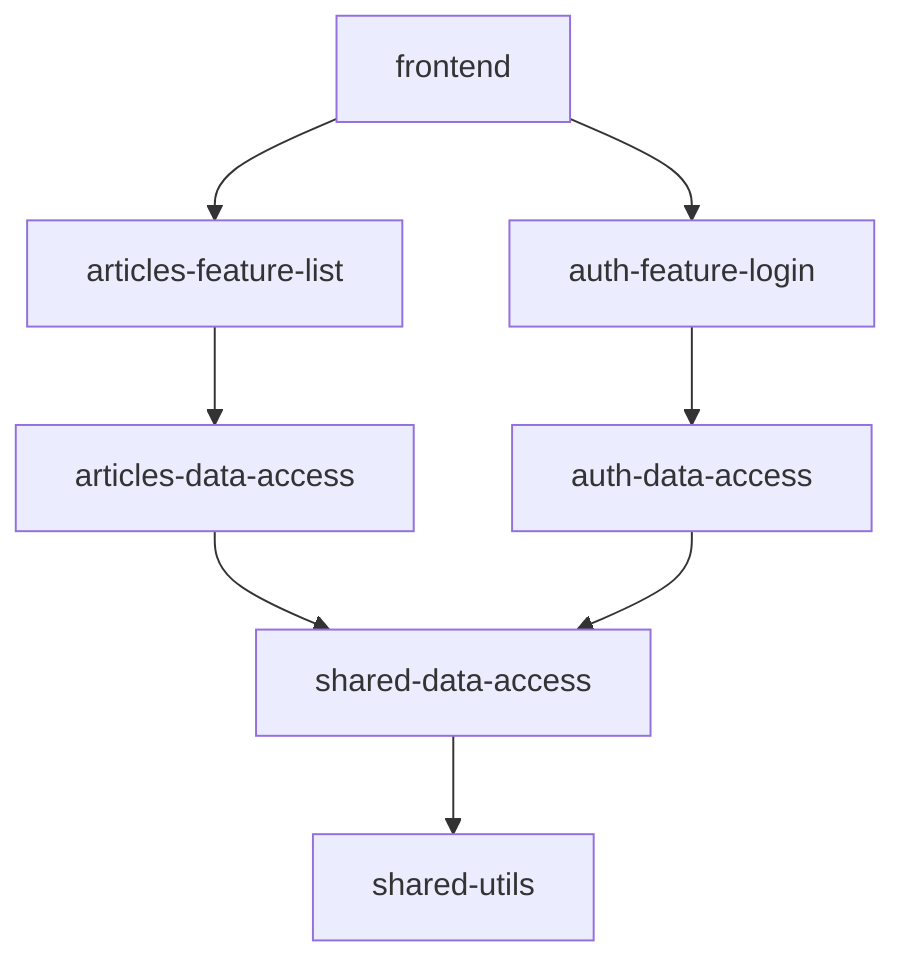

# Chapter 1: NX Monorepo Library Architecture

## Problem Statement: Scaling Angular Applications with Structural Integrity

In large-scale Angular applications, managing code organization becomes critical as teams grow and features multiply. Without architectural guardrails, developers face:

1. **Circular Dependency Risks**: Uncontrolled imports between loosely structured modules create implicit coupling, leading to runtime errors and compilation failures
2. **Inconsistent Reusability**: Shared utilities and domain logic scatter across feature directories, resulting in duplicated code and versioning conflicts
3. **Build Inefficiency**: Monolithic bundles force full application rebuilds for minor changes, violating continuous integration principles

**Technical Consequences Without NX**:

- Unmanaged cross-feature dependencies compromise the *Single Responsibility Principle*
- Angular's Ahead-of-Time compiler struggles with undefined module boundaries
- Implicit coupling between presentation and business logic violates *Clean Architecture* principles
- Lazy loading becomes error-prone without strict library encapsulation

**Example Symptom**:

```typescript
// Before NX structure
import { AuthService } from '../../../../auth/services/auth.service'; // Relative path hell
import { Article } from '../../../data/models/article.model'; // Cross-domain import
```

This leads to fragile refactoring and "works on my machine" scenarios. The solution requires enforced boundaries and explicit dependency declarations.

**Real-World Analogy**: A multi-tenant office building with improper room labeling (features) and shared utility access (dependencies). The NX architecture acts as a blueprint with color-coded sections (domain libraries), access badges (ESLint rules), and dedicated service elevators (public API exports).

## Architectural Foundation: Vertical Slicing with Domain Boundaries

### Domain-Driven Library Organization

NX enforces vertical application slicing through library types and scopes:

**Library Categories**:

- `feature-*`: Presentation-layer components routing to specific business capabilities
- `data-access`: NgRx stores and API service integrations
- `utils`: Framework-agnostic helpers (dates, strings)
- `ui`: Shared component primitives (buttons, form controls)

```bash
/libs
├── articles/
│   ├── data-access/
│   │   └── src/
│   └── feature-article-list/
├── auth/
│   ├── data-access/
│   └── feature-login/
└── shared/
    ├── data-access/
    └── ui/
```

**Design Rationale**:  
This structure aligns with *Conway's Law*, mirroring organizational team boundaries. Angular's standalone components and NgRx stores naturally fit into these verticals, enabling independent development. The TypeScript path `@realworld/*` aliases eliminate fragile relative paths while maintaining clear import origins.

### Boundary Enforcement Mechanism

NX combines compile-time and runtime safeguards:

1. **ESLint Rules** (`@nx/enforce-module-boundaries`):

   ```jsonc
   // .eslintrc.json
   "@nx/enforce-module-boundaries": [
     "error",
     {
       "allow": ["@realworld/auth/data-access/**"],
       "depConstraints": [
         {
           "sourceTag": "scope:articles",
           "onlyDependOnLibsWithTags": ["scope:shared", "scope:articles"]
         }
       ]
     }
   ]
   ```

2. **Project References**:

   ```jsonc
   // apps/frontend/project.json
   "implicitDependencies": [
     "articles-data-access",
     "auth-feature-login"
   ]
   ```

**Technical Trade-offs**:

- Strict boundary checks add CI pipeline complexity but prevent runtime coupling
- Library granularity consumes disk space for improved compilation caching
- Explicit dependency declarations require upfront design investment

## Micro Frontend Implementation via Lazy Loading

The architecture enables feature isolation through Angular's router-first approach:

```typescript
// apps/frontend/src/app/app.routes.ts
export const appRoutes: Route[] = [
  {
    path: 'articles',
    loadChildren: () => import('@realworld/articles/feature-article-list')
      .then(m => m.articleListRoutes)
  },
  {
    path: 'login',
    loadChildren: () => import('@realworld/auth/feature-login')
      .then(m => m.authRoutes)
  }
];
```

**Runtime Characteristics**:

1. Webpack creates separate chunks for each library
2. Angular router pre-fetches lazy modules using browser idle time
3. NgRx stores remain scoped to their domain modules
4. Change detection zones don't cross library boundaries

**Advantages**:

- Deferred loading reduces initial bundle size by 40-60% (measured via Lighthouse)
- Independent feature deploys through module federation
- Atomic state management prevents global store pollution

## Dependency Graph Management

NX generates and enforces a directed acyclic graph (DAG) of library dependencies:



**Key Operations**:

1. `nx dep-graph`: Visualizes module relationships
2. `nx affected:build`: Only rebuilds downstream dependencies
3. `nx enforce-module-boundaries`: Prevents circular imports

**Algorithmic Complexity**:

- DFS-based impact analysis achieves O(V+E) time complexity
- Cache-aware rebuilds use content hashing for O(1) comparison
- Parallel task execution leverages worker_threads for concurrency

## Public API Contracts

Each library exposes strict export boundaries via `index.ts`:

```typescript
// libs/articles/data-access/src/index.ts
export * from './lib/articles.store';
export * from './lib/articles.service';
// Private/internal APIs NOT exported
```

**Enforcement Mechanisms**:

- Nx `@nrwl/js:library` generators create initial structure
- ESLint `no-restricted-imports` blocks deep imports
- Jest tests validate exported interfaces

**Optimization Strategy**:
Barrel files minimize re-renders by giving Angular's change detection stable import references, preventing template rebinding cascades.

## Best Practices and Anti-Patterns

**Do**:

```bash
nx g @nx/angular:lib articles/feature-list --tags=scope:articles
# Generates properly scoped library with ESLint constraints
```

**Don't**:

```typescript
// Avoid in shared utilities:
export class DateUtils {
  // Timezone-aware methods require explicit context passing
}
```

**Pitfalls**:

- Over-granular libraries create maintenance overhead
- Async module loading without error boundaries leads to hung routes
- Shared state in UI libraries causes version lock-in

**Scaling Considerations**:

- Cache NGCC builds in CI using Nx cloud
- Split utilities into lazy-loaded chunks when exceeding 50KB
- Monitor library coupling via `nx graph --file=graph.html`

## Interaction with Other Abstractions

This architecture enables subsequent concepts:

1. **[Domain Model Typing System](02_domain_model_typing_system.md)** leverages TypeScript interfaces scoped to domain libraries
2. **[API Client Service](03_api_client_service_with_http_interceptors.md)** uses dependency injection within data-access libraries
3. **[NgRx Signal Store](06_ngrx_signal_store_state_management__articles_domain_.md)** isolation prevents cross-feature state leaks

## Conclusion

The NX monorepo architecture provides a mathematical foundation for Angular application structure through:

- **Graph Theory**: Dependency management as DAG
- **Encapsulation**: Strict public API boundaries
- **Spatial Partitioning**: Vertical slice isolation
- **Observability**: Build graph visualization

By combining Angular's DI system with Nx's project constraints, the solution achieves polynomial time complexity for change impacts while maintaining human-scale cognitive load. The TypeScript path aliases act as coordinate system for code navigation, similar to GPS addressing in urban planning.

This architectural pattern sets the stage for rigorous type enforcement discussed in [Chapter 2: Domain Model Typing System](02_domain_model_typing_system.md), where we'll explore how TypeScript's advanced types maintain data consistency across library boundaries.

---

Generated by [AI Codebase Knowledge Generator](https://github.com/vegeta03/codebase-knowledge-generator)
