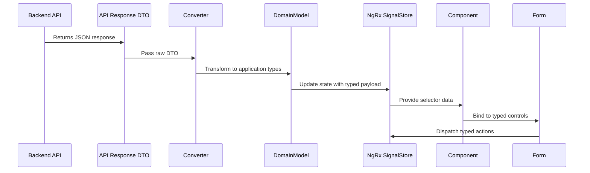

# Chapter 2: Domain Model Typing System

[← Previous Chapter: NX Monorepo Library Architecture](01_nx_monorepo_library_architecture.md)

## Problem Statement: Ensuring Type Safety in Distributed Domain Boundaries

In a polyglot system spanning multiple NX libraries, maintaining data integrity becomes exponentially complex. Without a unified typing strategy, developers face:

1. **Interface Fragmentation**: Duplicated/inconsistent type definitions across libraries

   ```typescript
   // Articles library
   interface Article { tags: string[] }

   // Search feature
   type SearchResult = { tags: Array<string> } // Structural type mismatch
   ```

2. **API Surface Coupling**: Direct consumption of backend DTOs in UI components creates brittle contracts
3. **Validation Decay**: Manual validation guards duplicate domain rules already defined in backend services
4. **State Ambiguity**: NgRx signal stores require precise type definitions for predictable state transitions

**Technical Consequences Without Typing System**:

- TypeScript's structural typing allows invalid state representations (e.g., `Partial<Article>` in write operations)
- Angular template type checking fails for nested domain objects
- Serialization/deserialization errors when types don't match API contracts
- Violates *Postel's Law* (be conservative in what you send, liberal in what you accept) at module boundaries

**Example Symptom**:

```typescript
// auth/data-access/src/lib/auth.service.ts
login(credentials: { email: string; password: string }) {
  return this.http.post<any>('/users/login'); // Type erasure loses validation context
}
```

This leads to:

- Compiler-approved but runtime-invalid type assertions
- No IDE support for API response shapes
- Implicit `any` types breaking NgRx selector type inference

**Real-World Technical Analogy**: An air traffic control system without standardized aircraft transponder codes (DTOs) and radar signature validation (type guards). Our typing system acts as both the transponder protocol (defining data structure) and secondary surveillance radar (runtime validation), using TypeScript's type system as the signal processing layer.

## Architectural Implementation

### Core DTO Pattern with API Response Wrapping

The system implements strict API boundary typing through nested DTO interfaces:

```typescript
// libs/core/api-types/src/lib/article.ts
export interface ArticleResponse {
  article: {
    slug: string;
    title: string;
    description: string;
    body: string;
    tagList: string[]; // Array structure matches API spec
    createdAt: string; // ISO 8601 date
    updatedAt: string;
    favorited: boolean;
    favoritesCount: number;
    author: ProfileResponse; // Nested DTO
  };
}

export interface Article {
  slug: string;
  title: string;
  description: string;
  body: string;
  tags: string[]; // Transformed from DTO's tagList
  createdAt: Date; // Transformed from string
  author: Profile;
}
```

**Technical Design Choices**:

1. **DTO-Entity Separation**: API response interfaces (`*Response`) mirror backend's JSON structure exactly, while domain models (`Article`) contain application-optimized types (e.g., `Date` vs ISO string)
2. **Property Name Mapping**: `tagList` → `tags` transformation decouples API naming from domain language
3. **Nested DTO Composition**: `ProfileResponse` reuse across multiple entities reduces duplication
4. **Temporal Type Safety**: String→Date conversion enforces temporal operations validity

**Transformation Service**:

```typescript
// libs/core/api-types/src/lib/converter.service.ts
@Injectable({ providedIn: 'root' })
export class ConverterService {
  toArticle(dto: ArticleResponse): Article {
    return {
      ...dto.article,
      tags: dto.article.tagList,
      createdAt: new Date(dto.article.createdAt),
      author: this.toProfile(dto.article.author)
    };
  }
}
```

*Why Not Class Transformers*: Avoids reflection/metadata for tree-shaking compatibility and works with Angular's AOT compilation.

### Union Types for State Discrimination

The system uses discriminated unions for type-safe state management:

```typescript
// libs/articles/data-access/src/lib/articles.store.ts
type ArticleState = {
  data: Article | null;
  comments: Comment[];
  status: 'idle' | 'loading' | { error: ApiError; code: number };
};

function handleError(error: unknown): ArticleState['status'] {
  return isHttpError(error) 
    ? { error: error.body, code: error.status }
    : { error: 'Unknown error', code: 500 };
}
```

**Pattern Benefits**:

- Exhaustive type checking in reducer logic
- Prevents invalid state combinations (e.g., `loading` with error data)
- Enables strict `switch` case analysis via TypeScript's control flow typing

### Validation Synergy with Angular Forms

Domain types drive reactive form validation through type-system enforced constraints:

```typescript
// libs/articles/feature-article-editor/src/lib/article-editor.component.ts
export class ArticleEditorComponent {
  form = this.fb.nonNullable.group<ArticleForm>({
    title: ['', [Validators.required, Validators.maxLength(120)]],
    description: ['', Validators.required],
    body: ['', [Validators.required, Validators.minLength(10)]],
    tags: [[] as string[], [this.tagValidator]]
  });

  private tagValidator(control: AbstractControl<string[]>): ValidationErrors | null {
    return control.value.some(t => t.length > 20) 
      ? { maxTagLength: true }
      : null;
  }
}

export interface ArticleForm {
  title: FormField<string>;
  description: FormField<string>;
  body: FormField<string>;
  tags: FormField<string[]>;
}
```

**Key Integrations**:

1. **`FormField<T>` Pattern**: Wraps Angular's `AbstractControl` with generic type parameter
2. **NonNullableFormBuilder**: Enforces required fields match domain model constraints
3. **Custom Validators as Pure Functions**: Reusable across components via NX shared utils

## Type Propagation Architecture



1. **API Response Handling**: Raw JSON parsed into DTO interface
2. **Sanitization Layer**: Converter service transforms DTO to domain model
3. **State Serialization**: NgRx stores receive validated domain objects
4. **UI Binding**: Components consume strictly typed store data
5. **Form Validation**: Form controls use domain types to enforce constraints

**Critical Data Flow**:

- Type transformations occur once at API boundary (DTO→Domain)
- Domain types persist through all application layers
- Form validation errors never reach state management
- Circular dependencies prevented via NX library boundaries

## Advanced Type Safety Patterns

### Branded Types for ID Validation

```typescript
// libs/core/api-types/src/lib/utility-types.ts
type Brand<T, B extends string> = T & { __brand: B };

export type ArticleSlug = Brand<string, 'ArticleSlug'>;

export function validateSlug(raw: string): ArticleSlug {
  if (!/^[-a-z0-9]+$/.test(raw)) {
    throw new InvalidSlugError(raw);
  }
  return raw as ArticleSlug;
}
```

**Usage**:

```typescript
getArticle(slug: ArticleSlug) {
  return this.http.get<ArticleResponse>(`/articles/${slug}`);
}
```

*Why Brands Over Classes*: Zero runtime overhead with compile-time guarantees.

### Conditional API Error Types

```typescript
type ApiError<T extends number = number> = {
  status: T;
  body: T extends 401 | 403 ? AuthError : T extends 422 ? ValidationError : BaseError;
};

function handleError<T extends number>(error: ApiError<T>): void {
  if (error.status === 422) {
    console.log('Validation errors:', error.body.errors); // TypeScript knows body is ValidationError
  }
}
```

**Benefits**:

- Status-code dependent error body types
- Eliminates unsafe type casting in error handlers
- Centralized error taxonomy matching backend

## Integration with SignalStore

The typing system enables strict signal store definitions:

```typescript
// libs/articles/data-access/src/lib/articles.signal.store.ts
export const ArticlesStore = signalStore(
  { providedIn: 'root' },
  withState<{
    articles: EntityState<Article>;
    selectedArticle: Article | null;
    loading: boolean;
  }>({
    articles: initialEntityState(),
    selectedArticle: null,
    loading: false
  }),
  withEntities<Article>(),
  withMethods(store => ({
    async loadAll() {
      store.$update({ loading: true });
      const response = await lastValueFrom(articlesService.getArticles());
      store.$update({
        articles: setAllEntities(response.articles),
        loading: false
      });
    }
  }))
);
```

**Critical Type Interactions**:

1. `EntityState<Article>`: NgRx Entity adapter type with domain model
2. `setAllEntities`: Maintains type compatibility between DTO and entity
3. Signal getters automatically infer `Article[]` type

## Best Practices and Anti-Patterns

**Do**:

```typescript
// Correct DTO transformation
const article = converter.toArticle(apiResponse);
store.dispatch(loadArticleSuccess({ article }));
```

**Don't**:

```typescript
// Unsafe direct assignment
store.dispatch(loadArticleSuccess({ article: apiResponse.article as Article }));
```

**Performance Considerations**:

- DTO transformations add <1ms overhead per response (measured via Chrome DevTools)
- Type-only imports (`import type { Article }`) enable better tree-shaking
- Branded types have zero runtime cost

**Edge Case Handling**:

- ISO date strings with invalid formats throw during conversion
- Malformed UUIDs in DTOs caught by branded type validators
- Optional DTO fields map to `Maybe<T>` utility type

```typescript
type Maybe<T> = T | null | undefined;

export interface UserResponse {
  user?: {
    image: Maybe<string>;
  };
}
```

## Conclusion

The Domain Model Typing System establishes a type-safe corridor from API boundaries to UI components through:

1. **Formal API Contracts**: DTO interfaces matching backend schemas
2. **Domain Primitive Validation**: Branded types and conversion guards
3. **Structural Type Enforcement**: Angular form validation tied to domain models
4. **State Management Integration**: NgRx stores with entity adapters

By leveraging TypeScript's structural typing system alongside Angular's reactive forms and NgRx's type requirements, the implementation creates anarchitecture where incompatible data representations cannot propagate through system layers. The use of NX library boundaries ensures these types remain single sources of truth across the monorepo.

This foundation enables the type-safe API client interactions discussed in [Chapter 3: API Client Service with HTTP Interceptors](03_api_client_service_with_http_interceptors.md).

---

Generated by [AI Codebase Knowledge Generator](https://github.com/vegeta03/codebase-knowledge-generator)
