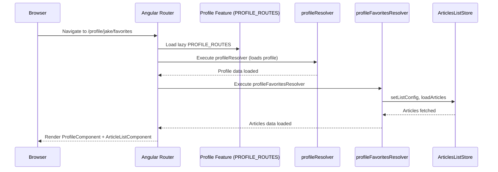
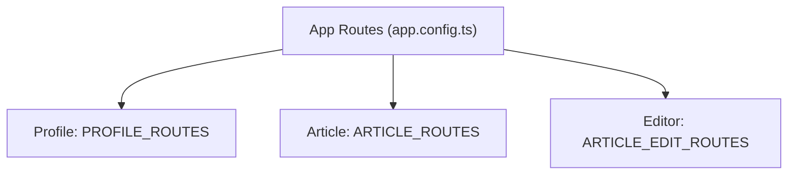

# Chapter 2: Routing, Lazy Loading, and Resolver Abstractions

[← Domain Modularization and Nx Monorepo Structure](01_domain_modularization_and_nx_monorepo_structure.md)

---

## Bridging Modular Features with Modern Angular Routing

In [Chapter 1: Domain Modularization and Nx Monorepo Structure](01_domain_modularization_and_nx_monorepo_structure.md), you saw how a well-structured monorepo splits features into independent, testable, and strictly-boundaried "departments." Now comes the critical question: **How are these departments orchestrated together into a seamless, fast, reactive application?**

_The answer: through powerful, lazy-routed, and composable navigation—driven by Angular's modern Standalone Router, lazy loading, and functional resolvers._

---

## Motivation: When (and Why) Routing is More Than URLs

Imagine a user visits `/profile/jake/favorites`. For the best experience, we want:

- Only relevant code and data to load (not the entire app).
- The UI to "just work"—with Jake's favorited articles ready before the component "lands".
- Authentication protection for personal areas.
- Rapid navigation, minimal flicker, and maximal UX.

**Problem:**  
Large apps quickly become slow or tangled if every navigation loads too much, or code for unrelated features is loaded upfront, or component trees must bootstrap their own data after navigation.

**Solution:**  
_A highly modular, declarative, and lazy router config, backed by functional resolvers and guards, connects each feature’s department—allowing only the right planes (modules) to land on the right runways (URLs), after pre-flight checks (data preload/guards) are done._

---

## Central Example Use Case

**Scenario:**  
_When a user visits `/profile/jake/favorites`, the app must:_

1. Lazily load only the "Profile" and "Article" features it needs.
2. Preload "Jake’s" profile data and favorited articles before any page logic runs.
3. Ensure only authenticated users can reach this page.
4. Display content instantly as soon as everything’s ready.

**Let’s see exactly how this is achieved.**

---

## Key Concepts

Let's break down the core building blocks:

- **Standalone Angular Router Config**
- **Lazy Loading (loadComponent / loadChildren)**
- **Functional Resolvers and Guards**

### 1. Standalone Angular Router Config

In modern Angular (v14+), you can define routing separate from modules, using standalone route definitions in plain TypeScript—no more verbose routing modules!

**Benefits:**

- Routes become more central, declarative, and easier to split per feature.
- Features can expose their own `ROUTES` array as an exported constant.

#### Example: App-level Routing Setup

```typescript
// File: apps/conduit/src/app/app.config.ts

import { provideRouter } from '@angular/router';

export const appConfig = {
  providers: [
    provideRouter([
      { path: '', redirectTo: 'home', pathMatch: 'full' },
      { path: 'home', loadComponent: () => import('@realworld/home/feature-home').then(m => m.HomeComponent) },
      { path: 'login', loadComponent: () => import('@realworld/auth/feature-auth').then(m => m.LoginComponent) },
      // ... more top-level routes ...
      {
        path: 'profile',
        loadChildren: () => import('@realworld/profile/feature-profile').then(profile => profile.PROFILE_ROUTES),
      },
    ])
  ]
};
```

**Explanation:**  
At the top level, each root URL simply points to either a standalone component or a lazy set of child routes—no imports of concrete component classes, only TypeScript-level references via `import()`.

---

### 2. Lazy Loading: `loadComponent` and `loadChildren`

**What does this mean?**  
Components/pages/features are loaded _only_ when the user needs them—keeping the main bundle tiny and navigation fast.

- Use `loadComponent: () => import(...).then(x => x.XComponent)` for single-page routes.
- Use `loadChildren: () => import(...).then(x => x.ROUTES)` for sets of nested routes (e.g., a feature’s full routing tree).

**Why?**  

- **Performance:** You ship only what the user asks for.
- **Scalability:** Each "department" (feature lib) can own its own routes.
- **Isolation:** Teams can independently add/change their own route configs.

---

### 3. Functional Resolvers and Guards

**Resolvers:**  
Think of a resolver as a "pre-flight check". Before navigating to a page, the router runs the resolver, which can:

- Fetch required data (e.g., profile info, articles).
- Populate stores or services, so the component has _instant_ access when activated.

**Guards:**  
Guards determine whether navigation should proceed (e.g., authentication check).

Both can now be written as **pure functions** that rely on dependency injection (with `inject()`).

---

## Walking through the Use Case: `/profile/jake/favorites`

### 1. Route Declaration in the Feature: `PROFILE_ROUTES`

```typescript
// File: libs/profile/feature-profile/src/profile.routes.ts

import { ArticleListComponent } from '@realworld/articles/feature-articles-list/src';
import { authGuard } from '@realworld/auth/data-access';
import {
  profileArticlesResolver,
  profileFavoritesResolver,
  profileResolver,
} from '@realworld/profile/data-access';
import { ProfileComponent } from './profile.component';

export const PROFILE_ROUTES: Routes = [
  {
    path: ':username',
    component: ProfileComponent,
    resolve: { profileResolver },
    canActivate: [authGuard],
    children: [
      {
        path: '',
        component: ArticleListComponent,
        resolve: { profileArticlesResolver },  // Loads user's articles by default
      },
      {
        path: 'favorites',
        component: ArticleListComponent,
        resolve: { profileFavoritesResolver }, // Loads favorites for user
      },
    ],
  },
];
```

**Explanation:**  

- `profileResolver` runs before the parent component is created—loading the profile data.
- Both child routes (`''` and `'favorites'`) render an article list, but use different resolvers for different data (user’s articles vs. favorited articles).
- `authGuard` protects the whole profile area.

---

### 2. Resolver Implementation: Preloading Data

Let’s look at the _favorites_ resolver:

```typescript
// File: libs/profile/data-access/src/resolvers/profile-favorites-resolver.ts

import { inject } from '@angular/core';
import { ActivatedRouteSnapshot, ResolveFn } from '@angular/router';
import { of } from 'rxjs';
import { ArticlesListStore, articlesListInitialState } from '@realworld/articles/data-access';

export const profileFavoritesResolver: ResolveFn<boolean> = (route: ActivatedRouteSnapshot) => {
  const username = route?.parent?.params['username'];
  const articlesListStore = inject(ArticlesListStore);

  const config = {
    ...articlesListInitialState.listConfig,
    filters: { ...articlesListInitialState.listConfig.filters, favorited: username }
  };

  articlesListStore.setListConfig(config);
  articlesListStore.loadArticles(config);

  return of(true);
};
```

**Explanation:**  

- Reads the username parameter from the route.
- Configures the articles list store to load only articles favorited by this user.
- Kicks off the data load _before_ activating the ArticleListComponent.
- Returns an observable, as required—the router waits for completion.

---

### 3. Guard Implementation: Protecting Routes

```typescript
// File: libs/auth/data-access/src/lib/auth.guard.ts

import { inject } from '@angular/core';
import { CanActivateFn, Router } from '@angular/router';
import { AuthService } from './auth.service';

export const authGuard: CanActivateFn = () => {
  const authService = inject(AuthService);
  const router = inject(Router);

  if (authService.isAuthenticated()) {
    return true;
  }
  // Redirect to login if not authenticated
  router.navigate(['/login']);
  return false;
};
```

**Explanation:**  

- Guards can be functions that use dependency injection.
- Simple logic: only allow access if user is authenticated.

---

## The Flow: What Actually Happens Step-by-Step?

Let's visualize navigation to `/profile/jake/favorites`:



**Explanation:**  

- Only profile and article list features ("planes") are loaded.
- Data for profile _and_ articles is pre-loaded ("pre-flight check") _before_ rendering the component.
- Components mount with all the data ready to go—no spinners, no component-internal bootstrapping.

---

## A Closer Look: Internal Implementation Details

### How Standalone Route Configs Fit Together

- **Application-level routes:**  
  Declared in `app.config.ts`, reference domain-specific `feature-xyz/ROUTES` arrays.

- **Domain (Feature) routes:**  
  Each feature folder (e.g., `profile/feature-profile`) exports its route config (`PROFILE_ROUTES`), using standalone components/resolvers/guards.

- **Composable across libs:**  
  Feature "departments" never need to know about each other—only the central router orchestrates connections.

#### Visual: Route Configurations and their Ownership



**No feature imports another’s routing—total domain isolation!**

---

### Building a Resolver: Example Step-by-Step

Let’s build a resolver for editing articles.

**Use case:** When a user goes to `/editor/:slug`, the page should have the article ready for editing _before_ the editor UI loads.

```typescript
// File: libs/articles/feature-article-edit/src/resolvers/article-edit-resolver.ts

import { inject } from '@angular/core';
import { ActivatedRouteSnapshot, ResolveFn } from '@angular/router';
import { ArticleStore } from '@realworld/articles/data-access/src';
import { of } from 'rxjs';

export const articleEditResolver: ResolveFn<boolean> = (route: ActivatedRouteSnapshot) => {
  const slug = route.params['slug'];
  const articleStore = inject(ArticleStore);

  if (slug) {
    articleStore.getArticle(slug);
  }

  // Must return an observable
  return of(true);
};
```

**What happens here?**

- Fetches the article for the given slug, **before** activating the edit page.
- Populates the store, so the editor component has the article data ready via signal/selectors.

**Where is it wired?**

```typescript
// File: libs/articles/feature-article-edit/src/article-edit.routes.ts

import { ArticleEditComponent } from './article-edit.component';
import { articleEditResolver } from './resolvers/article-edit-resolver';

export const ARTICLE_EDIT_ROUTES: Routes = [
  {
    path: '',
    component: ArticleEditComponent,
    children: [
      {
        path: '',
        pathMatch: 'full',
        component: ArticleEditComponent,
        canActivate: [authGuard],
      },
      {
        path: ':slug',
        component: ArticleEditComponent,
        resolve: { articleEditResolver },
      }
    ],
  },
];
```

---

## Advanced: Abstracting Resolvers and Guards

One major strength here is the **abstraction**—feature teams write small, intent-focused functions for preloading state; the router composes them declaratively. This is possible because:

- Resolvers/guards are **plain functions** (no classes), easy to test and evolve.
- They leverage **dependency injection** with `inject()`.
- Logic is strictly **side-effecting** (loads state/services), not UI-bound.
- The **lifecycle is observable**: router waits for completion before instantiating components.

---

## Analogy: Routing as Air Traffic Control

Think of each route as a runway, each feature as a plane:

- **Lazy loading:**  
  The plane (feature module/component) is called to the gate only when a runway (route) is requested.
- **Guards:**  
  Control tower checks the pilot’s credentials before taxiing onto the runway.
- **Resolvers:**  
  Pre-flight checks: refuel, load passengers (data), and only then is the flight (component) cleared to depart.
- **Components:**  
  Land perfectly, fully prepared, with everything on board.

---

## Summary: Why This Routing Model Wins

- **Modular:** Each team/department owns and exposes its own routes, with strict boundaries.
- **Performant:** Only what's necessary is shipped, fetched, and rendered.
- **Compositional:** You can easily nest, extend, or override feature flows as the business grows.
- **Testable:** Resolvers and guards are pure, functional, and easy to test.
- **Declarative:** The router config is the only "map," easy to reason about.

Together, this allows large teams to **collaborate fearlessly** without stepping on each other’s toes—and for users to enjoy blazing-fast, seamless navigation.

---

## Next Steps

In the next chapter, you'll learn how the project leverages modern Angular **smart and presentational standalone components**—keeping page smartness and UI rendering concerns highly isolated and composable. This pattern, combined with the routing model you've just explored, is the backbone of scalable view architecture.

👉 Continue reading:  
[Standalone Smart and Presentational Components Pattern](03_standalone_smart_and_presentational_components_pattern.md)

---

Generated by [AI Codebase Knowledge Generator](https://github.com/vegeta03/codebase-knowledge-generator)
