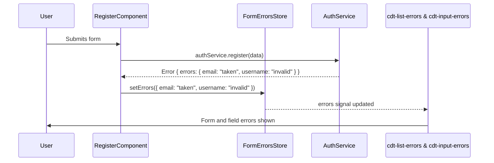

# Chapter 6: Form Error Handling Abstraction

[← Call State Abstraction (withCallState Feature)](05_call_state_abstraction__withcallstate_feature_.md)

---

## Motivation: Why Abstract Form Error Handling?

As Angular apps scale, user input forms multiply—registration, login, profile, article edit, comments, settings, and more. Each form brings two intertwined error-handling challenges:

- **Field-level errors**: "This email is required", "Must be at least 8 characters."
- **Form-level errors**: "Invalid credentials", "Server temporarily unavailable", "Username already taken."

**Central Use Case:**  
*Suppose a user submits the "Register" form. Their data passes local validation, but the server responds:*

- `{"errors": { "email": "already taken", "username": "contains invalid characters" }}`

*You want:*

- Each field to show precise messages (“Email already taken” under the email input).
- The top of the form to list all errors clearly (“Username contains invalid characters”).
- Consistent UX and reliable error signals for all forms across your app.
- Abstract error management and test it independently of the UI.

**The problem:**  
Traditionally, Angular developers scatter ad-hoc error handling code in every form component. This leads to:

- Inconsistent error formats and messages.
- Messy presentation logic bleeding into business code.
- Hard-to-test components and tangled control flow for edge-cases.

**The solution:**  
*Decouple error state management from presentation*—by introducing a **centralized, reactive Form Error Store** and reusable error display components/pipes across your codebase. Treat error handling as a first-class, testable abstraction, not a UI afterthought.

---

## Key Concepts: Building Robust Form Error Handling

Let’s clarify the moving parts in this abstraction.

### 1. **Centralized, Reactive Store for Form-Level Errors**

A single source of truth for all errors relating to a form (not just field validity)—updated by API responses or business logic.

### 2. **Reusable Error Display Utilities**

Components like `<cdt-input-errors>` or `<cdt-list-errors>`, and error-mapping pipes, render error signals at the right place, consistently.

### 3. **Input Error Mapping**

Translate technical validation keys (`minlength`, `pattern`, `customApiError`) and API error payloads into human-friendly messages.

### 4. **Error Visibility Management**

Logic to show errors only if a user has "touched" or "dirtied" an input, and not on pristine fields—improving UX.

### 5. **Decoupling from the UI**

The form error store is testable, domain-agnostic, and not tied to any specific component or visual style.

---

## Applying the Abstraction: End-to-End Example

Let’s build (and then dissect) a robust Register form, wiring up:

- Form controls with validation.
- API submission capturing errors.
- Centralized Form Error Store.
- Presentational components displaying errors.
- Error pipes for field-level mapping.

### Step 1: Creating the Form and Connecting FormErrorsStore

**register.component.ts** (simplified for clarity):

```typescript
import { Component, inject } from '@angular/core';
import { FormBuilder, Validators } from '@angular/forms';
import { FormErrorsStore } from '@realworld/core/forms';
import { AuthService } from '@realworld/auth/data-access';

@Component({
  selector: 'cdt-register',
  templateUrl: './register.component.html',
  // ...
})
export class RegisterComponent {
  private fb = inject(FormBuilder);
  private authService = inject(AuthService);
  private formErrors = inject(FormErrorsStore);

  form = this.fb.group({
    username: ['', [Validators.required, Validators.minLength(3)]],
    email: ['', [Validators.required, Validators.email]],
    password: ['', [Validators.required, Validators.minLength(6)]],
  });

  // Expose errors as signal to template
  $errors = this.formErrors.errors;

  onSubmit() {
    if (this.form.valid) {
      // Submit via API
      this.authService.register(this.form.value).subscribe({
        next: () => {/* success UI */},
        error: (apiError) => {
          // Set form-level errors in FormErrorsStore, mapping server error shape
          this.formErrors.setErrors(apiError.errors || {});
        }
      });
    }
  }
}
```

**Explanation:**  

- The RegisterComponent builds a form and injects FormErrorsStore (provided in root).
- On a failed API call, it passes server errors to formErrors, which stores and exposes them reactively.
- UI (see template below) can now bind to `$errors`.

---

### Step 2: Displaying Form-Level Errors

**register.component.html:**

```html
<!-- Display a list of all form errors at the top -->
<cdt-list-errors [errors]="$errors()"></cdt-list-errors>

<form [formGroup]="form" (ngSubmit)="onSubmit()">
  <!-- Field Inputs... (see below) -->
</form>
```

**Explanation:**  

- `<cdt-list-errors>` is a reusable, presentational UI component—displays any array of errors.
- Pass in the error signal from the error store. Whenever errors update, so does the display.

---

### Step 3: Field-Level Validation and Error Rendering

For each field, combine Angular validation and custom error mapping.

**register.component.html (continued):**

```html
<label>
  Username
  <input formControlName="username" />
  <cdt-input-errors [control]="form.get('username')"></cdt-input-errors>
</label>
<label>
  Email
  <input formControlName="email" />
  <cdt-input-errors [control]="form.get('email')"></cdt-input-errors>
</label>
<label>
  Password
  <input type="password" formControlName="password" />
  <cdt-input-errors [control]="form.get('password')"></cdt-input-errors>
</label>
```

**Explanation:**  

- For each field, `<cdt-input-errors>` shows validation errors using Angular’s own form control state.
- Handles visibility (“touched”/“dirty” logic) automatically, so untouched fields don’t spam the user with errors.

---

### Step 4: Mapping Validation Keys to User-Friendly Messages

**input-errors/error-messages.ts**:

```typescript
import { InjectionToken } from '@angular/core';

export const ERROR_MESSAGES: { [key: string]: (args?: any) => string } = {
  required: () => `Required field`,
  email: () => `Not a valid email`,
  minlength: ({ requiredLength }) => `The length should be at least ${requiredLength} characters`,
};

export const VALIDATION_ERROR_MESSAGES = new InjectionToken(
  `Validation Messages`,
  {
    providedIn: 'root',
    factory: () => ERROR_MESSAGES,
  }
);
```

**Explanation:**  

- Map both standard Angular validator keys and any custom error codes to clean, localized strings.
- New field or custom validation? Add entries to this map—no UI change needed.

---

### Step 5: The ErrorMapperPipe (input-errors/error-mapper-pipe.ts)

```typescript
import { inject, Pipe, PipeTransform } from '@angular/core';
import { VALIDATION_ERROR_MESSAGES } from './error-messages';

@Pipe({ name: 'errorMapper' })
export class ErrorMapperPipe implements PipeTransform {
  private errorMessages = inject(VALIDATION_ERROR_MESSAGES);

  transform(key: string, errValue: any): string {
    if (!this.errorMessages[key]) {
      return '';
    }
    return this.errorMessages[key](errValue);
  }
}
```

**Explanation:**  

- Translates `{ required: true }` or `{ minlength: { requiredLength: 6 } }` into clear user messages.
- Used inside `<cdt-input-errors>`, but can be used in custom field UIs as well.

---

### Step 6: InputErrorsComponent (input-errors/input-errors.component.ts)

```typescript
import { Component, input } from '@angular/core';
import { AbstractControl } from '@angular/forms';
import { ErrorMapperPipe } from './error-mapper-pipe';
import { IsErrorVisibleDirective } from './is-error-visible.directive';
import { KeyValuePipe } from '@angular/common';

@Component({
  selector: 'cdt-input-errors',
  templateUrl: './input-errors.component.html',
  // ...other boilerplate...
  imports: [KeyValuePipe, ErrorMapperPipe, IsErrorVisibleDirective],
})
export class InputErrorsComponent {
  readonly control = input.required<AbstractControl>();
}
```

**input-errors.component.html**  

```html
<ul *cdtIsErrorVisible="control">
  <li *ngFor="let error of control.errors | keyvalue">
    {{ error.key | errorMapper:error.value }}
  </li>
</ul>
```

**Explanation:**  

- If field is invalid and error should be visible (touched/dirty), show the mapped errors underneath in a bullet list.
- Pipe takes care of the translation.

---

### Step 7: ListErrorsComponent (list-errors/list-errors.component.ts)

```typescript
import { Component, Input, ChangeDetectionStrategy } from '@angular/core';

@Component({
  selector: 'cdt-list-errors',
  template: `
    <ul *ngIf="errors?.length" class="error-messages">
      <li *ngFor="let error of errors">{{ error }}</li>
    </ul>
  `,
  changeDetection: ChangeDetectionStrategy.OnPush,
})
export class ListErrorsComponent {
  @Input() errors: string[] = [];
}
```

**Explanation:**  

- Form-level (not field) errors go here; for example, after an unsuccessful API call.
- Accepts a pre-flattened list of error strings and renders them.

---

## Internal Implementation: "What Actually Happens" Walkthrough

Let’s chart the path from submit to error display, both for field and form errors.

### Event Flow Sequence



**Explanation:**  

- The form component interacts with API and error store.  
- Errors get set in the centralized error store.  
- Error display UI reacts instantly to store changes; no custom local logic per form.

---

### Error Store Structure: File `forms-errors.store.ts`

```typescript
import { signalStore, withState, withMethods, withComputed, patchState } from '@ngrx/signals';
import { computed } from '@angular/core';

export interface Errors {
  [key: string]: string;
}

export const FormErrorsStore = signalStore(
  { providedIn: 'root' },
  withState<{ _errors: Errors }>({
    _errors: {},
  }),
  // Expose `errors` as an array of "field error" strings
  withComputed(({ _errors }) => ({
    errors: computed(() => Object.keys(_errors() || {}).map((key) => `${key} ${_errors()[key]}`)),
  })),
  withMethods((store) => ({
    setErrors(errors: Errors): void {
      patchState(store, { _errors: errors });
    },
  })),
);
```

**Explanation:**  

- The error store holds an `_errors` object (e.g., `{ email: "taken", username: "invalid" }`).
- The computed `errors` signal outputs an array of user-friendly error messages:  
  e.g., `[ "email taken", "username invalid" ]`.
- The store provides a single `setErrors(errors)` method to update error state.
- All displays anywhere in the app read from `formErrors.errors`—no more duplicated logic.

---

## Real-World Analogy: The Information Desk

Think of the Form Error Handling Abstraction as the *information desk* at an airport:

- As passengers (users) interact with various counters (forms: check-in, security, boarding), any problem encountered—a lost passport, overweight baggage, invalid ticket—gets reported to a central desk.
- The information desk translates technical jargon (“admitted for weight overage”) into clear language for travelers (“Bag exceeds 23kg limit, please repack.”).
- Presentation (the screen above the desk, the printout handed to the user) never talks to the backend counter directly; it just subscribes to what the desk says.
- Any change at the backend, and all screens update instantly and consistently.

---

## How Does All This Tie Together? (Big Picture)

- **Store**: Central FormErrorsStore, injectable and singleton per domain, holds form errors.
- **Presentational UI**: `cdt-list-errors`, `cdt-input-errors`—consume error signals and handle visibility/UI logic.
- **Pipes/Helpers**: Abstract mapping and messages away from the component code.
- **No code duplication**: All forms, throughout the monorepo, use the same infra.
- **Boundary enforcement**: The forms-related state and UI live in a shared, single domain (`core/forms`).
- **Easily testable**: With error sets and outputs abstracted, you can write unit tests focusing on error handling alone, decoupled from the UI tree.

---

## Advanced Usage: Mapping Server Errors Back Onto Controls

If your API errors map directly to fields, you can even wire errors into Angular’s own control error bag (as custom errors), displaying field errors with no extra code. Optionally, you might:

```typescript
for (const [key, message] of Object.entries(apiError.errors)) {
  const ctrl = this.form.get(key);
  if (ctrl) {
    ctrl.setErrors({ api: message });
  }
}
```

Then, just add to your error mapping pipe:

```typescript
api: (msg) => msg,
```

**This way:**  

- UX shows per-field errors exactly where users expect,
- "Generic" errors (not field-specific) go to the form-level list as before.

---

## Example: Adding Custom Error Messages

**Suppose you add a password strength validator:**

```typescript
export const ERROR_MESSAGES = {
  // ...existing,
  passwordStrength: () => 'Password must contain numbers and uppercase letters',
};
```

Validation logic on control:

```typescript
password: ['', [Validators.required, passwordStrengthValidator]],
```

Control adds `{ passwordStrength: true }` on failure; UI maps the error key as usual.

---

## Best Practices Recap

- **Centralize error state.** Use FormErrorsStore, not scattered flags.
- **Translate all raw codes.** Use error-mapping pipes/messages for all known keys.
- **Prefer signals for error data.** Components subscribe, never manage or “pull” error state.
- **Split form-level and field-level** messages, display each in context.
- **Keep UI and error logic decoupled.** Presentational error displays should never talk to APIs or stores.

---

## Summary and Transition

In this chapter, you learned how the **Form Error Handling Abstraction** brings predictability, clarity, and testability to form validation and error reporting—across every feature and user flow in your Angular Nx monorepo.

You now have:

- A centralized, signal-based form error store,
- UI components and pipes for consistent error display,
- Decoupled, testable error handling infrastructure suitable for the most demanding user-facing forms.

**Next up:**  
Learn how the API/data layer connects, centralizes access, and supports all domain features via data access services—ensuring both robust backend communication and clean application boundaries.

[→ Data Access Services (API Layer)](07_data_access_services__api_layer_.md)

---

---

Generated by [AI Codebase Knowledge Generator](https://github.com/vegeta03/codebase-knowledge-generator)
