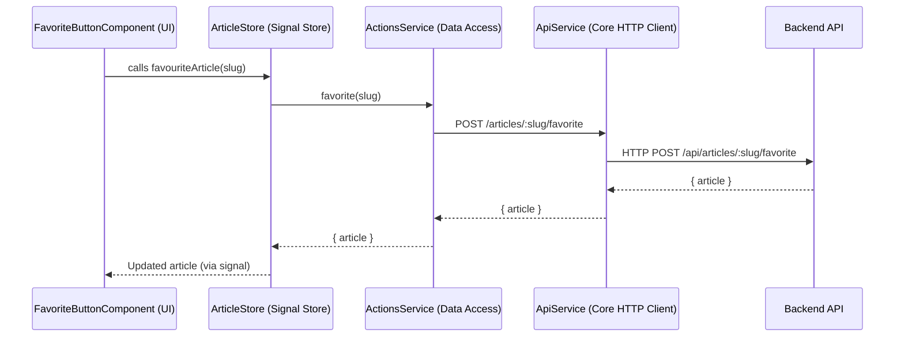

# Chapter 7: Data Access Services (API Layer)

[← Form Error Handling Abstraction](06_form_error_handling_abstraction.md)

---

## Motivation: Why Data Access Services?

As large Angular applications scale and diversify, every domain—articles, authentication, profiles, home—must communicate with the backend API for loading, mutating, or deleting data. Without structure, this leads rapidly to a codebase where:

- Components and stores make raw HTTP calls directly.
- API endpoints, HTTP verbs, and serialization details scatter and duplicate everywhere.
- Business logic and view layers tangle up with low-level network or protocol details.
- Backend API changes break many features at once.
- Testing, mocking, or changing contracts becomes error-prone and costly.

**_Central Use Case:_**  
Suppose you’re implementing the “Favorite/Unfavorite Article” feature for “Conduit”:

- The UI asks: "Is this article already favorited?"
- The user clicks ★ to favorite or unfavorite.
- The application must POST/DELETE the correct API endpoint, handle the backend contract, and update UI state accordingly.
- If the backend changes (e.g., new endpoint, additional fields), you don’t want every component/store/service to be rewritten.

**Solution:**  
**Data Access Services**—also known as the **API Layer**—encapsulate and abstract all backend communication:

- Present clear, high-level methods for each domain operation (e.g., `favorite(slug: string)`).
- Hide endpoint URLs, HTTP verbs, serialization, headers, and authentication details.
- Provide a thin, testable, injectable API for state stores, resolvers, guards, and feature modules.
- Allow you to centralize backend changes and enable mocking for testability.

> Think of Data Access Services as the **front desk of a hotel chain**—guests (features/stores) ask for what they want in plain English. The front desk knows _how_ to reach the backend systems, deal with policies, and adapt to changes—without exposing guests to any internal machinery.

---

## Breakdown: Core Concepts of the Data Access Services Pattern

Let's clarify the building blocks of API Layer abstraction.

### 1. **Encapsulation of Backend Communication**

All logic for communicating with backend HTTP APIs—endpoints, verbs, params, error handling, (de)serialization—lives in a single testable service for each domain, rather than scattered in components or stores.

### 2. **Domain-Specific Interfaces**

Each domain (articles, auth, profile, etc.) exposes its own Angular service, such as `ArticlesService`, `AuthService`, `ProfileService`. These present only operations relevant to their domain.

### 3. **High-Level, Intention-Revealing Methods**

Consumers (stores, smart components) interact through methods like `favorite(slug)`, `getArticle(slug)`, or `register(user)`, never by constructing raw HTTP requests.

### 4. **Type-Safe Contracts**

All request and response shapes are defined via shared TypeScript interfaces (see [API Types (Domain Model Contracts)](09_api_types__domain_model_contracts_.md)), ensuring strong typing throughout.

### 5. **Testability and Mockability**

API services are easily mockable for tests (e.g., override with spies or fakes), and stubbing the backend for isolation is trivial.

---

## Applying the Pattern: Solving the “Favorite Article” Use Case

### Step 1: API Service Structure in the Monorepo

Each domain has a `data-access` library with its Data Access Service:

```plaintext
libs/
  articles/
    data-access/
      src/
        services/
          articles.service.ts      // For read/change
          actions.service.ts       // For singular actions (e.g. favorite, follow)
  auth/
    data-access/
      src/
        services/
          auth.service.ts
  profile/
    data-access/
      src/
        services/
          profile.service.ts
  core/
    http-client/
      src/
        lib/
          api.service.ts          // Environment-agnostic, low-level HTTP engine
```

**Explanation:**  

- _Per-domain services_ only deal with their domain's API endpoints.
- A _core API adapter_ (`ApiService`) provides reusable, environment-agnostic HTTP methods for these domain services.

### Step 2: A Complete Domain Data Access Service Example

Here’s `ActionsService` for **Articles**—encapsulating the “favorite” and “unfavorite” logic:

```typescript
// File: libs/articles/data-access/src/services/actions.service.ts

import { Injectable, inject } from '@angular/core';
import { Observable } from 'rxjs';
import { ApiService } from '@realworld/core/http-client';
import { ProfileResponse, ArticleResponse } from '@realworld/core/api-types';

@Injectable({ providedIn: 'root' })
export class ActionsService {
  private readonly apiService = inject(ApiService);

  followUser(username: string): Observable<ProfileResponse> {
    return this.apiService.post<ProfileResponse, void>(`/profiles/${username}/follow`);
  }

  unfollowUser(username: string): Observable<ProfileResponse> {
    return this.apiService.delete<ProfileResponse>(`/profiles/${username}/follow`);
  }

  favorite(slug: string): Observable<ArticleResponse> {
    return this.apiService.post<ArticleResponse, void>(`/articles/${slug}/favorite`);
  }

  unfavorite(slug: string): Observable<ArticleResponse> {
    return this.apiService.delete<ArticleResponse>(`/articles/${slug}/favorite`);
  }
}
```

**Explanation:**  

- Consumers (e.g., stores, feature components) call `favorite(slug)`, not `http.post(...)`.
- No outside code sees endpoint details (`/articles/:slug/favorite`) or worries about verbs (`POST` vs. `DELETE`).
- All requests and responses use strongly-typed contracts imported from `core/api-types`.

### Step 3: Leveraging Data Access Services in a Store or Component

Here’s how a Store or Feature Component uses the API Layer:

```typescript
// File: libs/articles/data-access/src/article.store.ts

import { signalStore, withMethods, patchState } from '@ngrx/signals';
import { inject } from '@angular/core';
import { ActionsService } from './services/actions.service';

export const ArticleStore = signalStore(
  { providedIn: 'root' },
  withMethods((store, actionsService = inject(ActionsService)) => ({
    // Mark article as favorite
    favouriteArticle: (slug: string) => {
      actionsService.favorite(slug).subscribe({
        next: ({ article }) => patchState(store, { data: article }),
        // handle errors as needed
      });
    },
    // Remove article from favorites
    unFavouriteArticle: (slug: string) => {
      actionsService.unfavorite(slug).subscribe({
        next: ({ article }) => patchState(store, { data: article }),
        // handle errors as needed
      });
    },
  })),
);
```

**Explanation:**  

- The Store doesn’t know anything about HTTP, backend endpoints, or serialization.
- All it cares about is: “When I favorite this article, give me the latest article data.”

### Step 4: Effects on Testing & Maintenance

- **Easy mocking**: In tests, simply provide a fake `ActionsService`, and you control all network responses.
- **Backend change resilience**: If the server changes `/articles/:slug/favorite` to some other endpoint, update _one_ place—the service. Feature code everywhere else just keeps calling `favorite(slug)`.

---

## Internal Implementation: What Happens Under the Hood?

### Step-by-Step Request Walkthrough

Let's examine the full call flow when a user favorites an article, showing all layers involved.



**Key Observations:**

- The upper layers know _only_ about domains and business operations.
- Lower layers handle HTTP/REST details, headers, and (de)serialization.
- If the backend API changes, only `ActionsService` (or `ApiService`) cares—UI, stores, and features are isolated.
- For testing, you can drop in a mock `ActionsService` or `ApiService`.

---

## Under the Hood: How the Data Access Layer is Built

### The Generic API Adapter

At the core is a reusable/flexible `ApiService` that simplifies HTTP calls:

```typescript
// File: libs/core/http-client/src/lib/api.service.ts

import { Injectable, inject } from '@angular/core';
import { HttpClient, HttpParams, HttpHeaders } from '@angular/common/http';
import { Observable } from 'rxjs';
import { API_URL } from './api-url.token';

@Injectable({ providedIn: 'root' })
export class ApiService {
  private readonly http = inject(HttpClient);
  private readonly api_url = inject(API_URL);

  get<T>(url: string, params: HttpParams = new HttpParams()): Observable<T> {
    return this.http.get<T>(`${this.api_url}${url}`, {
      headers: this.headers,
      params,
      withCredentials: true,
    });
  }

  post<T, D>(url: string, data?: D): Observable<T> {
    return this.http.post<T>(`${this.api_url}${url}`, JSON.stringify(data), {
      headers: this.headers,
      withCredentials: true,
    });
  }

  put<T, D>(url: string, data: D): Observable<T> {
    return this.http.put<T>(`${this.api_url}${url}`, JSON.stringify(data), {
      headers: this.headers,
      withCredentials: true,
    });
  }

  delete<T>(url: string): Observable<T> {
    return this.http.delete<T>(`${this.api_url}${url}`, {
      headers: this.headers,
      withCredentials: true,
    });
  }

  get headers(): HttpHeaders {
    return new HttpHeaders({
      'Content-Type': 'application/json',
      Accept: 'application/json',
    });
  }
}
```

**Explanation:**

- Handles base URL, serialization, credentials, headers.
- Used by all domain `DataAccessService`s—no repeated HTTP logic.

### A Domain-Specific Data Access Service

A more complex articles example showing many high-level domain API methods:

```typescript
// File: libs/articles/data-access/src/services/articles.service.ts

import { Injectable, inject } from '@angular/core';
import { ApiService } from '@realworld/core/http-client';
import { Article, ArticleResponse, MultipleCommentsResponse, NewArticle, SingleCommentResponse } from '@realworld/core/api-types';
import { Observable } from 'rxjs';
import { HttpParams } from '@angular/common/http';

@Injectable({ providedIn: 'root' })
export class ArticlesService {
  private readonly apiService = inject(ApiService);

  getArticle(slug: string): Observable<ArticleResponse> {
    return this.apiService.get<ArticleResponse>(`/articles/${slug}`);
  }

  getComments(slug: string): Observable<MultipleCommentsResponse> {
    return this.apiService.get<MultipleCommentsResponse>(`/articles/${slug}/comments`);
  }

  deleteArticle(slug: string): Observable<void> {
    return this.apiService.delete<void>(`/articles/${slug}`);
  }

  addComment(slug: string, comment: string): Observable<SingleCommentResponse> {
    return this.apiService.post<SingleCommentResponse, { comment: { body: string } }>(
      `/articles/${slug}/comments`,
      { comment: { body: comment } }
    );
  }

  // More domain operations...
}
```

**Explanation:**

- Method names express _operations_, not endpoints/HTTP jargon.
- Only the implementation details (URL, body shape, verb) change.
- UI/stores consume an intention-revealing API.
- This pattern is consistent for every domain: Auth, Profile, Home, etc.

### Example: AuthService

```typescript
// File: libs/auth/data-access/src/services/auth.service.ts

import { Injectable, inject } from '@angular/core';
import { ApiService } from '@realworld/core/http-client';
import { User, UserResponse, LoginUser, NewUser } from '@realworld/core/api-types';
import { Observable } from 'rxjs';

@Injectable({ providedIn: 'root' })
export class AuthService {
  private readonly apiService = inject(ApiService);

  user(): Observable<UserResponse> {
    return this.apiService.get<UserResponse>('/user');
  }

  login(credentials: LoginUser): Observable<UserResponse> {
    return this.apiService.post<UserResponse, { user: LoginUser }>('/users/login', { user: credentials });
  }

  register(credentials: NewUser): Observable<User> {
    return this.apiService.post<User, { user: NewUser }>('/users', { user: credentials });
  }

  // More methods...
}
```

**Explanation:**

- Clean separation: AuthService only knows about authentication logic.
- All API details encapsulated—no leaking into callers.
- Each method returns Observable of strong-typed contract.

---

### Testing, Mocking, and Maintenance

Suppose you need to test a smart component or store that triggers API calls:

- You can provide a **mocked Data Access Service** (e.g., `ActionsService`), replacing real HTTP calls with Jasmine spies or fake Observables.
- No need to mock `HttpClient` or set up a fake backend everywhere.
- Maintenance: backend changes only require updates in data access services.

---

## Why This Pattern Scales: Clean Boundaries and Domain Autonomy

- **UI/Store code becomes backend-agnostic**: Could refactor API routes, move from REST to GraphQL, or swap out the transport entirely—most feature code does not change.
- **Backend changes become low-risk**: Teams can safely evolve endpoints, add/remove fields, or change server contracts, without massive app rewrites.
- **Teams can own their domains**: Article team owns `ArticlesService`, Auth team owns `AuthService`, and so on.
- **Automated code analysis/enforcement** (via Nx): No spurious cross-domain dependencies—data access remains per-domain unless explicitly shared.

---

## Advanced Usage & Best Practices

- **Do:** Keep Data Access Services _thin and focused_—no business logic, just API adaptation.
- **Do:** Use only the contracts (interfaces) from `core/api-types` for requests/responses. [See: [API Types (Domain Model Contracts)](09_api_types__domain_model_contracts_.md)]
- **Do:** Never inject `HttpClient` outside of `ApiService`; always go through it for consistent headers, serialization, base URL, etc.
- **Do:** Export all Data Access APIs from their domain's `data-access` library index—never deep-import privately.
- **Don't:** Mix data-access concerns in smart components, resolvers, or stores.
- **Don't:** Expose your low-level `ApiService` or `HttpClient` to feature code—it should always flow through the per-domain service.

---

## Real-World Analogy: The Hotel Front Desk

Imagine your app as a grand hotel:

- Guests (features/components/stores) need services: room reservations, wakeup calls, billing inquiries.
- The **front desk** (Data Access Service) provides a clear, repeatable, high-level service API ("Book a room", "Call a cab").
- The front desk knows _how_ to reach each backend system (room database, billing, car service) and handles changes, errors, and policies.
- Guests never deal with raw backend systems—if one changes, only the desk adjusts; guests keep using the same high-level requests.

---

## Recap: Why Data Access Services Are Fundamental

- **They centralize all backend API communication.**
- **Enable per-domain ownership and clear boundaries.**
- **Expose intention-revealing, type-safe, testable APIs for each feature.**
- **Abstract away protocol, endpoint, and HTTP messiness from the rest of the app.**
- **Scale up as teams and features grow, enabling backend change resilience and rapid maintenance.**
- **Are the glue layer between global API infrastructure (e.g., `ApiService`) and business logic (stores, features).**

---

## Transition: What's Next?

With Data Access Services, your application's backend communication is clean, abstracted, and robust. But even with clean APIs, backend errors, HTTP failures, and validation issues will happen. Next, you’ll learn how to **systematically capture, surface, and react to errors across the application**—via interceptors, centralized error stores, and best practices.

[→ Error Handling Interceptor and Store](08_error_handling_interceptor_and_store.md)

---

---

Generated by [AI Codebase Knowledge Generator](https://github.com/vegeta03/codebase-knowledge-generator)
