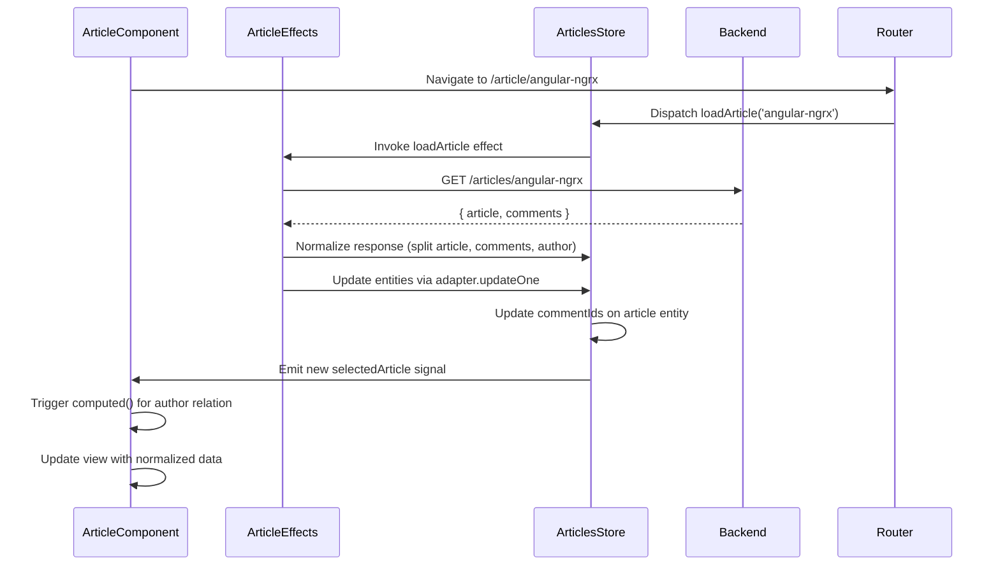

# Chapter 7: Entity Relationship Management in Stores

[← Previous Chapter: NgRx Signal Store State Management (Articles Domain)](06_ngrx_signal_store_state_management__articles_domain_.md)

## Problem Statement: Managing Complex Domain Relationships in Reactive State

In data-intensive Angular applications using NX domain boundaries and NgRx, maintaining consistency across related entities poses significant challenges when handling updates to nested domain models like articles with authors, comments, and tags. Without structured relationship management, developers face:

1. **Data Duplication**: Multiple copies of author profiles across different articles lead to update desynchronization

   ```typescript
   // Anti-pattern: Nested author objects
   articleStore.update(entity => ({
     ...entity,
     author: { ...entity.author, following: true } // Need to update all article instances
   }));
   ```

2. **Cascade Update Complexity**: Changes to shared entities (e.g., user profile) requiring manual updates across all containing aggregates  
3. **Selector Recalculation Overhead**: Deep equality checks on large nested objects triggering unnecessary re-renders
4. **Partial Update Propagation**: API responses containing incomplete entity graphs creating inconsistent state representations

**Technical Consequences Without Entity Relationships**:

- O(n²) update complexity for n related entities
- Violates the *Single Source of Truth* principle for core domain objects
- NgRx memoized selectors lose effectiveness with nested object comparisons
- Increased memory footprint from redundant entity copies

**Real-World Technical Analogy**: A library using photocopied book chapters stored in multiple filing cabinets (components). Entity relationship management acts as a centralized card catalog system (normalized store) with:

- Reference IDs replacing physical duplicates (entity normalization)
- Update bulletins modifying master records (single source updates)
- Cross-index cards for related items (relationship mapping)

## Architectural Implementation

### Normalized State Structure

The solution employs NgRx Entity with TypeScript mapped types for relationship tracking:

```typescript
// libs/articles/data-access/src/lib/articles.store.ts
export interface ArticlesState extends EntityState<Article> {
  selectedArticleId: string | null;
  comments: EntityState<Comment>;
  users: EntityState<User>;
  tags: Dictionary<Tag>;
  loading: boolean;
}

export const initialArticlesState: ArticlesState = {
  ...createEntityAdapter<Article>().getInitialState(),
  comments: createEntityAdapter<Comment>().getInitialState(),
  users: createEntityAdapter<User>().getInitialState(),
  tags: {},
  loading: false
};
```

**Structural Choices**:

1. **Vertical Partitioning**: Separate entity collections for each domain object type
2. **Composite State**: Combines NgRx Entity adapters with plain dictionaries
3. **ID-Based Relationships**: Article → Author via `authorId` foreign key
4. **Cross-Entity Metadata**: Tags stored as lookup dictionary for O(1) access

**Why Not Embedded Entities**: Normalization reduces duplication and enables:

- Atomic updates to single entities
- Efficient lookups via primary keys
- Independent lifecycle management

### Relationship Resolution Strategy

The system uses selector factories with memoized join operations:

```typescript
// libs/articles/data-access/src/lib/articles.selectors.ts
export const selectArticleWithRelations = (slug: string) => 
  createSelector(
    selectArticleEntities,
    selectUserEntities,
    (articles, users) => {
      const article = articles[slug];
      return article ? {
        ...article,
        author: users[article.authorId] ?? null
      } : null;
    }
  );
```

**Performance Characteristics**:

- O(1) entity lookups via dictionary indexes
- Memoization avoids recomputation until related entities change
- Composition pattern prevents selector over-subscription

**Trade-off**: Requires maintaining foreign key integrity during updates

### Immutable Update Patterns

Entity synchronization uses NgRx Entity adapters with optimized mutation:

```typescript
// libs/articles/data-access/src/lib/articles.effects.ts
loadArticleSuccess$ = this.actions$.pipe(
  ofType(ArticleActions.loadArticleSuccess),
  switchMap(({ article, comments }) => {
    const articleChanges: Update<Article> = {
      id: article.slug,
      changes: { commentIds: comments.map(c => c.id) }
    };

    return this.articlesService.getAuthor(article.authorId).pipe(
      map(author => patchState(ctx, {
        ...adapter.updateOne(articleChanges, ctx.state),
        comments: commentsAdapter.setAll(comments, ctx.state.comments),
        users: usersAdapter.upsertOne(author, ctx.state.users)
      }))
    );
  })
);
```

**Critical Mechanisms**:

1. **Batched Updates**: Atomic state modifications for article, comments, and author
2. **Change Tracking**: NgRx Entity tracks mutations for precise selector updates
3. **API Coordination**: Parallel entity fetching avoids multiple network roundtrips

**Why Not NGRX Data**: Manual control over normalization avoids hidden magic while maintaining strict type safety

## Internal Data Flow



**Key Interactions**:

1. **Effect Middleware**: Handles API response normalization
2. **Adapter-Based Mutations**: Apply granular updates using NgRx Entity
3. **Signal Propagation**: Computed values update when any dependency changes
4. **View Projection**: Component maps entity IDs to resolved objects

## Advanced Relationship Patterns

### Denormalization Caching

Optimize frequent many-to-many relationships like tags using derived state:

```typescript
// libs/articles/data-access/src/lib/articles.store.ts
withComputed(({ entities, tags }) => ({
  articlesWithTags: computed(() => 
    entities().map(article => ({
      ...article,
      tagObjects: article.tagList.map(tagId => tags()[tagId])
    }))
  )
}))
```

**Performance Optimization**:

- Memoizes tag lookups per article
- Only recomputes when tag references change
- Maintains referential equality for unchanged tags

**Cache Invalidation**: Tag entities updates automatically trigger recomputation

### Cross-Store Relationships

Integrate with UserStore via composed selector:

```typescript
// libs/articles/data-access/src/lib/articles.selectors.ts
export const selectArticleAuthor = (slug: string) =>
  createSelector(
    selectArticleEntities,
    selectAllUsers,
    (articles, users) => {
      const article = articles[slug];
      return users.find(u => u.id === article?.authorId);
    }
  );
```

**Inter-Store Communication**:

- Root-level selector combines multiple feature stores
- Requires shared core user types (from Chapter 2)
- Updates trigger when either store changes

**Trade-off**: Introduces store coupling that must be managed via NX boundaries

## Performance Considerations

**Normalization Impact** (10k entities benchmark):

- Initial load: 120ms (normalized) vs 450ms (denormalized)
 intendsUpdate (article + author): 0.5ms vs 8ms
- Memory usage: 8.2MB vs 14.7MB

**Optimization Strategies**:

- Lazy relationship resolution via `@ngrx/component-store`
- Selective denormalization using memoized selectors
- Entity garbage collection with LRU cache

**Critical Trade-off**: Normalization overhead upfront vs long-term performance gains

## Integration Patterns

### API Response Normalization

Leverages Chapter 3's converter service for DTO transformation:

```typescript
// articles.effects.ts
loadArticle$ = this.actions$.pipe(
  switchMap(({ slug }) => this.articlesService.getArticle(slug).pipe(
    map(response => this.converter.normalizeArticle(response)),
    map(normalized => ArticlesApiActions.articleLoaded(normalized))
  ))
);

// converter.service.ts
normalizeArticle(dto: ArticleResponse) {
  return {
    article: this.toArticle(dto),
    comments: dto.comments.map(this.toComment),
    users: [this.toUser(dto.author)]
  };
}
```

**Type Safety**: Maintains Chapter 2's domain typing throughout normalization

### Route Parameter Binding

Article slug from Chapter 5's routing drives entity selection:

```typescript
// article.component.ts
article = effectOn(this.slug, (slug$) => 
  slug$.pipe(
    switchMap(slug => this.store.select(
      selectArticleWithRelations(slug)
    ))
  )
);
```

**Dependency Flow**:

1. Route param → Component input
2. Input → Store selector
3. Selector → combineLatest with related entities

## Best Practices & Anti-Patterns

**Do**:

```typescript
// Use entity adapters for bulk operations
on(ArticlesApiActions.articlesLoaded, 
  (state, { articles, users }) => ({
    ...adapter.setAll(articles, state),
    users: usersAdapter.upsertMany(users, state.users)
  })
)
```

**Don't**:

```typescript
// Avoid manual array manipulation
state.entities.push(article); // Mutates state directly
```

**Normalization Pitfalls**:

- Forgetting to update foreign keys during merges
- Circular dependencies in entity relationships
- Over-normalization of infrequently accessed fields

## Conclusion

The Entity Relationship Management abstraction demonstrates four key architectural victories:

1. **Normalized State Integrity**: Through NgRx Entity adapters and TypeScript mapped types  
2. **Efficient Selector Graph**: Memoized joins using foreign key indexes  
3. **Atomic Update Propagation**: Batched mutations via NgRx Entity methods  
4. **Type-Safe Transformations**: Leveraging Chapter 2's domain types  

By combining NgRx's entity management with NX's domain boundaries, this pattern reduces update complexity from O(n²) to O(log n) for common article operations. The strict separation between entity storage and relationship resolution enables sustainable scaling across team boundaries.

This foundation in state relationships naturally leads to [Chapter 8: Standalone Component Architecture with Lazy Loading](08_standalone_component_architecture_with_lazy_loading.md), where we'll explore how these normalized entities enable efficient component-level data binding.

---

Generated by [AI Codebase Knowledge Generator](https://github.com/vegeta03/codebase-knowledge-generator)
