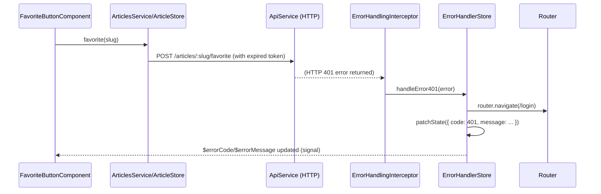

# Chapter 8: Error Handling Interceptor and Store

[← Data Access Services (API Layer)](07_data_access_services__api_layer_.md)

---

## Why Centralized Error Handling?

In the [previous chapter](07_data_access_services__api_layer_.md), you saw how the API layer ensures robust, intention-revealing communication with your backend. But as your Angular app grows, backend and network **errors** become inevitable: failed requests, authentication drops, expired tokens, broken links, server-side validation rejections. Scattering error handling in every service and component creates:

- Inconsistent user messaging and navigation on errors.
- Repeated, hard-to-test logic for common scenarios (`401`, `404`, etc).
- Security vulnerabilities: e.g., not returning to login on unauthorized.
- Error states that aren’t visible or queryable throughout the app.
- A tangle of duplicated `catchError()` all over the codebase.

**Central Use Case:**  
Suppose your API access layer (`ArticlesService`, `AuthService`, etc) encounters a `401 Unauthorized` (user's credentials expired) or a `404 Not Found` (invalid article slug). You want **all** feature modules to handle this gracefully and consistently:

- On `401`, users are redirected to the login page (except when already registering).
- On `404`, users are navigated to a "home" or safe fallback.
- Error messages are stored centrally for UI or logging.
- No feature component or data service needs to manually repeat this logic.

How do you **universally and reactively handle errors**—from any HTTP call, in any domain—**in one place**, and expose error state as a Signal Store to any part of your application?  
That's the power of the **Error Handling Interceptor and Store**.

---

## Key Concepts

To make this abstraction clear, let's break it down into digestible concepts:

1. **HTTP Error Interceptor**  
   - A centralized "guard post" injected into your Angular HTTP pipeline, which catches all backend response errors **before** they hit your services or components.

2. **Error Handling Store**  
   - A global, reactive (Signal) store which records the current error condition (code, message, etc), exposes Signals for UI, and provides methods (`handleError401`, `handleError404`, etc) for custom navigation or side-effects.

3. **Error Type Handling**  
   - Distinct, testable logic for common error types (`401`, `404`, etc): redirect to login, show a notification, navigate to home, etc—all in one file.

4. **Error State as a Signal**  
   - Error state (code, message) exposed via signals—any component or feature may "listen" and react in a reactive, DRY manner.

5. **Uniform Redirection & Messaging**  
   - The same response on similar failures, everywhere in the app, without duplication.  
   - E.g., every `401` triggers a login dialog or navigation, every `404` routes home—without copy-pasting conditional logic.

6. **Analogy: A Building's Security Desk**  
   - Every event goes past the front desk: if a badge is invalid (`401`), send to the security office (login page); if a guest is lost (`404`), route to the main entrance. The log is visible from any authorized department.

---

## How to Use: From Failure to Recovery

Let's walk through implementing and consuming this abstraction to address the use case (universal error handling).

### 1. Register the Global Error Handling Interceptor

At bootstrap (likely in your `app.config.ts` or wherever you set up Angular providers), register the HTTP interceptor *before* any data-access or API code:

```typescript
// File: apps/conduit/src/app/app.config.ts

import { HTTP_INTERCEPTORS } from '@angular/common/http';
import { errorHandlingInterceptor } from '@realworld/core/error-handler';

export const appConfig = {
  providers: [
    // ...
    { provide: HTTP_INTERCEPTORS, useValue: errorHandlingInterceptor, multi: true },
    // ...other providers
  ]
};
```

**Explanation:**  
All HTTP responses, from all libraries (auth, articles, profiles…), pass through this interceptor **before** reaching any component, service, or store. It becomes the universal "security desk" for abnormal API events.

---

### 2. How the Interceptor Handles Errors

A single source of truth for all response error logic:

```typescript
// File: libs/core/error-handler/src/lib/error-handler-interceptor.service.ts

import { HttpErrorResponse, HttpEvent, HttpHandlerFn, HttpRequest } from '@angular/common/http';
import { inject } from '@angular/core';
import { Observable, throwError } from 'rxjs';
import { catchError } from 'rxjs/operators';
import { ErrorHandlerStore } from './error-handler.store';

export const errorHandlingInterceptor = (
  request: HttpRequest<any>,
  next: HttpHandlerFn,
): Observable<HttpEvent<any>> => {
  const errorHandlerStore = inject(ErrorHandlerStore);

  return next(request).pipe(
    catchError((error) => {
      if (error instanceof HttpErrorResponse) {
        switch (error.status) {
          case 401:
            errorHandlerStore.handleError401(error);
            break;
          case 404:
            errorHandlerStore.handleError404(error);
            break;
          default:
            throwError(error); // Rethrow for less critical errors or consume as needed elsewhere
            break;
        }
      }
      return throwError(error);
    }),
  );
};
```

**What happens?**  

- On **every HTTP error** (any status), this code is called **once**.
- For `401` and `404`, it runs the designated store handler.
- Error details are sent to the `ErrorHandlerStore`, which patches global error state and performs corrective action.
- If not a handled code, error is passed along (could chain to feature code or generic logger).

---

### 3. Handling and Acting on Errors in the Store

The signal store records error data and triggers navigation or other logic as needed:

```typescript
// File: libs/core/error-handler/src/lib/error-handler.store.ts

import { signalStore, withState, withMethods, patchState } from '@ngrx/signals';
import { inject } from '@angular/core';
import { ActivatedRoute, Router } from '@angular/router';
import { ErrorHandlerState, errorHandlerInitialState } from './models/error-handler.state';
import { HttpErrorResponse } from '@angular/common/http';

export const ErrorHandlerStore = signalStore(
  { providedIn: 'root' },
  withState<ErrorHandlerState>(errorHandlerInitialState),
  withMethods((store, router = inject(Router), route = inject(ActivatedRoute)) => ({
    handleError401: (error: HttpErrorResponse) => {
      patchState(store, {
        code: error.status,
        message: error.message,
      });
      // Only route to login if not already registering
      if (route.snapshot.children[0].url[0].path !== 'register') {
        router.navigate(['/login']);
      }
    },
    handleError404: (error: HttpErrorResponse) => {
      patchState(store, {
        code: error.status,
        message: error.message,
      });
      router.navigate(['/']);
    },
  })),
);
```

**Explanation:**  

- **Error state**: `code` and `message` are stored in the signal store, visible to the whole app.
- **Navigation/routing**: On `401` errors (user session expired/missing), if not already on the registration page, users are redirected to login. On `404`, users go home.
- **UI can subscribe** to this error state to show banners, messages, dialogs, etc.
- All mutations (patch/clear) flow through a single API—a major boost for DRYness and auditability.

---

### 4. Subscribe to and Use Error State Anywhere

You can *read* or *react* to global error state by injecting and subscribing to the ErrorHandlerStore:

```typescript
import { Component, inject } from '@angular/core';
import { ErrorHandlerStore } from '@realworld/core/error-handler';

@Component({
  selector: 'cdt-global-error-banner',
  template: `
    <div *ngIf="$errorMessage()" class="error-banner">
      Error ({{ $errorCode() }}): {{ $errorMessage() }}
    </div>
  `
})
export class GlobalErrorBannerComponent {
  private errorStore = inject(ErrorHandlerStore);
  $errorCode = this.errorStore.code;        // Signal<number | undefined>
  $errorMessage = this.errorStore.message;  // Signal<string | undefined>
}
```

**Explanation:**  

- Any component, in any feature, can reactively display latest error code/message—cleanly, without polling or event-bus hacks.
- UI is decoupled: it just reads state; handling logic remains in the store/interceptor.

---

### Example: What Actually Happens When a 401 or 404 Occurs

Suppose a user’s session expires while trying to favorite an article. Here’s how everything fits together (no component or service needs to know about the error handling logic!):



**Critical Path Explanation:**  

- Business or domain code (`favorite(slug)`) is **unaware** of error handling.
- The interceptor catches the error and delegates to the store, which patches global state and ensures redirection.
- Any feature/UI bound to error state is **immediately reactive**—no polling or event subscriptions.
- Navigation/redirection is declaratively handled **once**, globally—not duplicated in every handler.

---

## Internal Implementation Deep Dive

### 1. The Interceptor: `error-handler-interceptor.service.ts`

A stateless pipeline step—*does not* store state, but calls store methods upon certain error responses.

```typescript
export const errorHandlingInterceptor = (
  request: HttpRequest<any>,
  next: HttpHandlerFn,
): Observable<HttpEvent<any>> => {
  const errorHandlerStore = inject(ErrorHandlerStore);

  return next(request).pipe(
    catchError((error) => {
      if (error instanceof HttpErrorResponse) {
        switch (error.status) {
          case 401:
            errorHandlerStore.handleError401(error);
            break;
          case 404:
            errorHandlerStore.handleError404(error);
            break;
          default:
            throwError(error);
            break;
        }
      }
      return throwError(error);
    }),
  );
};
```

**CS Perspective:**  

- Decouples error-type-specific handling from business code.
- Fulfills the [Interceptor Pattern](https://martinfowler.com/eaaCatalog/interceptor.html): a chain-of-responsibility for global cross-cutting concerns.

### 2. The Error Signal Store: `error-handler.store.ts`

A domain store holding error code/message, and responsible for triggering centralized actions.

```typescript
export const ErrorHandlerStore = signalStore(
  { providedIn: 'root' },
  withState<ErrorHandlerState>(errorHandlerInitialState),
  withMethods((store, router = inject(Router), route = inject(ActivatedRoute)) => ({
    handleError401: (error: HttpErrorResponse) => {
      patchState(store, {
        code: error.status,
        message: error.message,
      });
      if (route.snapshot.children[0].url[0].path !== 'register') {
        router.navigate(['/login']);
      }
    },
    handleError404: (error: HttpErrorResponse) => {
      patchState(store, {
        code: error.status,
        message: error.message,
      });
      router.navigate(['/']);
    },
  })),
);
```

**CS Perspective:**  

- Manages global error state immutably.
- Acts as a **mediator** between the interceptor (producer-of-error) and the rest of the app (consumer-of-error).
- Exposes state as [Angular Signals](04_signal_store_pattern__ngrx_signal_store_.md)—reactive, computable, easy to subscribe to.
- Encapsulates navigation side effects—no proliferation of router logic.

### 3. Error State Model

```typescript
// File: libs/core/error-handler/src/lib/models/error-handler.state.ts

export interface ErrorHandlerState {
  code?: number;
  message?: string;
}

export const errorHandlerInitialState: ErrorHandlerState = {};
```

**Simple Schema:**  

- `code`: HTTP status code (optional—undefined when clean).
- `message`: User- or developer-facing message (optional).

---

## Analogy: Real World Centralized Security/Incident Desk

**Picture a large company building:**

- Any floor or department might experience issues: keycard denied, fire alarm tripped, critical package missing.
- These events **always** route through the *security/incident desk* first.
- The desk logs all incidents (with codes/messages), broadcasts alerts to relevant departments, and applies standard operating procedures.
- Example: For unauthorized badge (401), send employee to the main entrance for ID validation (login); for lost guest (404), route to lobby (home).
- Floors and departments can "subscribe" to the incident log to react—e.g., display banners, re-route traffic, alert building managers.

In this analogy:

- **ErrorHandlingInterceptor** = sensors/input panels funneling events to the desk.
- **ErrorHandlerStore** = the log and operator triggering responses.
- **Features/Components** = floors subscribing for updates.

---

## Best Practices

- **Globally register the error interceptor**—ensure it is chained *before* all feature code.
- **Keep error handling DRY**—all redirects, message signals, and major side-effects in the store, *not* scattered.
- **Expose error status via signals** for UI, logging, and auditability.
- **Handle only common error codes** in the interceptor (e.g., 401, 404). Bubble up other or unknown errors for feature-level handling/logging.
- **Write tests** for both the interceptor and the store—these are critical user experience touchpoints.
- **Never** duplicate error-handling logic in dozens of services/components; the interceptor plus error-store combo gives you true centralization.

---

## How This Fits with Other Abstractions

- **Works hand-in-hand with [Data Access Services (API Layer)](07_data_access_services__api_layer_.md):**  
  All errors from domain API services are intercepted and handled before they reach specific features, ensuring uniform recovery.

- **Injects error state into [Signal Store Pattern (NgRx Signal Store)](04_signal_store_pattern__ngrx_signal_store_.md):**  
  Smart components can use error signals for overlays, banners, or flow control.

- **Supports UI feedback in [Standalone Smart and Presentational Components Pattern](03_standalone_smart_and_presentational_components_pattern.md):**  
  Presentational components consume only error state signals, never handle recovery logic.

- **Complements [Form Error Handling Abstraction](06_form_error_handling_abstraction.md) for validation/server errors,** but is focused on global HTTP/transport/application errors.

---

## Summary and Transition

In this chapter you learned to:

- Capture and act on **all HTTP errors** with a single interceptor—no duplicated boilerplate or inconsistent handling.
- Use a **Signal Store** as the centralized authority and log for error state, navigation, and messaging.
- Cleanly route users (e.g., redirect to login on `401`, home on `404`), patch error messages, and expose them to the UI reactively.
- Keep error-handling logic uniform, testable, and DRY across your entire Nx monorepo—just like a top-tier enterprise security system.

This approach ensures that your application never feels "broken" or leaves users stranded—errors are caught, messaged, and resolved in predictable ways.

**Next up:**  
Deepen your contract safety by exploring how all backend and frontend code speaks the same language with typed domain models. Proceed to [API Types (Domain Model Contracts)](09_api_types__domain_model_contracts_.md).

---

---

Generated by [AI Codebase Knowledge Generator](https://github.com/vegeta03/codebase-knowledge-generator)
