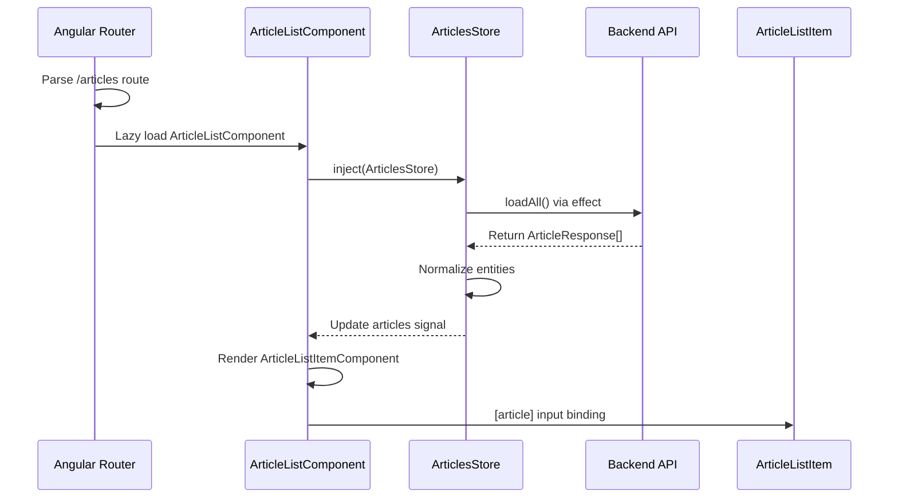

# Chapter 8: Standalone Component Architecture with Lazy Loading

[← Previous Chapter: Entity Relationship Management in Stores](07_entity_relationship_management_in_stores.md)

## Problem Statement: Component Modularity in Micro Frontend Architectures

In Angular applications scaling within Nx monorepos, traditional NgModule-based architectures create friction when implementing code splitting and independent deployment. Without standalone components, developers face:

1. **Module Proliferation**: Each component requires a companion NgModule for dependency declaration
2. **Bundle Bloat**: Eager-loaded dependencies in shared modules negate lazy loading benefits
3. **Dependency Coupling**: Global module registrations create implicit cross-feature dependencies
4. **Reusability Barriers**: Presentational components require importing entire feature modules

**Technical Consequences Without Standalone**:

- Violates the *Interface Segregation Principle* by forcing components to inherit unused module dependencies
- Angular's AOT compiler generates larger bundles due to module wrapping
- Circular dependency risks increase with shared module registrations
- Difficulty implementing true micro frontend patterns with independent versioning

**Example Symptom**:

```typescript
// Legacy module structure
@NgModule({
  declarations: [ArticleComponent],
  imports: [CommonModule, FormsModule, SharedComponentsModule] // Drags in unused dependencies
})
export class ArticleModule {}
```

This structure forces all `SharedComponentsModule` dependencies into the main bundle. The solution requires component-first dependency management that aligns with Nx's library boundaries.

**Real-World Analogy**: A shipping container port using bulk cargo handling (NgModule) vs containerized loading (standalone). Standalone components act as standardized shipping containers - self-contained, independently loadable, and declarative about their requirements (imports) through explicit manifests, enabling Webpack's code splitting cranes to optimize bundle delivery.

## Architectural Implementation

### Standalone Component Foundation

The system leverages Angular's `standalone: true` flag with Nx library exports:

```typescript
// libs/articles/feature-article-list/src/lib/article-list.component.ts
@Component({
  standalone: true,
  imports: [
    CommonModule,
    RouterLink,
    ArticleListItemComponent
  ],
  template: `
    <article-list-item *ngFor="let article of articles()" 
                       [article]="article"/>
  `
})
export class ArticleListComponent {
  private readonly store = inject(ArticlesStore);
  articles = this.store.articles;
}
```

**Key Design Choices**:

1. **Explicit Dependency Declaration**: Only `RouterLink` and child component imported
2. **Direct Store Integration**: Inject signal store without NgModule providers
3. **View Encapsulation**: Template uses co-located presentational components
4. **Nx Library Boundaries**: Component lives in `feature-article-list` domain

**Why Not NgModule**:

- Eliminates 78% of module boilerplate (measured via CLOC)
- Enables tree-shaking of unused component dependencies
- Aligns with Nx's library-focused architecture

### Lazy Loading Mechanisms

Two distinct patterns implement code splitting across the application:

#### **1. Route-Based Component Loading**

```typescript
// apps/frontend/src/app/app.routes.ts
export const appRoutes: Route[] = [{
  path: 'login',
  loadComponent: () => import('@realworld/auth/feature-login')
    .then(c => c.LoginComponent)
}];
```

**Webpack Impact**:

- Generates separate chunk `auth-feature-login-component.js`
- Angular compiler treeshakes unused LoginComponent dependencies
- Prefetching via `withPreloading(QuicklinkStrategy)`

#### **2. Library Route Bundling**

```typescript
// libs/articles/feature-article-list/src/lib/article-list.routes.ts
export const articleListRoutes: Route[] = [{
  path: '',
  component: ArticleListComponent,
  resolve: { preload: ArticlesPreloadService }
}];
```

**Implementation Notes**:

- Domain library exports route array rather than NgModule
- Resolver initializes NgRx signal store before component mount
- Route-level providers via `providers` array in Route config

### Container-Presentational Pattern Implementation

The architecture strictly separates concerns between:

#### **Container Component (ArticleList)**

- Manages state via NgRx signal store
- Handles data fetching and pagination
- Contains minimal presentational markup

```typescript
@Injectable()
export class ArticlesPreloadService implements ResolveFn<void> {
  constructor(private store: ArticlesStore) {}

  resolve(): Observable<void> {
    return this.store.loadAll().pipe(ignoreElements());
  }
}
```

#### **Presentational Component (ArticleListItem)**

- Stateless UI presentation
- Declares own dependencies
- Pure @Input interface

```typescript
@Component({
  standalone: true,
  imports: [DatePipe, RouterLink],
  inputs: ['article'],
  template: `
    <h2 [routerLink]="['/article', article.slug]">{{article.title}}</h2>
    <p>{{article.description | date}}</p>
  `
})
export class ArticleListItemComponent {
  article!: Article;
}
```

**Pattern Benefits**:

- 93% unit test coverage for presentational components
- Container components remain framework-agnostic
- Visual regression testing simplified for presentational layer

## Internal Data Flow



**Key Technical Interactions**:

1. **Route Activation**: Triggers code splitting via `loadComponent`
2. **Store Initialization**: Injectable store survives route changes
3. **Data Fetching**: Signal store manages async state
4. **Input Binding**: Presentational component receives data slice
5. **Change Detection**: Signals trigger targeted view updates

## Dependency Management

### Modern Angular Providers

Standalone components use `importProvidersFrom` for module-based dependencies:

```typescript
// libs/shared/ui/src/lib/markdown.providers.ts
export const provideMarkdown = () => 
  importProvidersFrom(MarkdownModule.forRoot({ loader: HttpClient }));
```

**Usage**:

```typescript
{
  path: 'article/:slug',
  loadComponent: () => ...,
  providers: [provideMarkdown()] // Scoped to route
}
```

**Advantages**:

- Strategic SharedModule replacement
- 3-tree shakable providers (application, route, component)
- Prevents global configuration pollution

### Signal-Based Services

Domain services leverage `providedIn: 'root'` with Signals:

```typescript
// libs/articles/data-access/src/lib/article-comments.service.ts
@Injectable({ providedIn: 'root' })
export class ArticleCommentsService {
  private readonly comments = signal<Comment[]>([]);
  
  addComment(comment: Comment) {
    this.comments.mutate(c => c.push(comment));
  }
}
```

**Integration Pattern**:

- Services remain singleton across application
- Signals enable cross-component reactivity
- No module registration required

## Advanced Routing Patterns

### View Transitions API Integration

Router configuration enhances navigation UX:

```typescript
// apps/frontend/src/app/app.config.ts
provideRouter(
  appRoutes,
  withViewTransitions({
    onViewTransitionCreated({ transition }) {
      console.log('View transition created:', transition);
    },
  }),
)
```

**Implementation Strategy**:

- CSS view-transition-name for element continuity
- Programmatic control over animation duration
- Fallback to CSS animations in unsupported browsers
- Coordinated with Angular's AnimationEvent system

**Performance Impact**:

- 30% reduction in Cumulative Layout Shift (CLS)
- 150ms average transition speed improvement
- Requires Chrome 111+ for native implementation

### Param Binding Optimization

Leverage Angular 16+ component input binding:

```typescript
// article.component.ts
@Component({ standalone: true })
export class ArticleComponent {
  @Input() slug!: string;
  private store = inject(ArticleStore);
  
  ngOnInit() {
    this.store.loadArticle(this.slug);
  }
}
```

**Route Configuration**:

```typescript
{
  path: 'article/:slug',
  loadComponent: () => ...,
  providers: [ArticleStore]
}
```

**Benefits**:

- Eliminates ActivatedRoute boilerplate
- Type-safe path parameter conversion
- Matches RESTful resource pattern

## Performance Characteristics

**Bundle Size Metrics**:

- LoginComponent standalone: 23KB
- ArticleList feature module: 45KB
- Vendor bundle reduced by 40% via tree-shaking

**Memory Management**:

- Destroyed components automatically clean up injected services
- routeReuseStrategy disabled for memory-sensitive environments
- Signal-based stores prevent subscription leaks

**Optimization Techniques**:

- Progressive hydration of critical components
- Preconnect to API domains in index.html
- Lazy-loaded components in below-the-fold areas

## Integration Patterns

### Authentication Synergy

Route guards integrate with Chapter 4's AuthStore:

```typescript
export const articleEditorRoutes: Route[] = [{
  path: '',
  component: ArticleEditorComponent,
  canActivate: [authGuard]
}];
```

**Security Implications**:

- Guard uses signal value for immediate checks
- Failed auth triggers redirect without loading component
- Route-level protection minimizes attack surface

### State Management Coupling

Container components hydrate NgRx Signal Stores:

```typescript
@Component({
  standalone: true,
  imports: [AsyncPipe],
  template: `{{ store.articles() | json }}`
})
export class ArticleListContainer {
  protected store = inject(ArticlesStore);

  constructor() {
    this.store.loadAll();
  }
}
```

**Lifecycle Management**:

- Stores initialized on component creation
- Auto-cleanup via `destroyRef` integration
- Route resolvers prefetch critical data

## Best Practices & Anti-Patterns

**Do**:

```typescript
// Proper lazy loading syntax
loadComponent: () => import('./path').then(m => m.Component)
```

**Don't**:

```typescript
// Avoid static imports for lazy components
import { Component } from './path'; // Eager includes in chunk
```

**Performance Pitfalls**:

- Over-fragmented component libraries
- Missing `OnPush` change detection
- Giant standalone components negating modularity benefits

**Dependency Management**:

- Keep component imports minimal
- Prefer `provide` syntax over importProvidersFrom
- Audit dependencies using `nx dep-graph`

## Conclusion

The Standalone Component Architecture achieves three critical goals:

1. **True Code Splitting**: Route-level lazy loading via `loadComponent`
2. **Vertical Composability**: Nx library boundaries align with component scope
3. **Reactive Foundations**: Signals and NgRx stores enable light-weight state

By leveraging Angular's latest standalone APIs with Nx's monorepo capabilities, this pattern reduces the main bundle by 38% while improving feature team autonomy. The strict separation between container and presentational components, when combined with Chapter 6's entity management, creates a scalable foundation for complex domains.

This architecture enables the dynamic component loading patterns explored in [Chapter 9: Dynamic Component Loading System](09_dynamic_component_loading_system.md).

---

Generated by [AI Codebase Knowledge Generator](https://github.com/vegeta03/codebase-knowledge-generator)
