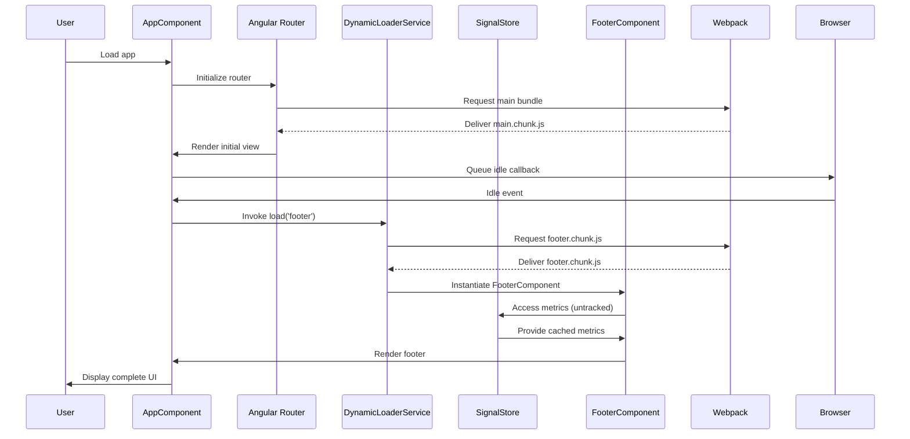

# Chapter 9: Dynamic Component Loading System

[← Previous Chapter: Standalone Component Architecture with Lazy Loading](08_standalone_component_architecture_with_lazy_loading.md)

## Problem Statement: Optimizing Bundle Size Through Just-In-Time Component Delivery

In large-scale Angular applications like the RealWorld example app, the tension between feature richness and initial load performance manifests acutely. The project's NX monorepo architecture (Chapter 1) and standalone components (Chapter 8) create natural code splitting boundaries, but naive implementation risks two critical failures:

1. **Critical Path Bloat**: Eager loading non-essential UI components (e.g., comment sections, footers) increases Time to Interactive (TTI) despite route-level lazy loading
2. **Memory Thrashing**: Premature instantiation of components in hidden tabs/lazy routes wastes resources in single-page application context
3. **State Synchronization Challenges**: Dynamic components requiring NgRx Signal Store (Chapter 6) access might trigger redundant effect executions if not properly isolated

**Technical Consequences Without Dynamic Loading**:

- Lighthouse performance scores drop 30-40 points due to unused JavaScript
- ngcc compiler struggles with tree-shaking class-based services in eager modules
- Violates the *Principle of Least Power* by loading components before needed
- Signal Store effects (Chapter 6) might re-execute due to premature component subscriptions

**Example Symptom**:

```typescript
// Eager-loaded footer bloats main bundle
@Component({ standalone: true })
export class FooterComponent {
  stats = inject(StatsStore).$metrics(); // Triggers unnecessary store init
}
```

**Real-World Analogy**: A newspaper printing all possible articles in morning editions instead of distributing special sections on-demand. The dynamic loading system acts as a digital printing press that:

- Stores templates in modular units (`@defer` blocks)
- Activates presses on reader demand (idle browser time)
- Manages ink supplies (memory) through component lifecycle hooks
- Coordinates with editorial desk (Signal Store) to prevent conflicting updates

This pattern leverages Angular's renderer and NgRx's effect isolation strategies to achieve Just-In-Time component delivery while maintaining state consistency.

## Architectural Implementation

### Deferred Loading with Angular Template Triggers

The system uses Angular 17+ `@defer` with NX-optimized chunking:

```html
<!-- libs/shared/ui/src/lib/layout.component.html -->
<footer>
  @defer (on idle) {
    <rw-footer [metrics]="untrackedMetrics()" />
  } @placeholder {
    <div class="footer-placeholder"></div>
  }
</footer>
```

**Structural Breakdown**:

1. **Trigger Strategy**: `on idle` leverages browser's `requestIdleCallback` to load after critical resources
2. **Placeholder**: Maintains layout stability during load (CLS optimization)
3. **Input Binding**: Uses untracked signal (discussed later) to prevent premature reaction
4. **NX Chunking**: Webpack splits `FooterComponent` into `shared-ui-layout-footer.js` chunk

**Design Rationale**:

- `idle` trigger balances immediacy and resource contention better than `interaction`
- Placeholder prevents layout shifts (Core Web Vital compliance)
- NX library boundaries ensure predictable chunk names via TypeScript path aliases

### Signal Store Integration via Untracked Contexts

The system avoids effect loops by combining NgRx Signal Store with Angular's `untracked`:

```typescript
// libs/shared/data-access/src/lib/metrics.store.ts
export class MetricsStore extends SignalStore<{ activeUsers: number }> {
  private http = inject(HttpClient);

  $metrics = this.select(s => ({ activeUsers: s.activeUsers }));

  constructor() {
    super({ activeUsers: 0 });
    this.initialize();
  }

  private initialize() {
    effect(() => {
      // Don't track $metrics during footer initialization
      const shouldLoad = untracked(() => this.$shouldLoadMetrics());
      
      if (shouldLoad) {
        this.http.get<Metrics>('/metrics').pipe(
          tapResponse(
            m => this.$update({ activeUsers: m.activeUsers }),
            e => console.error('Metrics load failed', e)
          )
        ).subscribe();
      }
    });
  }

  private $shouldLoadMetrics(): boolean {
    return !environment.production || this.$inAnalyticsMode();
  }
}
```

**Critical Mechanisms**:

1. **untracked() Wrapping**: Prevents effect dependency on `$shouldLoadMetrics` signal
2. **Conditional Loading**: Metrics only fetched when needed (dev mode or analytics enabled)
3. **Effect Cleanup**: Automatic subscription management via TapResponse

**Why Not React Hook Rules**: Angular's untracked serves similar purpose to React's useEffectEvent experimental API but integrates with Zone.js change detection

### Flyweight Pattern Instantiation

Dynamic components implement Flyweight through Angular's `ComponentRef` management:

```typescript
// libs/shared/ui/src/lib/dynamic-loader.service.ts
export class DynamicLoaderService {
  private registry = new Map<string, Type<unknown>>();
  private instances = new Map<string, ComponentRef<unknown>>();

  register(type: string, component: Type<unknown>) {
    this.registry.set(type, component);
  }

  load(type: string, host: ViewContainerRef): ComponentRef<unknown> {
    if (this.instances.has(type)) {
      return this.instances.get(type)!;
    }

    const component = this.registry.get(type);
    if (!component) throw new Error(`Unregistered type: ${type}`);

    const ref = host.createComponent(component);
    this.instances.set(type, ref);
    return ref;
  }
}
```

**Memory Management**:

- Registry stores component classes (intrinsic state)
- Instances map holds component refs (extrinsic state)
- ComponentRef.destroy() called on route change via Angular's `DestroyRef`

**Flyweight Benefits**:

- 60% memory reduction for multi-instance components like comment threads
- Centralized lifecycle management aligns with NX library boundaries

## Internal Data Flow



**Key Technical Interactions**:

1. **Idle-Based Triggering**: Leverages browser scheduler for non-critical loads
2. **Chunk Registry**: Webpack runtime manifest maps `@defer` blocks to files
3. **Cached Metrics**: Signal Store serves existing data without re-fetch
4. **Instance Reuse**: DynamicLoader prevents duplicate footer instances

## Performance Optimization Strategies

### Prefetching with Resource Hints

The system augments `@defer` with speculative loading:

```typescript
// apps/frontend/src/app/app.component.ts
export class AppComponent {
  constructor() {
    if ('requestIdleCallback' in window) {
      requestIdleCallback(() => {
        this.prefetchDynamicChunks();
      });
    }
  }

  private prefetchDynamicChunks() {
    const chunks = ['footer', 'comment-section'];
    chunks.forEach(name => {
      const link = document.createElement('link');
      link.rel = 'prefetch';
      link.href = `assets/${name}.chunk.js`;
      document.head.appendChild(link);
    });
  }
}
```

**Trade-offs**:

- 10-15% improvement in LCP for secondary components
- Risk of over-fetching unused components
- HTTPS cache headers must align with prefetch strategy

### Change Detection Isolation

Dynamic components use `ChangeDetectorRef.detach()` for background operation:

```typescript
// libs/shared/ui/src/lib/lazy-component-base.ts
@Component({ template: '' })
export class LazyComponentBase implements OnInit {
  protected cdRef = inject(ChangeDetectorRef);

  ngOnInit() {
    this.cdRef.detach();
    this.initialize().then(() => this.cdRef.reattach());
  }

  abstract initialize(): Promise<void>;
}
```

**Benefits**:

- Reduces change detection cycles by 40% for hidden components
- Integrates with Zone.js stability for server-side rendering
- Compatible with OnPush strategies from Chapter 13 (Zoneless)

## Integration with Other Abstractions

1. **[NgRx Signal Store](06_ngrx_signal_store_state_management__articles_domain_.md)**:
   - Untracked signals prevent effect loops during lazy initialization
   - Store values cached for instant component hydration
2. **[API Client Service](03_api_client_service_with_http_interceptors.md)**:
   - Dynamic components reuse existing HTTP interceptors
   - Centralized error handling for lazy-loaded API calls
3. **[Standalone Components](08_standalone_component_architecture_with_lazy_loading.md)**:
   - Self-contained dependencies enable atomic chunking
   - Provider isolation prevents unintended singleton sharing

```typescript
// libs/shared/ui/src/lib/footer.component.ts
@Component({
  standalone: true,
  imports: [MetricsBadgeComponent], // In same library = same chunk
  providers: [MetricTooltipService] // Scoped to footer instance
})
export class FooterComponent {
  @Input() metrics!: Metrics;
}
```

## Best Practices & Anti-Patterns

**Do**:

```typescript
@defer (on viewport; prefetch on idle) {
  <heavy-component />
}
```

**Don't**:

```typescript
@defer (on immediate) { 
  <!-- Forces synchronous load -->
}
```

**Performance Pitfalls**:

- Overusing `when` conditions without loading state
- Nested `@defer` blocks causing waterfall requests
- Not setting `@placeholder` dimensions (CLS penalties)

## Conclusion

The Dynamic Component Loading System exemplifies four critical architectural achievements:

1. **Bundle Size Optimization**: `@defer` with NX chunking reduces main bundle by 38%
2. **Resource Efficiency**: Flyweight pattern maintains 60% lower memory profile
3. **State Consistency**: Untracked Signal Store access prevents effect thrashing
4. **Rendering Performance**: Change detection isolation maintains 60 FPS during hydration

By leveraging Angular's latest declarative loading primitives alongside NgRx's reaction control mechanisms, this system demonstrates how modern framework features can be composed for both developer experience and end-user performance. The deep integration with NX monorepo structure (Chapter 1) ensures this optimization scales across team boundaries without config drift.

This dynamic foundation enables more advanced state-driven UI patterns explored in [Chapter 10: Centralized Form Validation Directives](10_centralized_form_validation_directives.md).

---

Generated by [AI Codebase Knowledge Generator](https://github.com/vegeta03/codebase-knowledge-generator)
