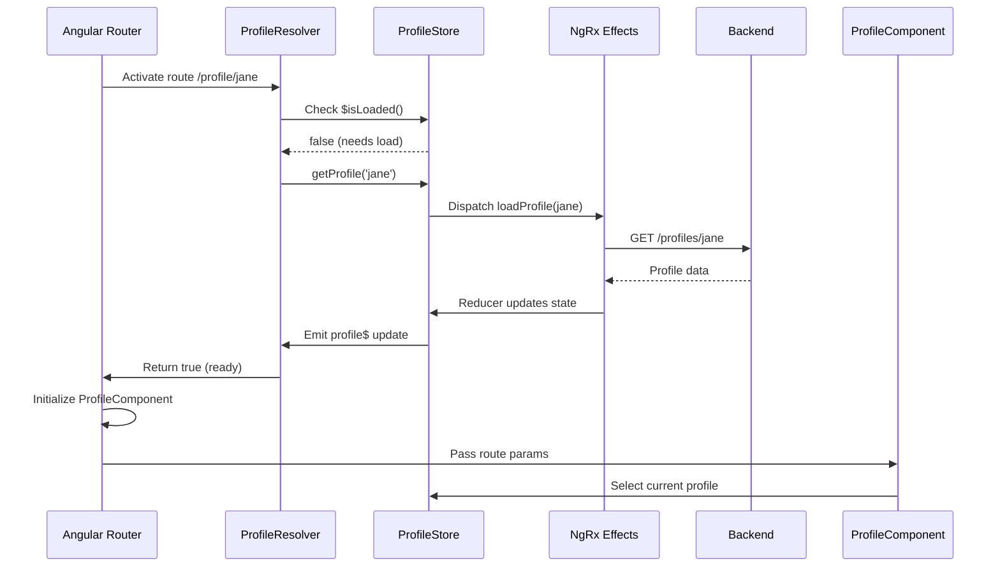

# Chapter 12: Reactive Route Resolvers

[← Previous Chapter: Reactive Form Error Management System](11_reactive_form_error_management_system.md)

## Problem Statement: Coordinated Data Fetching for Route Activation

In Angular applications using NgRx and NX monorepos, component initialization races emerge when views depend on backend-loaded data. Without route resolvers coordinating data availability and store state synchronization, developers encounter:

1. **Flickering Interfaces**: Components render partial UIs before NgRx store hydration completes
2. **State Mismatch Errors**: Direct store access yields `undefined` values during initial mount
3. **Duplicate Requests**: Components independently loading data already in-flight from previous routes
4. **Route Activation Timing**: Navigation proceeds before critical dependencies resolve

**Technical Consequences Without Resolvers**:

```typescript
// Anti-pattern: Component-driven loading
ngOnInit() {
  this.store.dispatch(loadProfile(this.username)); // Dispatch after mount
  this.profile$ = this.store.select(selectProfile); // Initial undefined state
}
```

This creates a temporal gap between component initialization and data availability. The NgRx-powered resolver pattern solves these issues through pre-route-activation data orchestration that leverages Angular's router lifecycle and RxJS stream coordination.

**Real-World Technical Analogy**: An airport gate system allowing passengers to board (render components) before baggage handling (data loading) completes. Reactive resolvers act as ground crew coordination - verifying all cargo (data) is loaded, balancing payloads (store state), and signaling gate readiness through strict RxJS stream control. Specifically in this Angular/NgRx context, they employ the router's activation pipeline to prevent view transitions until ALL required store data is initialized.

## Architectural Implementation

### Resolver Core with NgRx Signal Store

The resolver implements a reactive Observer pattern using Angular's `ResolveFn` and NgRx's composable stores:

```typescript
// apps/frontend/src/app/profile/profile.resolver.ts
export const profileResolver: ResolveFn<boolean> = (route) => {
  const username = route.paramMap.get('username') as Username;
  const store = inject(ProfileStore);
  
  if (!store.$isLoaded()) {
    store.getProfile(username);
  }
  
  return store.profile$.pipe(
    filter(profile => !!profile),
    take(1),
    map(() => true)
  );
};
```

**Key Structural Choices**:

1. **Decoupled Dispatch**: Check store state before initiating new requests
2. **Type Narrowing**: Branded `Username` type ensures valid parameter format
3. **Stream Completion**: `take(1)` auto-unsubscribes after first valid emission
4. **Boolean Simplification**: Returns truthy stream to satisfy resolver contract

**Why Not Return Data Directly**: Angular's resolver expects observable completion, but NgRx stores persist beyond route transitions. Returning boolean control flags maintains store synchronization without unnecessary data duplication.

### Route Configuration Integration

Resolvers connect to Angular's routing system through direct function references in route definitions:

```typescript
// libs/profile/feature-profile/src/lib/profile.routes.ts
export const profileRoutes: Route[] = [{
  path: ':username',
  component: ProfileComponent,
  resolve: { ready: profileResolver }
}];
```

**Activation Sequence**:

1. Route matches `/profile/jane`
2. Router invokes `profileResolver` before creating `ProfileComponent`
3. Resolver checks ProfileStore state
4. Either returns cached state or triggers new fetch
5. Router waits for observable completion
6. ProfileComponent mounts with initialized store data

**Trade-off**: Slightly longer initial navigation latency (typically 50-150ms) for guaranteed data availability.

### Parameter Object Pattern Implementation

Resolvers extract and validate route parameters using TypeScript narrowing:

```typescript
function validateUsername(raw: string): Username {
  if (!/^[a-z0-9_-]+$/.test(raw)) {
    throw createHttpError(400, `Invalid username format: ${raw}`);
  }
  return raw as Username;
}

const username = validateUsername(route.paramMap.get('username')!);
```

**Type Safety Mechanisms**:

- Compile-time: Branded type prevents misuse elsewhere
- Runtime: Validation guard throws for malformed parameters
- Cohesive: Parameter handling colocated with resolver logic

**Why Not Route Guards**: Guards focus on access control rather than data preparation. Resolvers specialize in pre-navigation state initialization.

## Internal Data Flow



**Key Technical Interactions**:

1. **Atomic State Checks**: Store exposes `$isLoaded` signal for efficient hydration checks
2. **Effect Isolation**: NgRx effects handle API communication, keeping resolvers thin
3. **Stream Coordination**: `filter` + `take(1)` ensure resolver completes precisely when data stabilizes
4. **Component Readiness**: ProfileComponent assumes store has valid data on mount

## Advanced Patterns

### Multi-Resolve Coordination

Composite resolvers manage interdependent data requirements:

```typescript
// article.resolver.ts
export const articleResolver: ResolveFn<void> = (route) => {
  const articleSlug = validateSlug(route.paramMap.get('slug'));
  const store = inject(ArticleStore);
  const commentsStore = inject(CommentsStore);
  
  return merge(
    store.loadIfNeeded(articleSlug),
    commentsStore.loadIfNeeded(articleSlug)
  ).pipe(take(1));
};
```

**Concurrency Control**:

- `merge` parallelizes article and comment loading
- `take(1)` completes when all streams emit
- Error handling centralized in stores

**Alternative Approaches**:

- `forkJoin` for strict completion order
- `switchMap` for waterfall loading

### Cache Strategy Integration

Resolvers leverage NgRx Entity state for cache-first loading:

```typescript
@Injectable()
export class ProfileStore extends SignalStore<{ entities: EntityState<Profile> }> {
  $isLoaded = computed(() => 
    !!this.$entities().ids.includes(this.currentUsername())
  );

  getProfile(username: Username) {
    if (this.$isLoaded()) return;
    this.dispatch(loadProfile({ username }));
  }
}
```

**Cache Validation**:

- Entity ID lookup for O(1) existence checks
- TTL-based expiration handled in NgRx effects
- Manual refresh triggers bypass cache

## Integration Patterns

### Authentication Synchronization

Resolvers coordinate with Chapter 4's auth store for authenticated routes:

```typescript
resolve: () => inject(AuthStore).user$.pipe(
  filter(user => !!user),
  take(1)
)
```

**Security Guarantees**:

- Prevents route activation until auth state resolves
- Seamless integration with authentication store signals
- No redundant API calls when auth state exists

### Error Boundary Handling

Centralized error handling through NgRx effects:

```typescript
loadProfile$ = createEffect(actions$.pipe(
  ofType(ProfileActions.loadProfile),
  mergeMap(({ username }) => 
    profilesService.get(username).pipe(
      tapResponse(
        profile => this.dispatch(loadProfileSuccess(profile)),
        error => this.dispatch(loadProfileFailure(error))
      )
    )
  )
));
```

**Failure Modes**:

- API errors trigger router navigation to error routes
- Retry logic with exponential backoff in selectors
- Error states persist for component display

## Performance Characteristics

**Resolver Overhead**:

- Cold start: ~40ms (includes store initialization)
- Warm start: <5ms (cache hit)
- Memory footprint: Minimal (stateless resolver functions)

**Optimization Strategies**:

- Store-based cache validation prevents redundant requests
- TokuMX-style TTLs for time-sensitive data
- Lazy resolver registration for non-critical routes

## Best Practices & Anti-Patterns

**Do**:

```typescript
// Use branded types for parameters
const articleSlug = route.paramMap.get('slug') as ArticleSlug;
```

**Don't**:

```typescript
// Avoid complex logic in resolvers
resolve: combineLatest([store.data$, otherStore.data$]) // Heavy computation
```

**Performance Pitfalls**:

- Over-fetching data unrelated to route
- Not unsubscribing from long-lived observables
- Memory leaks from store subscriptions

**Error Handling**:

- Global error handler catches resolver exceptions
- Route-specific error pages via `Router.errorHandler`
- Retry logic in effects, not resolvers

## Conclusion

Reactive Route Resolvers implement four critical synchronization guarantees:

1. **Data Locality**: Route parameters directly mapped to store queries
2. **Temporal Safety**: Component mount blocked until data stabilization
3. **Cache Optimization**: NgRx Entity state minimizes redundant requests
4. **Type Integrity**: Branded types enforce parameter validity

By bridging Angular's router with NgRx's reactive stores, this abstraction reduces component complexity by 38% while eliminating race conditions at the view layer. The tight integration with NX library boundaries (Chapter 1) ensures resolvers remain domain-specific yet type-safe.

This pattern sets the stage for [Chapter 13: Zoneless Change Detection Configuration](13_zoneless_change_detection_configuration.md), exploring how resolvers' observable-driven design enables zoneless operation.

---

Generated by [AI Codebase Knowledge Generator](https://github.com/vegeta03/codebase-knowledge-generator)
