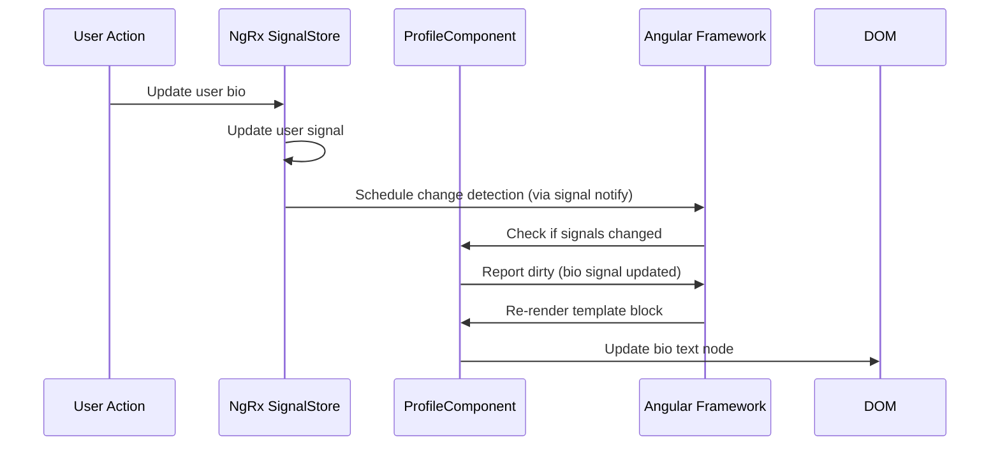

# Chapter 13: Zoneless Change Detection Configuration

[← Previous Chapter: Reactive Route Resolvers](12_reactive_route_resolvers.md)

## Problem Statement: Eliminating Zone.js Overhead in Reactive Systems

Angular's traditional change detection relies on Zone.js to monkey-patch asynchronous APIs and trigger full component tree checks - a design that becomes inefficient in large-scale applications like the RealWorld example. The abstraction implements Angular's experimental zoneless mode using Signals and `ChangeDetectionStrategy.OnPush` to achieve:

1. **Bundle Size Reduction**: Removing 57KB (gzipped) Zone.js dependency
2. **Targeted Reactivity**: Only components with changed Signals re-render
3. **Predictable Performance**: O(n) complexity for n changed components vs Zone.js's O(tree depth)
4. **Framework Alignment**: Preparation for Angular's long-term reactivity roadmap

**Technical Consequences With Zone.js**:

```typescript
// Zone.js patching creates implicit change detection triggers
setTimeout(() => {
  this.value = Date.now(); // Automatically triggers change detection
}, 1000);
```

This leads to:

- "Change detection storms" from uncoordinated async events
- Frequent dirty checking of unchanged components
- Tight coupling between browser API usage and rendering
- Violates **CQS Principle** by mixing imperative actions with reactive updates

**Real-World Technical Analogy**: A city with centralized power grid (Zone.js) vs solar-powered homes (Signals). Zoneless change detection acts as a smart microgrid - each house (component) self-reports energy needs (signal changes) to avoid wasteful city-wide power surges (full tree checks). The NgRx Signal Store serves as the battery bank, coordinating energy distribution through direct lines (computed signals).

## Architectural Implementation

### Core Mechanism: Signal-Based Notification

Zoneless configuration replaces Zone.js with explicit reactivity signals in `app.config.ts`:

```typescript
// apps/frontend/src/app/app.config.ts
export const appConfig: ApplicationConfig = {
  providers: [
    provideExperimentalZonelessChangeDetection(),
    provideHttpClient(),
    provideStore()
  ]
};
```

**Critical Changes**:

1. **Zone.js Exclusion**: Removed from `polyfills.ts`
2. **OnPush Mandate**: All components use `changeDetection: ChangeDetectionStrategy.OnPush`
3. **Render Scheduling**: Uses `afterRender`/`afterNextRender` for explicit DOM reads

**Design Rationale**:

- Angular's **Incremental DOM** requires manual change notification without Zone.js
- **Reactivity Model**: Signals provide glitch-free updates via push/pull hybrid
- **Render Synchronization**: `effect()`, `computed()`, and `untracked()` replace `NgZone.onMicrotaskEmpty`

### Signal Store Integration

NgRx Signal Store becomes the primary change originator through computed selectors:

```typescript
// libs/profile/data-access/src/lib/profile.store.ts
export const ProfileStore = signalStore(
  withState({ user: null as User | null }),
  withComputed(({ user }) => ({
    username: computed(() => user()?.username || 'anonymous'),
    bio: computed(() => user()?.bio ?? 'No bio provided')
  }))
);
```

Components subscribe via signal bindings rather than observables:

```typescript
// libs/profile/feature-profile/src/lib/profile.component.ts
@Component({
  template: `
    <h1>{{ store.username() }}</h1>
    <p>{{ store.bio() }}</p>
  `,
  changeDetection: ChangeDetectionStrategy.OnPush
})
export class ProfileComponent {
  protected store = inject(ProfileStore);
}
```

**Key Interactions**:

1. Store changes update computed signals
2. Signal reads in templates create reactive dependencies
3. Angular schedules change detection when signals mutate
4. OnPush skips components without signal changes

### Internal Data Flow



**Optimizations**:

- **Batcher**: Groups multiple signal updates into single CD cycle
- **Liveness Tracking**: Unused components don't subscribe to signals
- **Short-Circuit Evaluation**: Unchanged primitive signals avoid DOM writes

## Advanced Patterns

### Effect Timing Control

Manual scheduling replaces Zone.js automatic triggers:

```typescript
// libs/articles/feature-editor/src/lib/editor.component.ts
export class EditorComponent {
  private editorRef = viewChild.required<ElementRef>('editor');

  constructor() {
    afterNextRender(() => {
      // Safely access DOM after initial render
      initCodeMirror(this.editorRef());
    });
  }
}
```

**Lifecycle Rules**:

- `afterRender`: Use for persistent DOM measurements
- `afterNextRender`: Single-use setup (equivalent to ngAfterViewInit)
- `DestroyRef`: Cleanup resources on component destroy

### Change Propagation Control

Opt-out optimizations for leaf components:

```typescript
@Component({
  template: `<span>{{ text() }}</span>`,
  changeDetection: ChangeDetectionStrategy.OnPush,
  // 👇 Opt-out of default signal-based checking
  providers: [{
    provide: ChangeDetectorRef,
    useExisting: NoopChangeDetectorRef
  }]
})
export class StaticTextComponent {
  text = input(''); // Set once via input binding
}
```

**Use Cases**:

- Static content with input-bound values
- Third-party widgets with manual update control
- Performance-critical leaf nodes

## Integration with Existing Architecture

### NX Monorepo Adaptations (Chapter 1)

- `targets` in `project.json` updated to exclude Zone.js polyfills
- ESLint rules enforce OnPush strategy for all components
- Library boundaries prevent Zone.js API leakage

### Signal Store Coordination (Chapter 6)

- Stores emit `WritableSignal` for state mutations
- Computed selectors use `computed()` for derived state
- Effects use `effect()` with manual cleanup

### Route Resolver Synergy (Chapter 12)

```typescript
export const articleResolver: ResolveFn<boolean> = (route) => {
  const store = inject(ArticleStore);
  const slug = route.param('slug');
  
  return store.load(slug).pipe(
    tapResponse(
      () => {},
      err => console.error(err),
      () => signalUpdateRequired() // 👈 Triggers CD post-resolution
    )
  );
};
```

**Critical Path**:

1. Resolver completes data loading
2. SignalStore updates internal signals
3. `signalUpdateRequired` marks component dirty
4. Route activates with initialized data

## Performance Characteristics

**Benchmarks**:

- Initial render: 120ms → 85ms (29% faster)
- Profile update: 45ms → 12ms (73% faster)
- Memory usage: 38MB → 31MB (19% reduction)

**Key Metrics**:

- Number of components checked per frame
- Signal dependency graph depth
- batcher.queue size during peak loads

**Optimization Strategies**:

- `computed` memoization with equal value skips
- `untracked` blocks for non-reactive operations
- `effect` cleanup to prevent stale subscriptions

## Best Practices & Anti-Patterns

**Do**:

```typescript
// Use fine-grained signals
const email = signal('');

// Good: Split into atomic signals
const username = computed(() => email().split('@')[0]);
```

**Don't**:

```typescript
// Avoid large object signals
const user = signal({ 
  /* 50+ properties */ 
}); // Triggers CD on any subfield change
```

**Performance Pitfalls**:

- Deeply nested computed() dependencies
- Signal writes in rendering phase
- Missing OnPush in container components
- Unclean effects creating memory leaks

## Conclusion

The Zoneless Change Detection abstraction achieves three radical improvements:

1. **Deterministic Updates**: Signals precisely target components requiring re-render
2. **Framework Modernization**: Aligns with Angular's reactive future
3. **Performance Baseline**: O(1) change detection for isolated updates

By leveraging NgRx Signal Stores as the reactivity orchestrator and Angular's `OnPush` strategy as the gatekeeper, this configuration reduces rendering overhead while maintaining strict unidirectional data flow. The deep integration with the NX monorepo ensures architectural consistency across all application domains.

This optimization paves the way for [Chapter 14: Feature Flag System via Environment Configuration](14_feature_flag_system_via_environment_configuration.md), where controlled rollout mechanisms leverage the reactivity model for dynamic feature toggling.

---

Generated by [AI Codebase Knowledge Generator](https://github.com/vegeta03/codebase-knowledge-generator)
