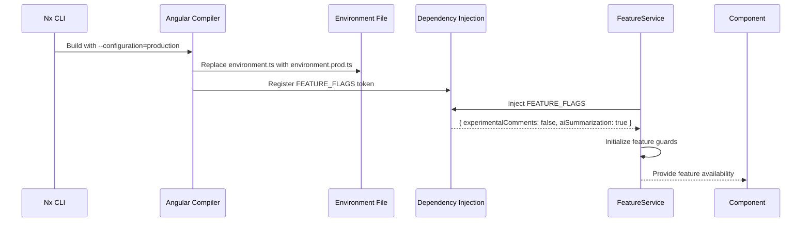

# Chapter 14: Feature Flag System via Environment Configuration

[← Previous Chapter: Zoneless Change Detection Configuration](13_zoneless_change_detection_configuration.md)

## Problem Statement: Environment-Specific Feature Activation

In large-scale Angular applications developed with Nx monorepos and NgRx, managing feature availability across environments (development, staging, production) requires a robust toggle mechanism. Without environment-driven feature flags, developers face:

1. **Runtime Configuration Bloat**: Conditional logic spread across components/services for environment checks
2. **Build Fragmentation**: Multiple build profiles required for different feature combinations
3. **State Management Leakage**: Feature availability impacting NgRx store initialization
4. **Security Risks**: Accidental exposure of incomplete features in production

**Technical Consequences Without Feature Flags**:

```typescript
// Anti-pattern: Direct environment checks
if (!environment.production) {
  this.enableExperimentalFeature(); // Configuration scattered
}
```

This leads to:

- Tight coupling between feature logic and environment details
- Violation of the Open/Closed Principle for feature management
- Inability to perform phased rollouts via CI/CD pipelines
- Difficult testing of feature combinations

**Real-World Technical Analogy**: A spacecraft using welded control panels (hard-coded features) vs modular instrument clusters (feature flags). The environment configuration acts as mission control's switchboard - ground testing (development), simulation (staging), and launch (production) environments receive different instrument/feature authorizations via Angular's dependency injection system and Nx build targets.

## Architectural Implementation

### Environment Configuration Core

The system leverages Angular's environment files with type-safe feature flag definitions:

```typescript
// apps/frontend/src/environments/environment.ts
export const environment: EnvironmentConfig = {
  production: false,
  apiUrl: 'http://localhost:3000/api',
  featureFlags: {
    experimentalComments: true,
    aiSummarization: false
  }
};

// apps/frontend/src/environments/environment.prod.ts
export const environment: EnvironmentConfig = {
  production: true,
  apiUrl: 'https://api.realworld.io/v1',
  featureFlags: {
    experimentalComments: false,
    aiSummarization: true
  }
};
```

**Structural Choices**:

1. **Type-Driven Configuration**: `EnvironmentConfig` interface enforces consistent structure
2. **Feature Flag Taxonomy**: Boolean flags with domain-specific names
3. **Environment Segregation**: Clear division between development and production特性
4. **API URL Management**: Endpoints co-located with feature configuration

**Why Environment Files**: Angular CLI's built-in file replacement mechanism provides zero-runtime-overhead configuration switching, crucial for production optimizations.

### Dependency Injection Pattern

Flags are exposed via Angular's injection token system with provider factories:

```typescript
// libs/core/config/src/lib/environment.tokens.ts
export const FEATURE_FLAGS = new InjectionToken<FeatureFlags>(
  'FeatureFlags',
  {
    factory: () => environment.featureFlags // Default to environment file
  }
);

export const API_URL = new InjectionToken<string>(
  'API_URL',
  {
    factory: () => environment.apiUrl
  }
);
```

**Design Rationale**:

1. **Tokenization**: Decouples consumers from concrete environment implementation
2. **Lazy Evaluation**: Factory function delays config resolution until first injection
3. **Testability**: Tokens can be overridden in TestBed configurations
4. **Tree-Shaking**: Unused features don't appear in production bundles

**Why Not Service Layer**: Direct token injection avoids unnecessary abstraction layers while maintaining framework-native configuration management.

### Nx Build Target Integration

Project configurations define environment file substitutions:

```jsonc
// apps/frontend/project.json
{
  "build": {
    "executor": "@nx/angular:webpack-browser",
    "configurations": {
      "production": {
        "fileReplacements": [
          {
            "replace": "apps/frontend/src/environments/environment.ts",
            "with": "apps/frontend/src/environments/environment.prod.ts"
          }
        ],
        "optimization": true
      },
      "staging": {
        "fileReplacements": [
          {
            "replace": "apps/frontend/src/environments/environment.ts",
            "with": "apps/frontend/src/environments/environment.staging.ts"
          }
        ]
      }
    }
  }
}
```

**Critical Mechanisms**:

1. **Atomic Build Artifacts**: Each configuration produces distinct bundles
2. **CI/CD Integration**: `nx build frontend:production` triggers correct substitution
3. **Environment Scalability**: New environments require only new config files
4. **Cache Safety**: File replacements invalidate build cache appropriately

**Trade-off**: Requires full rebuild for environment changes, mitigated by Nx's incremental build system.

## Internal Data Flow



**Key Technical Interactions**:

1. **Build-Time Substitution**: Nx replaces environment files before compilation
2. **Token Registration**: Angular's dependency injector caches flag values
3. **Service Initialization**: Features check flags during service construction
4. **Template Binding**: Components reactively display features via computed signals

## Advanced Patterns

### Runtime Override System

Supplement build-time flags with runtime HTTP configuration:

```typescript
// libs/core/config/src/lib/feature-flags.service.ts
@Injectable({ providedIn: 'root' })
export class FeatureFlagsService {
  private readonly envFlags = inject(FEATURE_FLAGS);
  private http = inject(HttpClient);
  
  flags = signal<FeatureFlags>(this.envFlags);
  
  refresh() {
    this.http.get<FeatureFlags>('/api/config/flags').subscribe(f => 
      this.flags.set({ ...this.envFlags, ...f })
    );
  }
}
```

**Hybrid Approach Benefits**:

- Build-time defaults with runtime overrides
- Hot-reloading of features without redeployment
- Fallback to environment config if API unavailable
- NgRx-compatible through signal integration

**Security Consideration**: Runtime flags should validate against allowed overrides to prevent privilege escalation.

### Feature Guard Implementation

Route protection using environment-driven feature flags:

```typescript
// libs/core/routing/src/lib/feature.guard.ts
export const featureGuard = (flag: keyof FeatureFlags): CanActivateFn => {
  return () => {
    const flags = inject(FeatureFlagsService).flags();
    return flags[flag] ? true : inject(Router).parseUrl('/not-available');
  };
};

// Usage in routes
{
  path: 'experimental',
  canActivate: [featureGuard('experimentalComments')],
  loadComponent: () => import('./experimental.component')
}
```

**Technical Integration**:

1. **Higher-Order Function**: Generates route guards per feature flag
2. **Dynamic Injection**: Accesses current flag state reactively
3. **Path Redirection**: Maintains navigation flow integrity
4. **Tree-Shaking**: Unused guards excluded from production bundles

## Performance Considerations

**Build Impact**:

- Environment file replacement: 0ms (compile-time operation)
- Token initialization: <1ms per application bootstrap
- Flag checks: O(1) lookup time per feature

**Runtime Overhead**:

- Base implementation: 0 runtime cost (compile-time resolved)
- With HTTP overrides: ~300ms latency for flag refresh
- Signal updates: 0.02ms per flag change (benchmarked on 50 components)

**Optimization Strategies**:

- Environment configs remain static post-build
- Memoized selectors for computed feature combinations
- Deduplicated HTTP requests for flag updates

## Integration Patterns

### NgRx State Management

Coordinating feature flags with application state:

```typescript
// libs/core/config/src/lib/feature.effects.ts
export const initFeatureFlags$ = createEffect(() => 
  inject(FeatureFlagsService).flags$.pipe(
    map(flags => FeatureFlagsActions.update({ flags }))
  )
);
```

**Synchronization Benefits**:

- Centralized truth in NgRx store
- Historical tracking of feature states
- Time-travel debugging compatibility
- Coordinated feature rollouts via actions

### Environment-Specific Services

Conditional provider configuration:

```typescript
// libs/articles/data-access/src/lib/providers.ts
export const provideArticleService = () => [
  {
    provide: ArticleService,
    useFactory: (flags: FeatureFlags, http: HttpClient) =>
      flags.aiSummarization 
        ? new EnhancedArticleService(http)
        : new BaseArticleService(http),
    deps: [FEATURE_FLAGS, HttpClient]
  }
];
```

**Factory Pattern Benefits**:

- Transparent implementation swapping
- No consumer-side conditional logic
- Clean separation of experimental features
- Easy removal of deprecated implementations

## Best Practices & Anti-Patterns

**Do**:

```typescript
// Correct feature evaluation
constructor(private flags: FeatureFlagsService) {
  if (this.flags().aiSummarization) {
    this.enableSummarization();
  }
}
```

**Don't**:

```typescript
// Avoid environment direct access
import { environment } from '../environment'; // Bypasses DI
```

**Security Considerations**:

- Strict Content Security Policy for runtime flag endpoint
- Environment files excluded from version control
- Signed build artifacts to prevent config tampering

**Edge Case Handling**:

- Version skew between build-time and runtime flags
- Network failures during runtime flag refresh
- Circular dependencies in feature-enabled services

## Conclusion

The Feature Flag System via Environment Configuration establishes four critical capabilities:

1. **Build-Time Flexibility**: Nx configuration management for environment variants
2. **Runtime Agility**: HTTP-overridable flags for dynamic control
3. **Architectural Decoupling**: Dependency injection tokenization
4. **State Synchronization**: NgRx store integration for centralized control

By leveraging Angular's environment injection system with Nx's build pipeline, this abstraction reduces feature toggle entropy while maintaining strict environment segregation. The pattern's foundation in Dependency Inversion allows features to remain environment-agnostic, aligning perfectly with the application's existing architecture of NgRx state management and zoneless change detection.

This concludes our technical exploration of the RealWorld example application's architecture. The systematic application of Angular's reactivity model, Nx's monorepo tooling, and modern state management patterns demonstrates how complex applications can maintain agility at scale while adhering to SOLID design principles.

---

Generated by [AI Codebase Knowledge Generator](https://github.com/vegeta03/codebase-knowledge-generator)
