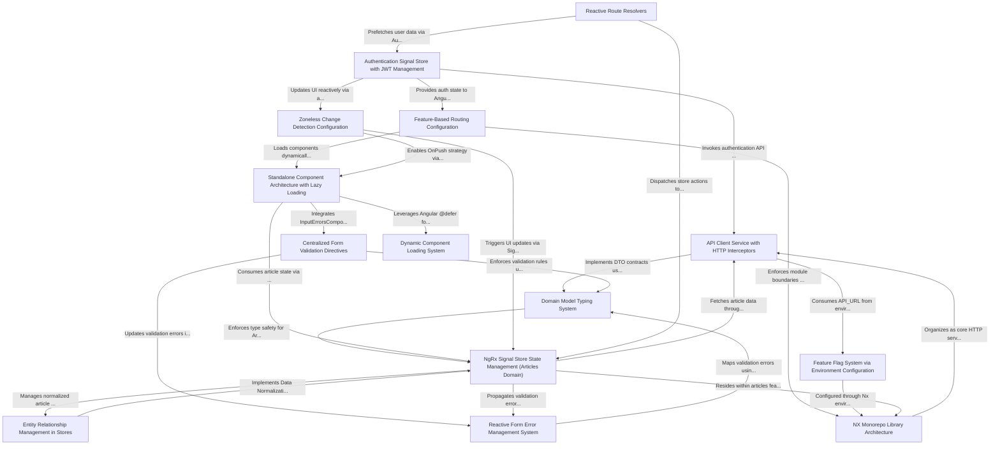

# Tutorial: angular-ngrx-nx-realworld-example-app

This project appears to be a **real-world example application** (likely a content-driven platform like a blog) built using **Angular** with **NgRx Signal Store** for state management and **NX monorepo** architecture. Its main purpose is to demonstrate modern Angular patterns including **standalone components**, **zoneless change detection**, and **reactive state management** with type-safe domain modeling. Key architectural choices include **feature-based lazy loading** through Nx libraries, **centralized API communication** with JWT management via HTTP interceptors, and **signal-driven UI updates** that integrate with NgRx stores. The system emphasizes **modularity** through vertical slicing in the Nx workspace and **performance optimizations** via dynamic component loading and environment-based feature flags.

**Source Repository:** [https://github.com/stefanoslig/angular-ngrx-nx-realworld-example-app](https://github.com/stefanoslig/angular-ngrx-nx-realworld-example-app)

## Chapters

1. [NX Monorepo Library Architecture](01_nx_monorepo_library_architecture.md)
2. [Domain Model Typing System](02_domain_model_typing_system.md)
3. [API Client Service with HTTP Interceptors](03_api_client_service_with_http_interceptors.md)
4. [Authentication Signal Store with JWT Management](04_authentication_signal_store_with_jwt_management.md)
5. [Feature-Based Routing Configuration](05_feature_based_routing_configuration.md)
6. [NgRx Signal Store State Management (Articles Domain)](06_ngrx_signal_store_state_management__articles_domain_.md)
7. [Entity Relationship Management in Stores](07_entity_relationship_management_in_stores.md)
8. [Standalone Component Architecture with Lazy Loading](08_standalone_component_architecture_with_lazy_loading.md)
9. [Dynamic Component Loading System](09_dynamic_component_loading_system.md)
10. [Centralized Form Validation Directives](10_centralized_form_validation_directives.md)
11. [Reactive Form Error Management System](11_reactive_form_error_management_system.md)
12. [Reactive Route Resolvers](12_reactive_route_resolvers.md)
13. [Zoneless Change Detection Configuration](13_zoneless_change_detection_configuration.md)
14. [Feature Flag System via Environment Configuration](14_feature_flag_system_via_environment_configuration.md)

---

Generated by [AI Codebase Knowledge Generator](https://github.com/vegeta03/codebase-knowledge-generator)
